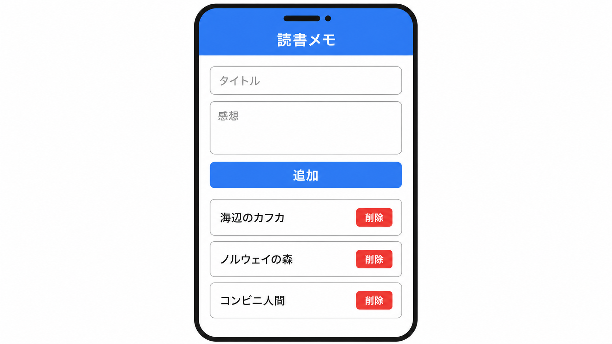
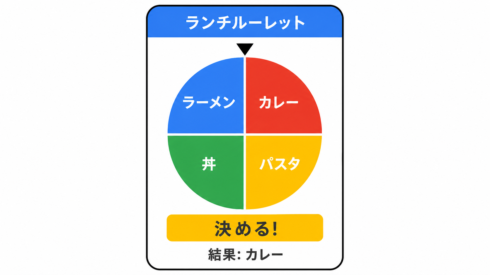
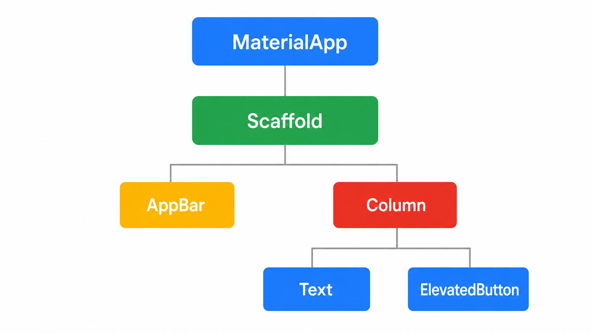
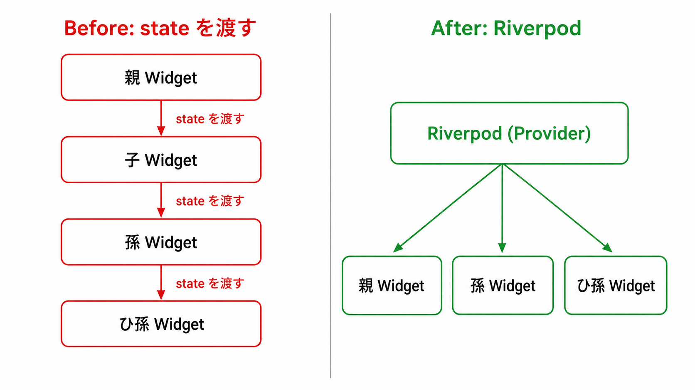
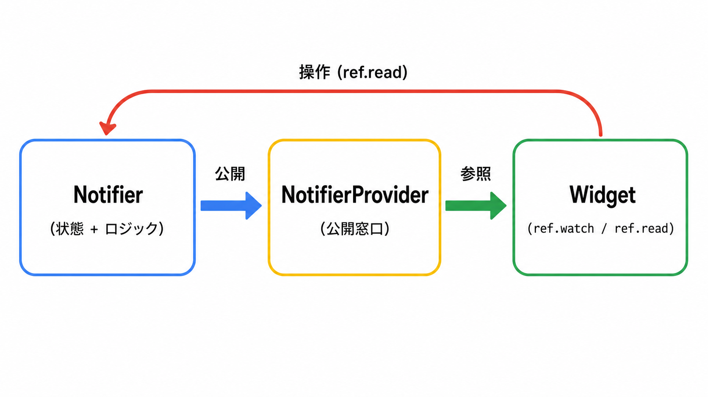

<script>
/* PowerPoint-style auto-shrink: iteratively reduce a slide's font size
   until its content stops overflowing. Also keeps the explicit opt-in
   <div class="fit">…</div> wrapper for finer-grained scaling. */
(() => {
  const MIN_FONT_PX = 12;
  const STEP = 0.96;
  const MAX_ITERS = 40;
  const TOLERANCE = 1;

  const overflows = (el) =>
    el.scrollHeight > el.clientHeight + TOLERANCE ||
    el.scrollWidth  > el.clientWidth  + TOLERANCE;

  const shrinkSection = (section) => {
    if (section.dataset.autofit === "skip") return;
    if (!overflows(section)) return;
    const base = parseFloat(getComputedStyle(section).fontSize) || 28;
    let size = base;
    for (let i = 0; i < MAX_ITERS && overflows(section) && size > MIN_FONT_PX; i++) {
      size *= STEP;
      section.style.fontSize = `${size}px`;
    }
  };

  const scaleFitBlocks = () => {
    for (const fit of document.querySelectorAll(".fit")) {
      if (!fit.scrollHeight) continue;
      const ratio = Math.min(1, fit.clientHeight / fit.scrollHeight);
      fit.style.transformOrigin = "top left";
      fit.style.transform = `scale(${ratio})`;
    }
  };

  window.addEventListener("load", () => {
    scaleFitBlocks();
    for (const section of document.querySelectorAll("section")) shrinkSection(section);
  });
})();
</script>

<style>
/* Set once per deck — drives the colored university name on every title slide. */
:root { --gdg-university: 'University of Osaka'; }
</style>

<!-- _class: title -->

# AI と Flutter で スマホアプリを作ろう

GDG on Campus University of Osaka
2026.05.21 / 2 時間ハンズオン

---

<!-- _class: lead -->

# 今日のゴール

自分のアイデアを、

**Claude Code と一緒に**

動くスマホアプリ (Web) として形にします!

---

## 今日の流れ (120 分)

| #   | 内容                | 時間  |
| --- | ------------------- | ----- |
| 1   | 完成デモ            | 5 分  |
| 2   | 事前準備チェック    | 10 分 |
| 3   | アイデア決定        | 5 分  |
| 4   | Flutter 基礎        | 20 分 |
| 5   | Riverpod 基礎       | 15 分 |
| 6   | Claude Code 使い方  | 10 分 |
| 7   | AI で実装ハンズオン | 45 分 |
| 8   | 共有                | 10 分 |

---

<!-- _class: split -->

## 今日のスコープ

### やること

- Flutter の **最小限の文法**を知る
- **Riverpod** で状態を管理する
- **Claude Code** でアプリを実装する
- 自分のアイデアを **1 画面**で形にする

### やらないこと

- iOS / Android エミュレータの利用
- Firebase / API 連携
- 認証・データ永続化
- 複数画面の遷移

---

<!-- _class: section -->

# 01. 完成デモ

## 5 分

---

## 完成イメージ① 読書メモ



読んだ本を **追加 / 一覧表示 / 削除**できるアプリ

- タイトルと感想を入力
- リストにずらっと並ぶ
- ボタンで削除できる

> 入力 + 一覧 + 状態変更 が全部入っています!

---

## 完成イメージ② ランチルーレット



候補をいくつか入れて、ボタンで **ランダムに 1 つ**選ぶアプリ

- 候補を追加・削除
- 「決める!」を押すと結果が出る
- 何度でも回せる

> 状態変更が見た目に出るので楽しいです!

---

## 今日作るアプリの制約

| 項目             | ルール                                    |
| ---------------- | ----------------------------------------- |
| 画面数           | **1 画面のみ**                            |
| 状態管理         | **Riverpod (Notifier)** で管理            |
| データの保存場所 | **メモリ上のみ** (再読み込みで消えて OK)  |
| 機能             | 入力 / 一覧 / 状態変更 のいずれかを含める |
| 実行環境         | **Chrome / Edge などの Web** で動かす     |
| 外部サービス     | API / Firebase / 認証は **使わない**      |

---

<!-- _class: section yellow -->

# 02. 事前準備チェック

## 10 分

---

## 必要なツール

| ツール      | 確認方法            | 用途                  |
| ----------- | ------------------- | --------------------- |
| Flutter SDK | `flutter --version` | アプリのビルド・実行  |
| VS Code     | アプリを起動できる  | コードを書くエディタ  |
| Chrome      | アプリを起動できる  | アプリの実行先        |
| Claude Code | `claude --version`  | AI でコードを書く相棒 |
| Git         | `git --version`     | プロジェクトの初期化  |

---

## Flutter SDK の確認

ターミナルで以下を実行してください!

```bash
flutter --version
flutter doctor
```

- `flutter --version` でバージョンが出れば OK
- `flutter doctor` は **Chrome の項目に ✓** が付いていれば今日は十分
- Android / iOS の項目に ✗ が付いていても今日は無視して OK!

---

## VS Code の準備

以下の拡張機能を入れておきましょう!

- **Dart** (Dart-Code.dart-code)
- **Flutter** (Dart-Code.flutter)

`Cmd/Ctrl + Shift + X` で拡張機能パネルを開いて「Flutter」で検索すると上に出てきます

---

## Claude Code の確認

ターミナルで起動できることを確認してください!

```bash
claude --version
claude
```

- `claude` で対話画面が立ち上がれば OK
- ログインを求められたら画面の指示に従ってください
- 起動後は `/exit` か `Ctrl + C` で抜けられます

---

<!-- _class: section green -->

# 03. アイデア決定

## 5 分

---

## 何を作るか決めましょう!

- **自分のアイデア**が一番です
- 1 画面で完結する小さなアプリを思い浮かべてください
- 入力・一覧・状態変更 のいずれかを含むものに
- 思いついたら隣の人にひと言シェア!

> 浮かばなければ次のスライドの 15 個から選んで OK です!

---

## アイデアが浮かばない人へ

ここから 1 つ選んでください!

<div class="fit">

- 今日の気分ログ
- ランチ決定ルーレット
- 読書メモ
- 勉強時間カウンター
- 筋トレ記録
- 水分摂取トラッカー
- 行きたいカフェリスト
- 映画ウォッチリスト
- 英単語カード
- 旅行先ガチャ
- 服装メモ
- 節約チャレンジ
- 推し活メモ
- 睡眠メモ
- 今日の一問クイズ

</div>

---

<!-- _class: section -->

# 04. Flutter 基礎

## 20 分

---

## Flutter とは


Google が作っている **マルチプラットフォーム UI フレームワーク**です

- 1 つのコードで **iOS / Android / Web / デスクトップ**に対応
- 言語は **Dart**
- 描画は Skia / Impeller で自前 (ネイティブ部品ではない)
- 今日は **Web ターゲット**だけ使います!

---

## Web 開発との対比

すでに知っている概念と紐付けると速いです!

| Web (HTML/CSS/JS)               | Flutter                                    |
| ------------------------------- | ------------------------------------------ |
| DOM ツリー                      | Widget ツリー                              |
| `<div>` / `<button>` などの要素 | `Container` / `ElevatedButton` 等の Widget |
| CSS のスタイル                  | Widget のプロパティ (色・余白・角丸 など)  |
| useState などのフック           | StatefulWidget / Riverpod                  |
| Vite の HMR                     | ホットリロード                             |

---

## すべては Widget



Flutter では **画面のすべてが Widget**です

- ボタンも文字も余白も Widget
- Widget が**入れ子になって 1 本のツリー**を作る
- ツリーのルートが `MaterialApp`
- 親 Widget が子 Widget を `child` / `children` で持つ

---

<!-- _class: split -->

## Stateless と Stateful

### StatelessWidget

- 状態を持たない
- 渡された値を表示するだけ
- ボタンやラベルなど
- React の純粋なコンポーネント相当

### StatefulWidget

- 内部で状態を持つ
- 値が変わると **再描画**する
- カウンター / チェックボックスなど
- 今回は **Riverpod に任せる**

---

## main.dart の最小構造

```dart
import 'package:flutter/material.dart';
import 'package:flutter_riverpod/flutter_riverpod.dart';

void main() {
  runApp(const ProviderScope(child: MyApp()));
}

class MyApp extends StatelessWidget {
  const MyApp({super.key});
  @override
  Widget build(BuildContext context) {
    return const MaterialApp(home: HomePage());
  }
}
```

> 入り口は `main()` → `runApp()` → ルートの Widget の順です

---

## Dart 文法 (JS との差分だけ)

| やりたいこと      | JavaScript             | Dart                        |
| ----------------- | ---------------------- | --------------------------- |
| 変数 (再代入あり) | `let x = 1;`           | `var x = 1;` / `int x = 1;` |
| 変数 (再代入なし) | `const x = 1;`         | `final x = 1;`              |
| 関数              | `function add(a,b){…}` | `int add(int a, int b) {…}` |
| 文末              | `;` 省略 OK            | `;` **必須**                |
| クラス            | `class Foo {…}`        | `class Foo {…}`             |
| null チェック     | `x?.y`                 | `x?.y` (同じ!)              |

---

## ホットリロードを使い倒そう!

- ファイルを保存するだけで **約 1 秒**で画面が更新される
- 状態を保ったまま更新される (`r` キー)
- 状態をリセットしたいときは **ホットリスタート** (`R` キー)
- `flutter run -d chrome` で起動するとターミナルから操作できます

---

<!-- _class: section red -->

# 05. Riverpod 基礎

## 15 分

---

## なぜ状態管理が必要?



- StatefulWidget だけだと、状態が **その Widget の中**に閉じる
- 離れた Widget で同じ状態を見たいとき、**親から子へバケツリレー**になる
- Widget が増えると爆発的に書きづらくなる
- → **Riverpod** で「どこからでも触れる場所」に置きます

---

## Riverpod の三要素



今日覚えるのはこの 3 つだけです!

- **Notifier**: 状態とロジックの入れ物
- **NotifierProvider**: 状態を公開する窓口
- **ref**: Widget から状態を読む手段 (`watch` / `read`)

---

## ① Notifier — 状態とロジック

```dart
class CounterNotifier extends Notifier<int> {
  @override
  int build() => 0;          // 初期値

  void increment() => state++;   // state を書き換える
  void reset()     => state = 0;
}
```

- `Notifier<T>` の `T` が状態の型
- `build()` で初期値を返す
- メソッドの中で `state = ...` と書き換えると **自動で再描画**される

---

## ② NotifierProvider — 公開する窓口

```dart
final counterProvider =
    NotifierProvider<CounterNotifier, int>(CounterNotifier.new);
```

- グローバル変数として宣言します
- 第 1 型引数: Notifier クラス / 第 2 型引数: 状態の型
- これを Widget から `ref` で参照します

---

## ③ ref.watch と ref.read

| やりたいこと               | 使うもの               | 例                                                |
| -------------------------- | ---------------------- | ------------------------------------------------- |
| **画面に表示**する値を取る | `ref.watch(p)`         | `final count = ref.watch(counterProvider);`       |
| **ボタンを押して**操作する | `ref.read(p.notifier)` | `ref.read(counterProvider.notifier).increment();` |
| 再描画される?              | watch → ○ / read → ×   | -                                                 |

> 「**表示は watch、操作は read**」と覚えてください!

---

## Widget 側で使う例

```dart
class CounterPage extends ConsumerWidget {
  const CounterPage({super.key});
  @override
  Widget build(BuildContext context, WidgetRef ref) {
    final count = ref.watch(counterProvider);          // 表示
    return Scaffold(
      body: Center(child: Text('$count')),
      floatingActionButton: FloatingActionButton(
        onPressed: () =>
          ref.read(counterProvider.notifier).increment(), // 操作
        child: const Icon(Icons.add),
      ),
    );
  }
}
```

---

<!-- _class: section -->

# 06. Claude Code 使い方

## 10 分

---

## Claude Code とは

Anthropic が作る **ターミナルで動く AI コーディング相棒**です

- ファイルの読み書き・コマンド実行まで自動でやってくれる
- 日本語で指示できる
- **`CLAUDE.md`** を置いておくと、それをルールとして守ってくれる
- 今日は **アーキテクチャ統一のため CLAUDE.md を配布**します!

---

## プロンプトのコツ

最初の指示で **何を / どう作るか**を具体的に伝えましょう

- **目的**: 何のアプリか (例: 読書メモアプリ)
- **画面要素**: テキスト入力欄、リスト、ボタン など
- **動き**: 「追加ボタンでリストに追加」「削除ボタンで消える」
- **状態の場所**: 「Riverpod の Notifier に持たせて」
- 短く小さく分けて指示する方が成功率が上がります!

---

## Discord でプロンプトを共有しよう

`#260521-flutter-workshop` をフル活用してください!

- 上手くいったプロンプトを **コピペで共有**
- エラーが出たら **エラーメッセージごと**貼って質問
- 「こう書いたら綺麗になった!」もシェア大歓迎
- 他の人の試行錯誤が一番の教材です!

---

<!-- _class: section green -->

# 07. AI で実装ハンズオン

## 45 分

---

<!-- _class: lead -->

# ここから 45 分、**自分のアプリ**を作りましょう!

詰まったらすぐ Discord か近くのメンターに声をかけてください!

---

## プロジェクトの作り方

ターミナルで以下を順に実行してください!

```bash
# 1. 適当な作業ディレクトリに移動
cd ~/Desktop

# 2. Flutter プロジェクトを作成
flutter create my_app
cd my_app

# 3. Riverpod を追加
flutter pub add flutter_riverpod
```

---

## 生成されるファイル / ディレクトリ

```text
my_app/
├── lib/
│   └── main.dart           ← 今日コードを書くのはほぼここ!
├── pubspec.yaml            ← 依存関係 (npm の package.json 相当)
├── pubspec.lock            ← ロックファイル (package-lock.json 相当)
├── web/                    ← Web 用ファイル (基本触らない)
├── android/  ios/  macos/  ← 各 OS 用設定 (今日は無視)
├── test/                   ← テストコード (今日は使わない)
└── analysis_options.yaml   ← Lint 設定
```

> **`lib/main.dart`** と **`pubspec.yaml`** だけ覚えておけば OK!

---

<!-- _class: invert -->

## ⚠️ 次に CLAUDE.md をダウンロード!

プロジェクト直下に **`CLAUDE.md` をダウンロード**してから Claude Code を起動してください!

```bash
# プロジェクト直下で実行
curl -fsSL -o CLAUDE.md \
  https://raw.githubusercontent.com/gdsc-osaka/education/master/flutter-workshop/app-1/CLAUDE.md

# Claude Code を起動
claude
```

> ダウンロード元: <https://github.com/gdsc-osaka/education/blob/master/flutter-workshop/app-1/CLAUDE.md>

---

## 達成ラインを決めておこう

完璧を目指さず、自分のラインを決めて進めましょう!

| ライン       | 内容                                       |
| --------- | ---------------------------------------- |
| **最低ライン** | Flutter Web で画面が表示される                     |
| **標準ライン** | 入力 / 一覧 / 状態変更 のどれかが動く                     |
| **発展ライン** | UI 改善・削除・ランダム・フィルタなど追加機能を実装                |

> 標準まで来たら、残り時間で自分のペースで発展に挑戦しましょう!

---

## Plan モードを使い分けよう

Claude Code は **`Shift` + `Tab`** で動作モードを切り替えられます!

| モード      | 動作                              | 使いどころ        |
| -------- | ------------------------------- | ------------ |
| **通常**   | 指示に応じてすぐにファイルを編集する               | 単純な変更・修正・改善  |
| **Plan** | まず計画 (Plan) を立てて、確認してから実装に進む    | 仕様整理・大きめの実装  |

> **仕様整理は Plan モード**、**実装は通常モード**で進めると流れが綺麗です!

---

## ステップ① 仕様を対話で整理する

まず Plan モードで、AI と対話してアプリの仕様を固めましょう!

```text
[アプリのテーマ] をテーマにしたモバイルアプリの仕様を、
対話形式で詳細化してください。
AskUserQuestion ツールを使ってください。
```

- `[アプリのテーマ]` には自分のアイデア (例: 読書メモ / ランチルーレット) を入れる
- Claude Code が **質問を投げてくる**ので、選択肢から答える
- 納得いくまで何往復もして OK
- 仕様が固まったら次のステップへ!

---

## ステップ② 実装を依頼する

仕様が固まったら、通常モードに戻して 1 行で依頼します!

```text
このようなアプリを Flutter で実装してください
```

- Plan モードで整理した内容をそのまま元に実装してくれます
- `CLAUDE.md` のルール (Riverpod / 1 画面 / メモリ) を守って書いてくれる
- 完了したら次のスライドのコマンドで動かしてみましょう!

---

## 実行コマンド

書き換えてもらったら、ターミナルで以下を実行!

```bash
flutter run -d chrome
```

- Chrome が立ち上がってアプリが動けば成功!
- ファイル保存で **ホットリロード** (約 1 秒で反映)
- ターミナルで `r` キーでも手動リロードできます

---

## 動かない時の聞き方

エラーが出たら **そのまま Claude Code に貼る**のが早いです!

```text
↑ のコードを動かしたら次のエラーが出ました。直してください。

[ここにエラーメッセージを全部貼る]
```

- 文字のエラーは **コピペの方が伝わりやすい**です
- 「画面が真っ白」など見た目の問題は **次のスライド**を参考に!

---

## スクショで UI を直そう

文字で説明しづらい見た目の問題は、**画像を貼る**のが圧倒的に早いです!

1. ブラウザでアプリを開いて、気になる部分を**スクショ**
2. Claude Code のターミナルに `Cmd/Ctrl + V` で**画像を貼り付け**
3. 「**ここの色をもっと淡くしたい**」など、指示と一緒に送る
4. Claude Code が画像を見ながら該当箇所を書き換える

> 「画面の真ん中の青いボタンを赤く」みたいな指示も、画像があれば一発です!

---

## 改善のプロンプト例

動いたら、機能や見た目を **1 つずつ** 追加していきましょう!

```text
追加したい機能:
- リストの項目をタップしたら詳細が表示されるようにして

見た目の改善:
- カードっぽいデザインにして、影と角丸をつけて

機能変更:
- 入力欄を空のまま追加ボタンを押せないようにして
```

> 1 度に 1 つずつ指示する方が失敗が少ないです!

---

## 早い人向け: 改善アイデア集

時間が余ったらここから挑戦してみましょう!

| カテゴリ   | アイデア例                                 |
| ------ | ------------------------------------- |
| 機能追加   | 削除 / 並び替え / 検索 / フィルタ / ランダム抽出 / 詳細表示 |
| UI 改善  | ダークモード / アイコン追加 / アニメーション / カード化      |
| データ表示  | 件数カウンター / 合計・平均 / 簡易グラフ                |
| 操作性向上  | 入力バリデーション / お気に入り / カテゴリ分け             |

> 1 機能ずつ Claude Code に依頼するのが安定します!

---

<!-- _class: section -->

# 08. 共有

## 10 分

---

## 発表してみましょう!

時間が残ったら、隣の人や全体に共有してください!

<div style="display: grid; grid-template-columns: repeat(3, 1fr); gap: 24px; margin-top: 32px;">
  <div style="padding: 24px; border-top: 4px solid var(--gdg-blue); background: #F8F9FA; border-radius: 8px;">
    <h3 style="margin-top: 0;">何を作った?</h3>
    <p>アプリの名前と一言コンセプト</p>
  </div>
  <div style="padding: 24px; border-top: 4px solid var(--gdg-green); background: #F8F9FA; border-radius: 8px;">
    <h3 style="margin-top: 0;">どう作った?</h3>
    <p>使ったプロンプトのコツ</p>
  </div>
  <div style="padding: 24px; border-top: 4px solid var(--gdg-yellow); background: #F8F9FA; border-radius: 8px;">
    <h3 style="margin-top: 0;">どこで詰まった?</h3>
    <p>解決方法もセットで共有!</p>
  </div>
</div>

---

## 今日のまとめ

- Flutter は **Widget ツリー**で画面を組む
- Riverpod は **Notifier / Provider / ref** の 3 点セット
- Claude Code には **CLAUDE.md でルールを伝える**
- AI に丸投げせず、**目的と要件**を自分の言葉で伝える
- 詰まったらすぐに **Discord で共有**!

---

<!-- _class: lead -->

# Thank you!

楽しいアプリ作りを!
質問は `#260521-flutter-workshop` で待っています!
