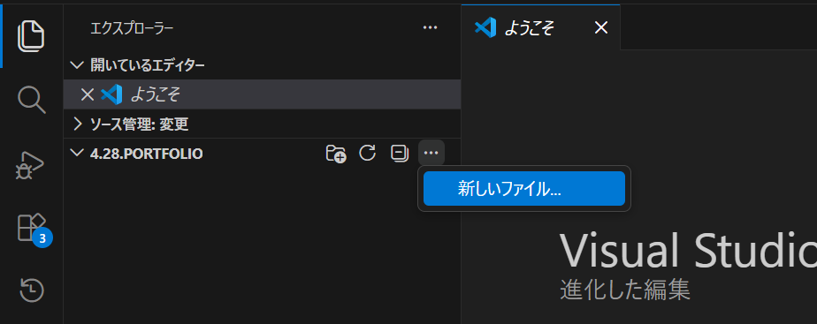
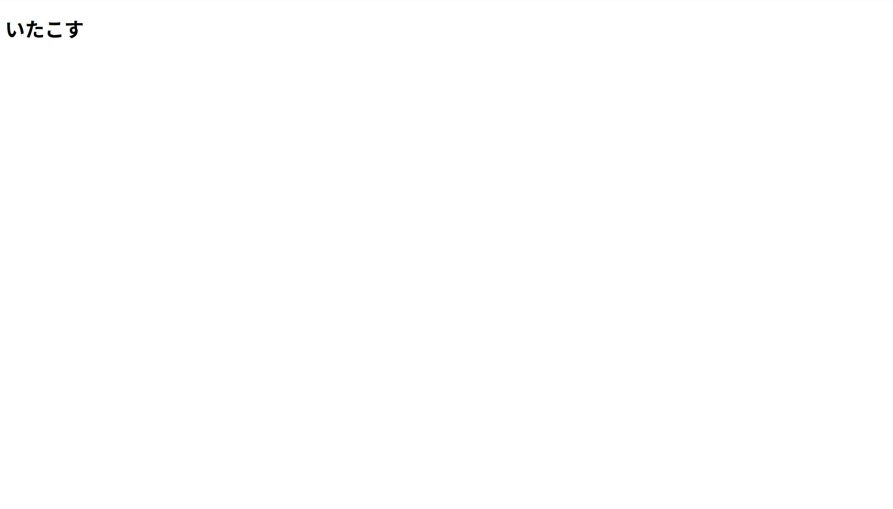
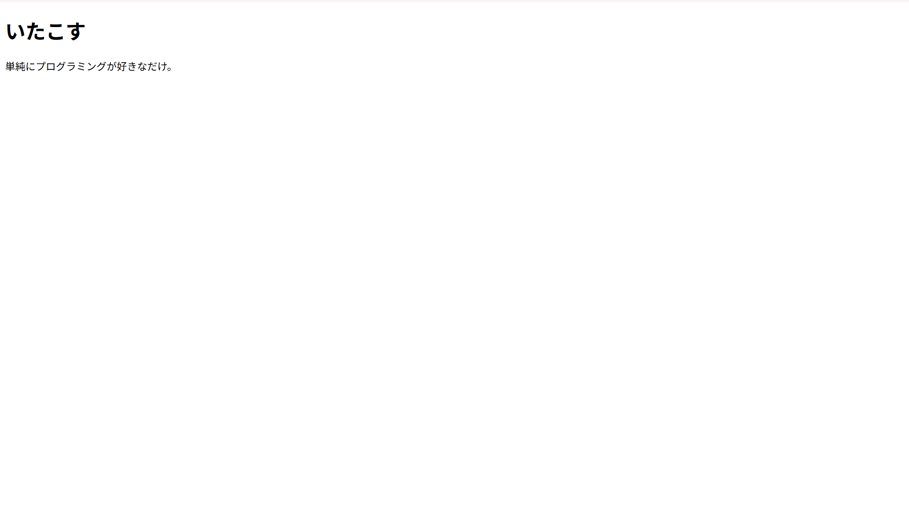
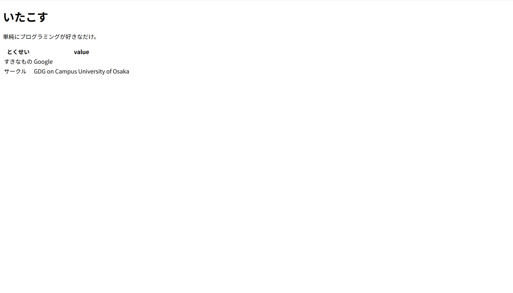
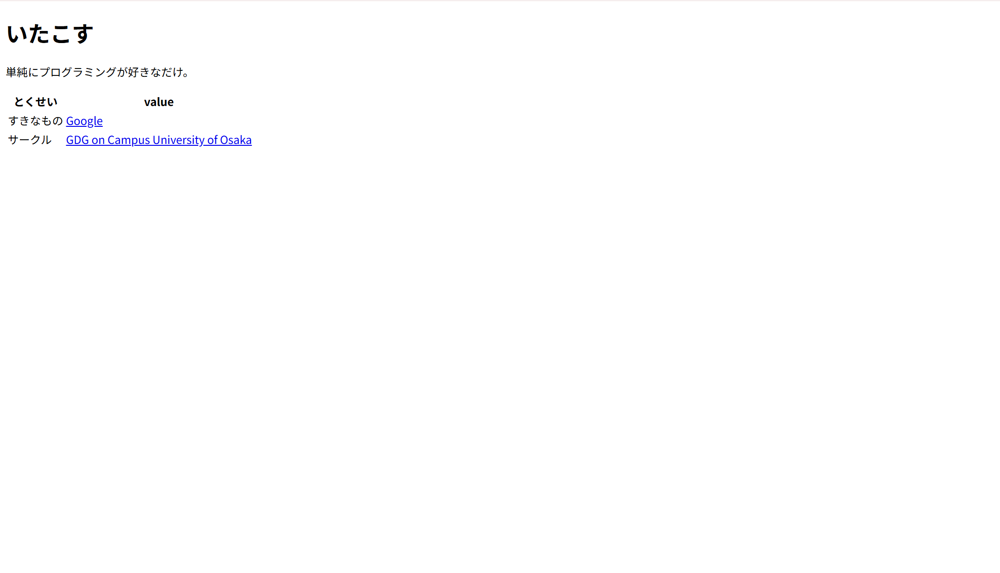
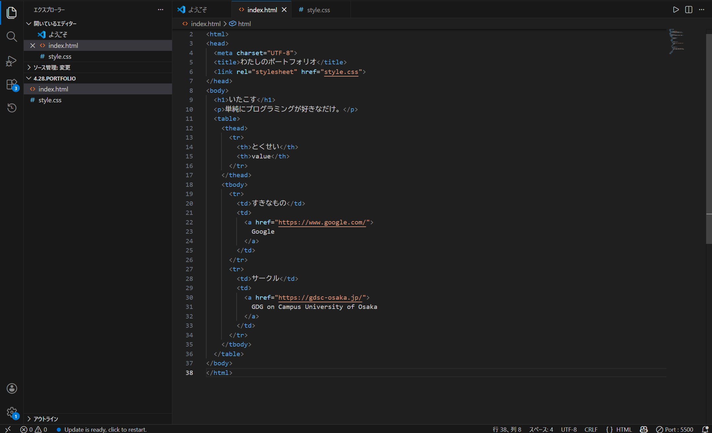
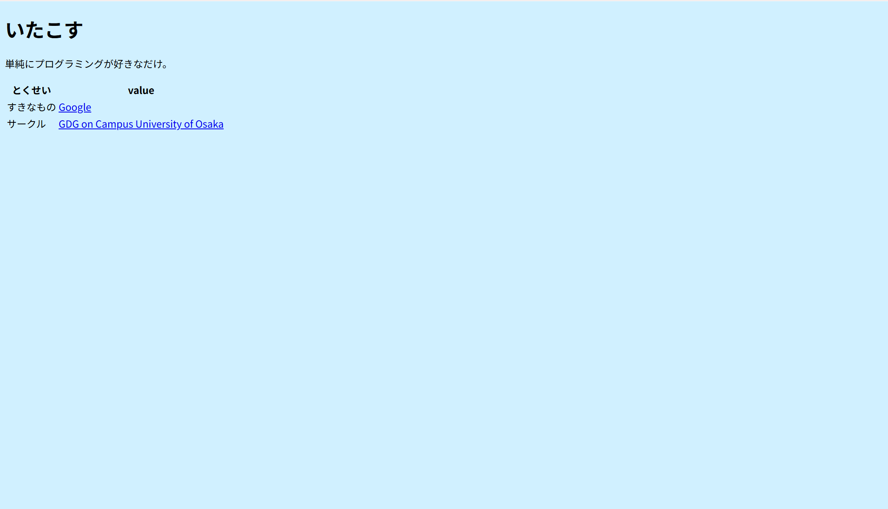
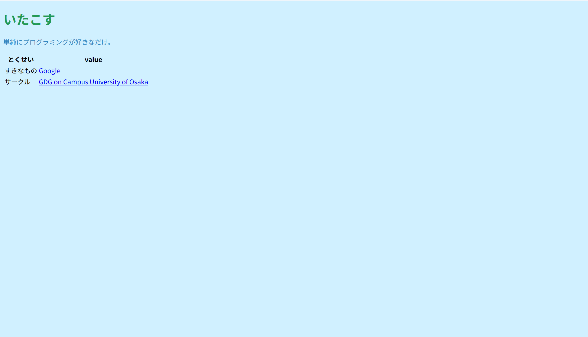
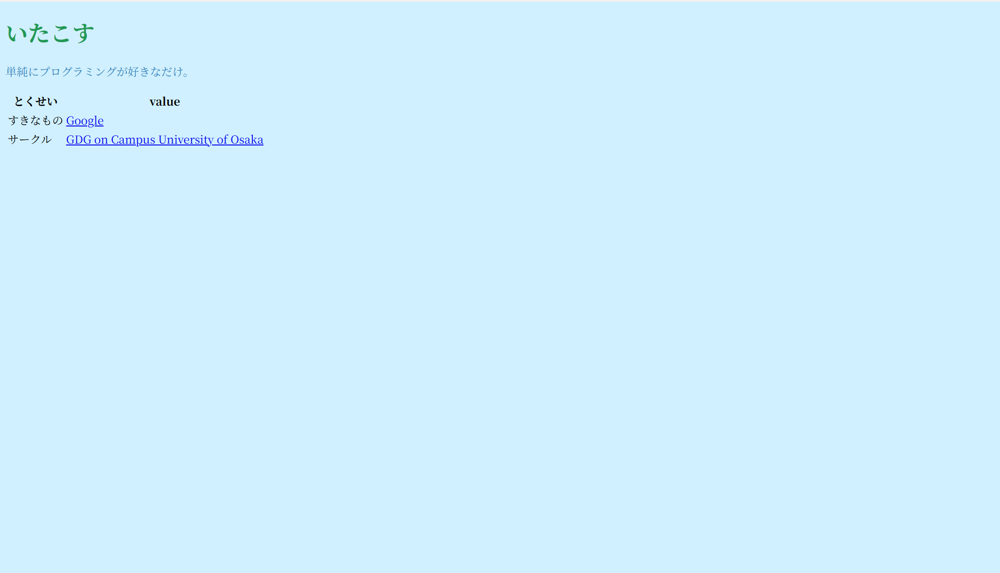
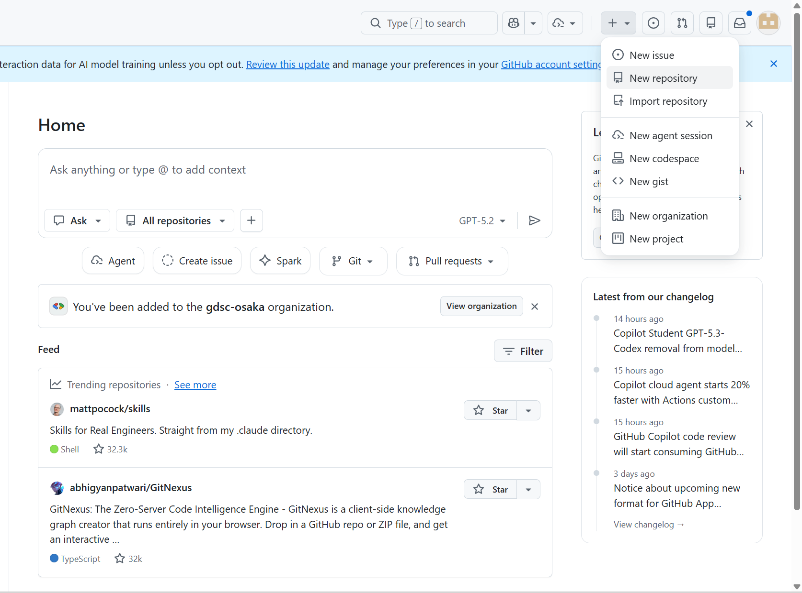

summary: 2時間で完成！はじめてのポートフォリオサイト作成
id: first-portfolio-workshop-2hr
categories: Web
environments: Web
status: Published
feedback link: https://github.com/googlecodelabs/your-first-pwapp/issues
author: GDG on Campus University of Osaka

# ポートフォリオ Web サイト作成ワークショップ

## ワークショップ の概要
Duration: 0:05:00

この Codelab では、プログラミングや Web 制作の経験がない方を対象に、2 時間という短い時間で簡単な自分のポートフォリオサイトを作成し、インターネット上に公開する手順を体験します。

**学習内容:**
* 簡単な Web ページの構造 (HTML)
* Web ページの見た目を整える方法 (CSS)
* 開発ツール (VSCode) の基本的な使い方
* GitHub を使った Web サイトの公開 (GitHub Pages)

**必要なもの:**
* インターネットに接続された PC (Windows または Mac)
* メールアドレス (GitHub アカウント作成用)

**注意:** この Codelab は時間短縮のため、駆け足での進行となります。**まずは Web サイトの公開を体験し、動くものを作る達成感を味わいましょう！** 時間に余裕のある方は、更なるカスタマイズに挑戦してみてください。**最低限 Step 3 までの完了を目指しますが、Step 4 以降にも積極的にチャレンジしてみましょう。**

## Step 1: 開発環境の準備
Duration: 0:30:00

はじめに、Web サイトを作成するための道具を準備します。

### **VSCode のインストール**
Web サイトの設計図 (コード) を書くためのエディタ「Visual Studio Code (VSCode)」をインストールします。

1.  お使いの Web ブラウザ (Chrome, Edge, Safari など) を開きます。
2.  [VSCode 公式サイト](https://code.visualstudio.com/download) にアクセスします。
   <button>
     [Download VSCode](https://code.visualstudio.com/download)
   </button>
3.  お使いの OS (Windows, Mac) に合ったインストーラーをダウンロードします。
4.  ダウンロードしたファイルを開き、画面の指示に従ってインストールを完了します。

> **Troubleshooting:** インストールがうまくいかない場合は、遠慮なくメンターに声をかけてください！

### **作業フォルダの作成**
Web サイトの作成を始める前に、成果物を保存するフォルダを作っておきましょう。

1.  パソコン上の好きな場所に新規フォルダを作成してください。
2.  VSCode を開きます。
3.  左上の「ファイル」→「フォルダを開く…」から、今作成したフォルダを開いてください。

### **GitHub アカウントの作成**
作成した Web サイトのバージョンを管理したり、インターネット上に公開したりするために、GitHub というサービスを使います。そのためのアカウントを作成しましょう。

1.  Web ブラウザで [GitHub 公式サイト](https://github.com/) にアクセスします。
2.  画面右上の「Sign up」ボタンをクリックします。
3.  画面の指示に従って、ユーザー名、メールアドレス、パスワードを設定します。
    * **ユーザー名:** 半角英数字とハイフンのみ使用可能です。これがあなたの Web サイトの URL の一部になります。
    * **メールアドレス:** `@` マークの入った、受信可能なメールアドレスを入力してください。確認メールが届きます。
4.  簡単なパズル認証やプラン選択（Free プランを選択）などを行います。
5.  登録したメールアドレスに GitHub から確認メールが届きます。メールを開き、「Verify email address」ボタンをクリックして認証を完了します。

> **Troubleshooting:** 確認メールが届かない場合や、手順で迷った場合は、メンターにサポートを求めてください。

## Step 2-1: [HTML] Web ページの骨組みを作ろう
Duration: 0:20:00

いよいよ Web サイトの中身を作っていきます。Web ページの構造を定義するには、HTML (HyperText Markup Language) を使います。HTML は「タグ」と呼ばれる要素を使って、テキストや画像などのコンテンツを構造化します。

### **3 つの主要なタグ - `<html>`, `<head>`, `<body>`**
HTML には `<html>`, `<head>`, `<body>` という 3 つの主要なタグがあります。

* `<html>` タグは、HTML 文書全体を囲むタグです。
* `<head>` タグは、Web ページのタイトルや、CSS ファイルのリンクなどの情報を記述するタグです。
* `<body>` タグは、実際にブラウザに表示される内容を記述するタグです。

まずはこれらのタグを使って、Web ページの基本的な構造を作ってみましょう。

### **`index.html` ファイルを作成**

1.  VSCode の左側にあるエクスプローラーパネルで、フォルダ名の横に表示される「新しいファイル」アイコンをクリックします。



2.  ファイル名を `index.html` と入力して Enter キーを押します。
3.  中央のエディタ画面に `index.html` が開かれるので、以下のコードを**正確に**入力（またはコピー＆ペースト）します。
4.  `Ctrl+S` (Windows) または `Cmd+S` (Mac) でファイルを保存しましょう。

`index.html`

```html
<!DOCTYPE html>
<html>
<head>
    <meta charset="UTF-8">
    <title>わたしのポートフォリオ</title>
</head>
<body>

</body>
</html>
```

> **補足:** コード中のタグについて
> `<!DOCTYPE html>` はこのファイルが HTML5 であることを示しています。
> `<meta charset="...">` はこのファイルの文字コードを表していて、文字化けを防ぎます。
> `<title>` はこのページのタイトルで、ブラウザのタブに表示されます。

### **実際に表示してみよう！**
今作成した Web ページがどのように見えるか、ブラウザで確認してみましょう。VSCode の拡張機能を使うと、編集した HTML ファイルをリアルタイムで表示できます。

1.  VSCode の左側にある四角が積み重なったような「拡張機能」アイコンをクリックします。
2.  検索ボックスに `Live Server` と入力します。
3.  検索結果に表示された `Live Server` (Ritwick Dey 作) を選択し、「インストール (Install)」ボタンをクリックします。
4.  インストールが完了したら、`index.html` のエディタ画面に戻ります。
5.  画面右下のステータスバーにある `Go Live` ボタンをクリックします。
6.  自動的に Web ブラウザが起動します。

真っ白な画面が表示されたら OK です。次の Step から内容を追加していきます！

> **Tips:** VSCode とブラウザを並べて表示しておくと、この後の作業がわかりやすいです。

> **Troubleshooting:** Step 2-1 はトラブルが発生することが多いので、わからないことがあったら気軽に声をかけてください！

## Step 2-2: [HTML] 見出しを追加しよう
Duration: 0:10:00

Web ページに見出しをつけるには、`<h1>` タグを使います。`<h1>` タグは、Web ページの中で最も重要な見出しを表します。

1.  `index.html` ファイルの `<body>` の中に、以下のコードを追加してください。

```html
<h1>ここをあなたの名前に変更</h1>
```

2.  ファイルを保存しましょう。
3.  先ほど起動したブラウザの画面に文字が表示されましたか？
4.  `<h1>` タグの中身をあなたの名前に書き換えてみましょう！



### **最終的なコード (例)**

* `index.html`

```html
<!DOCTYPE html>
<html>
<head>
  <meta charset="UTF-8">
  <title>わたしのポートフォリオ</title>
</head>
<body>
  <h1>いたこす</h1>
</body>
</html>
```

## Step 2-3: [HTML] 自己紹介文を追加しよう
Duration: 0:10:00

Web ページに段落を追加するには、`<p>` タグを使います。`<p>` タグは、Web ページの中で文章の段落を表します。

1.  `index.html` ファイルの `<body>` の中で、先程の `<h1>` タグの下に以下のコードを追加してください。

```html
<p>ここをあなたの自己紹介文に変更。Web開発に興味があります！</p>
```

2.  ファイルを保存しましょう。ブラウザの画面に文章が表示されましたか？
3.  `<p>` タグの中身をあなたの自己紹介文に書き換えてみましょう！



### **最終的なコード (例)**

* `index.html`

```html
<!DOCTYPE html>
<html>
<head>
  <meta charset="UTF-8">
  <title>わたしのポートフォリオ</title>
</head>
<body>
  <h1>いたこす</h1>
  <p>単純にプログラミングが好きなだけ。</p>
</body>
</html>
```

## Step 2-4: [HTML] 表を追加しよう (少し難)
Duration: 0:20:00

だんだん HTML の書き方には慣れてきましたか？
次は、Web ページ上で表を表示する `<table>`, `<thead>`, `<tbody>`, `<tr>`, `<th>`, `<td>` について紹介します。

> **Warn:** この内容は少し難しいです。ワークショップの後に時間がありますので、とりあえずコピーだけして次の手順に進んでいただいても大丈夫です。

### **表に関連するタグたち**

* `<table>` タグは、表全体を囲むタグです。表を作成する際は、まずこの `<table>` タグを記述します。
* `<thead>` タグは、表の見出し部分を表します。
* `<tbody>` タグは、表のデータ部分を表します。
* `<tr>` タグは、表の行を表すタグです。
* `<th>` タグは、表の見出しのセルを表すタグです。通常、表の最初の行に記述し、各列のタイトルを示します。
* `<td>` タグは、表のデータセルを表すタグです。各行のデータが入る部分です。

文章だけ読んでもわかりにくいと思うので、実際の HTML を見てみましょう。

### **簡単な表の例**

1.  `index.html` ファイルの `<body>` の中で、先程の `<p>` タグの下に以下のコードを追加してください。

```html
<table>
  <thead>
    <tr>
      <th>とくせい</th>
      <th>value</th>
    </tr>
  </thead>
  <tbody>
    <tr>
      <td>すきなもの</td>
      <td>Google</td>
    </tr>
    <tr>
      <td>サークル</td>
      <td>GDG on Campus University of Osaka</td>
    </tr>
  </tbody>
</table>
```

2.  このコードを保存して、ブラウザで表示を確認してください。簡単な表が表示されるはずです。
3.  ファイルを保存しましょう。ブラウザの画面に表が表示されましたか？
4.  `<th>` や `<td>` の中身を変えたり、`<tr>` で行を増やしたりして、自分のプロフィールを書いてみましょう！



> **補足:** HTML の改行について
> HTML では、基本的に値 (タグとタグの間) で好きなように改行ができます。逆に、HTML 上で改行をしても表示される文字列は改行されません。
> 自分の見やすいように適宜改行を入れるのがオススメです。(自動で見やすいように整えてくれるツールもあります)

### **最終的なコード (例)**

* `index.html`

```html
<!DOCTYPE html>
<html>
<head>
  <meta charset="UTF-8">
  <title>わたしのポートフォリオ</title>
</head>
<body>
  <h1>いたこす</h1>
  <p>単純にプログラミングが好きなだけ。</p>
  <table>
    <thead>
      <tr>
        <th>とくせい</th>
        <th>value</th>
      </tr>
    </thead>
    <tbody>
      <tr>
        <td>すきなもの</td>
        <td>Google</td>
      </tr>
      <tr>
        <td>サークル</td>
        <td>GDG on Campus University of Osaka</td>
      </tr>
    </tbody>
  </table>
</body>
</html>
```

## Step 2-5: [HTML] リンクを追加しよう
Duration: 0:10:00

ここでは、Web ページにリンクを追加する方法を紹介します。リンクは、Web ページ同士をつなぐ大切な要素で、例えば皆さんのお使いの SNS へのリンクを貼ることができます。
HTML でリンクを作成するには `<a>` タグを使います。リンクの基本的な書き方は、以下の通りです。

```html
<a href="リンク先のURL">リンクのテキスト</a>
```

では、これを元にみなさんの SNS などへのリンクを貼ってみましょう！

1.  Step 2-4 で作成した表の `<tr>` を、以下の例のように書き換えてください。

```html
<tr>
  <td>すきなもの</td>
  <td>
    <a href="https://www.google.com/">
      Google
    </a>
  </td>
</tr>
```

2.  ファイルを保存しましょう。ブラウザの画面にリンクが表示されましたか？
3.  リンク先の URL やリンクテキストを変えて、自分の SNS などへのリンクを貼ってみましょう！



> **補足:** HTML の入れ子
> このように、HTML ではタグ同士を入れ子にして組み合わせることができます。少し難しい書き方をしているので、わからない点があればぜひ聞いてください！

まだまだ HTML には面白い機能がありますが、本日のワークショップでは一旦ここまででとしておきます。

では、これまでに作成したレイアウトにもっとオリジナリティを出すにはどうすればいいでしょうか？
次の Step からは、CSS を用いて Web ページの見た目を調整してみます。

### **最終的なコード (例)**

* `index.html`

```html
<!DOCTYPE html>
<html>
<head>
  <meta charset="UTF-8">
  <title>わたしのポートフォリオ</title>
</head>
<body>
  <h1>いたこす</h1>
  <p>単純にプログラミングが好きなだけ。</p>
  <table>
    <thead>
      <tr>
        <th>とくせい</th>
        <th>value</th>
      </tr>
    </thead>
    <tbody>
      <tr>
        <td>すきなもの</td>
        <td>
          <a href="https://www.google.com/">
            Google
          </a>
        </td>
      </tr>
      <tr>
        <td>サークル</td>
        <td>
          <a href="https://gdsc-osaka.jp/">
            GDG on Campus University of Osaka
          </a>
        </td>
      </tr>
    </tbody>
  </table>
</body>
</html>
```

## Step 3-1: [CSS] CSS の基本を知ろう
Duration: 0:15:00

CSS (Cascading Style Sheets) は、Web ページの見た目 (スタイル) を定義するための言語です。CSS を使うことで、文字の色や大きさ、背景色、要素の配置など、Web ページの様々な要素を装飾することができます。

### **CSS の 3 つの構成要素**
CSS は、**セレクタ (selector)**、**プロパティ (property)**、**値 (value)** の 3 つの要素で構成されています。

```css
セレクタ {
  プロパティ: 値;
}
```

* **セレクタ:** スタイルをどこに適用するかを指定します。 (例: `body`, `h1`, `p`)
* **プロパティ:** 変更したいスタイルの種類を指定します。 (例: `background-color`, `color`, `font-size`)
* **値:** プロパティに設定する値を指定します。 (例: `red`, `20px`, `bold`)

### **CSS ファイルを作成**
CSS のコードを見たほうが分かりやすいと思うので、実際に書いてみましょう。まずは CSS ファイルを作成します。

1.  VSCode のエクスプローラーパネルで、`index.html` と同じ場所に新しいファイルを作成します。
2.  ファイル名を `style.css` と入力して Enter キーを押します

### **CSS ファイルを HTML に読込**
先ほど `style.css` を作成しましたが、ただファイルを作成するだけでは反映されません。HTML で CSS ファイルの存在を教えてあげる必要があるので、以下のようなコードを `index.html` の `<head>` の中に書き加えてください。

```html
<link rel="stylesheet" href="style.css">
```



### **最終的なコード (例)**

* `index.html`

```html
<!DOCTYPE html>
<html>
<head>
  <meta charset="UTF-8">
  <title>わたしのポートフォリオ</title>
  <link rel="stylesheet" href="style.css">
</head>
<body>
  <h1>いたこす</h1>
  <p>単純にプログラミングが好きなだけ。</p>
  <table>
    <thead>
      <tr>
        <th>とくせい</th>
        <th>value</th>
      </tr>
    </thead>
    <tbody>
      <tr>
        <td>すきなもの</td>
        <td>
          <a href="https://www.google.com/">
            Google
          </a>
        </td>
      </tr>
      <tr>
        <td>サークル</td>
        <td>
          <a href="https://gdsc-osaka.jp/">
            GDG on Campus University of Osaka
          </a>
        </td>
      </tr>
    </tbody>
  </table>
</body>
</html>
```

* `style.css`: 空のファイル

## Step 3-2: [CSS] 背景色を設定しよう
Duration: 0:10:00

Web ページ全体のデザインを設定してみましょう。以下の例では `<body>` の背景色を薄い水色にしています。

1.  `style.css` ファイルに、以下のコードを追加してください。

```css
body {
  background-color: #d0f0ff; /* 背景色を薄い水色に */
}
```

2.  ファイルを保存しましょう。ブラウザの画面上に反映されましたか？
3.  `background-color` の値を好きな色に変更してみましょう！色の名前やコードはこちらのサイトなどが参考になります: [HTML Color Codes](https://htmlcolorcodes.com/)



> **補足:** 色の表現方法
> `#d0f0ff` は、2桁ごとに 16 進数を表しています。左から赤、緑、青の色の強さを表していて、00 〜 ff の 256 段階の強さがあります。
> `#000000`: 黒色
> `#cccccc`: 灰色
> `#ff0000`: 赤色
> `#00ffff`: 水色 (シアン)

> **補足:** CSS のコメント
> 上記の CSS の `/* … */` の部分はコメントです。実際のデザインには影響しませんが、わかりにくい部分に書いておくと、後で見返したときに理解しやすくなります。

### **最終的なコード (例)**

* `index.html`: 変更なし
* `style.css`

```css
body {
  background-color: #d0f0ff; /* 背景色を薄い水色に */
}
```

## Step 3-3: [CSS] 文字色を設定しよう
Duration: 0:10:00

見出し (`<h1>` など) や段落 (`<p>` など) の文字色を変えてみましょう。

1.  `style.css` ファイルに、以下のコードを追加してください。

```css
h1 {
  color: #229954; /* 見出しの文字色を緑色に */
}
p {
  color: #2e86c1; /* 段落の文字色を青色に */
}
```

2.  ファイルを保存しましょう。文字の色が変わりましたか？
3.  `color` の値を好きな色に変更してみましょう！



### **最終的なコード (例)**

* `index.html`: 変更なし
* `style.css`

```css
body {
  background-color: #d0f0ff; /* 背景色を薄い水色に */
}
h1 {
  color: #229954; /* 見出しの文字色を緑色に */
}
p {
  color: #2e86c1; /* 段落の文字色を青色に */
}
```

## Step 3-4: [CSS] フォントを設定しよう
Duration: 0:10:00

皆さんの中には、これまでにプレゼン資料やレポートを作ったことがある人も多いと思いますが、その際にフォント (文字の形) を変更した経験のある方もいるのではないでしょうか。Web 上でも自分の好きなフォントを選んで表示することができます。

1.  `style.css` ファイルに、以下のコードを追加してください。

```css
body {
  font-family: serif; /* セリフ体 (≒ 明朝体) */
}
```

2.  ファイルを保存しましょう。文字の形が変わりましたか？
3.  `font-family` の値を好きなフォントに変更してみましょう！フォントの値は [こちらのドキュメント](https://developer.mozilla.org/ja/docs/Web/CSS/font-family) が参考になります。



> **補足:** 総称フォントファミリー
> 上記の例で指定した「serif」は総称フォントファミリーと言って、特定のフォントを指定しているわけではありません。環境によって表示されるフォントが変わりますが、一定のルールがあります。以下に一例を挙げます。
> `serif`: セリフ体 (≒ 明朝体)
> `sans-serif`: サンセリフ体 (≒ ゴシック体)
> `monospace`: 等幅フォント (プログラミングでよく使われる)

> **補足:** フォントの世界
> 世の中には数多くのフォントが存在しますが、ブラウザや OS、言語によって対応するフォントは異なります。例えば、Windows に搭載されている「游明朝」は、Android や macOS などには標準搭載されていません。逆に、macOS に搭載されている「ヒラギノ明朝」は他の OS には標準搭載されていません。そのため、フォントの名前を直接指定する際には、そのフォントが存在しない場合も想定して、以下のようにいくつか指定する場合が多いです。
> `font-family: '游明朝', 'Yu Mincho', YuMincho, 'Hiragino Mincho Pro', serif;`

ここまでで HTML と CSS の話は一旦終了としますが、Web サイトの仕組みについてなんとなく理解ができたでしょうか？
次の Step からは、これまでに作成した Web サイトを公開する方法について説明します。

### **最終的なコード (例)**

* `index.html`: 変更なし
* `style.css`

```css
body {
  background-color: #d0f0ff; /* 背景色を薄い水色に */
}
h1 {
  color: #229954; /* 見出しの文字色を緑色に */
}
p {
  color: #2e86c1; /* 段落の文字色を青色に */
}
body {
  font-family: serif; /* セリフ体 (≒ 明朝体) */
}
```

## Step 4-1: [GitHub] リポジトリを作成しよう
Duration: 0:20:00

ここまで皆さん、お疲れ様でした！いよいよ作成した Web サイトをこれから公開してみたいと思います。
公開する方法はたくさんあるのですが、今回はその中でも無料で簡単にできる GitHub Pages を使いたいと思います。

### **GitHub って何？**
GitHub は、ソフトウェア開発に欠かせない「**バージョン管理**」と「**共同作業**」ができるプラットフォームです。コードの変更履歴を管理し、複数人での共同作業を円滑に進めることができます。

> **補足:** Git とは
> 似たような名前で「Git」を聞いたことがある人もいるのではないでしょうか。Git は、ファイルの変更履歴を管理するシステムで、パソコン上で動作します。それに対して GitHub は、 Git を利用したプロジェクトを共有し、共同作業するためのプラットフォームです。

### **新しいリポジトリの作成**
GitHub では、それぞれのプロジェクトを「リポジトリ」という単位でまとめています。それでは、今回作成した Web サイトを管理する新しい「リポジトリ」を作成してみましょう。

1.  Web ブラウザで [GitHub](https://github.com/) にアクセスし、ログインします。
2.  画面右上の「+」アイコンをクリックし、「New repository」を選択します。



3.  以下の項目を設定します。
    * **Repository name:** `[your-GitHub-username].github.io` と**正確に**入力します。
        * 例: ユーザー名が `taro-yamada` なら `taro-yamada.github.io`
    * **Description:** (任意) 簡単な説明を入力します (例: My portfolio site)。
    * **Public** を選択します (Private だと GitHub Pages が使えません)。
    * **Initialize this repository with:** の下のチェックボックスは**すべてチェックを外した状態**にします (README などは不要)。
    * その他の部分もデフォルト (None や No) のままで大丈夫です。
4.  「Create repository」ボタンをクリックします。

### **ファイルのアップロード**
リポジトリが作成されると、「Quick setup」などの画面が表示されます。ここにファイルをアップロードします。

1.  画面に表示されている「uploading an existing file」というリンクをクリックします。
2.  ファイル選択画面が表示されるので、先ほど VSCode で作成した `index.html` と `style.css` の **2 つのファイル**を、画面の点線枠の中にドラッグ＆ドロップします。(間違えてフォルダごとアップロードしないように気をつけましょう)
3.  ファイルがアップロードされると、画面下に「Commit changes」というセクションが表示されます。特に変更せず、緑色の「Commit changes」ボタンをクリックします。

> **補足:** コミット (commit) とは
> リポジトリに加えた変更内容を記録する作業をコミットと呼びます。コミットを行うことで、変更履歴を保存し、過去の状態に戻したり、他の人と変更内容を共有したりすることができます。

## Step 4-2: [GitHub] GitHub Pages で公開しよう
Duration: 0:20:00

### **GitHub Pages の設定**
ファイルを置いただけではまだ公開されません。GitHub Pages の機能を有効にします。

1.  アップロードが完了したら、リポジトリのページ上部にある「Settings」タブをクリックします。
2.  左側のメニューから「Pages」を選択します。
3.  「Build and deployment」セクションで、「Source」が「Deploy from a branch」になっていることを確認します。
4.  「Branch」の項目で、「Branch: `main`」（または `master`）、「Folder: `/ (root)`」が選択されていることを確認し、「Save」ボタンをクリックします。

### **公開の確認**
設定が完了すると、「Your site is live at ...」のようなメッセージが表示されます（表示されるまで少し時間がかかる場合があります）。

表示された URL (`https://[your-GitHub-username].github.io`) をクリックして、作成した Web サイトがインターネット上で見られるか確認しましょう！

> **Troubleshooting:** もし "Page not found" (404) が表示される場合は、以下の点を確認してください。
> - 数分待ってみる
> - リポジトリ名が `[your-GitHub-username].github.io` と正確に一致しているか
> - 間違えてフォルダごとアップロードしていないか
> - ファイル名 (`index.html`) が正しいか
> - Pages の設定が正しいか
>
> 不明な場合はメンターに質問しましょう。

**おめでとうございます！これであなたのポートフォリオサイトが完成し、世界中に公開されました！**

## Step 5: まとめと次のステップ
Duration: 0:10:00

皆さん、大変お疲れ様でした！このワークショップでは、たった 1 時間半で以下のことを達成しました。

* VSCode を使って HTML と CSS ファイルを作成・編集した。
* 簡単な Web ページの構造と見た目を作った。
* GitHub アカウントを作成し、リポジトリを作成した。
* GitHub Pages を使って、作成した Web サイトをインターネットに公開した。

### **今回の手法について**
今回は時間短縮のため、ページに画像を表示したり、動きのあるコンテンツを作成したりすることはしていません。こちらも非常に楽しい内容なので、今後ぜひ体験してみてください。
また、今回は GitHub に直接ファイルをアップロードしました。これは手軽ですが、実際の Web 開発では **Git** というバージョン管理システムを使って、変更履歴を記録しながら GitHub と連携するのが一般的です。こちらも慣れると非常に強力なツールとなります。

> **Tips:** Step 6 以降の内容について
> 以下に紹介する「Next Steps」は、Step 6 〜 Step 9 で実際にハンズオン形式で体験できるように用意しています。気になるテーマから、自分のペースでぜひ挑戦してみてください！

### **Next Steps (初心者向け)**
* **コンテンツを充実させる:** `index.html` にもっと詳しい自己紹介や、作品紹介（もしあれば）を追加してみましょう。画像 (`` タグ) を追加するのも良いですね。
* **CSS でデザインを凝る:** `style.css` で、もっと色々なプロパティ (例: `border`, `font-size`, `margin`, `padding`) を試して、デザインを改善してみましょう。
    * 参考: [MDN Web Docs - CSS](https://developer.mozilla.org/ja/docs/Web/CSS)
* **Git を学ぶ:** Web 開発の基本スキルである Git の使い方を学んでみましょう。今日作ったサイトを Git で管理できるようにするのも良い練習になります。

### **Next Steps (中級者向け)**
もし Web 開発の経験が少しあるなら、以下の課題に挑戦してみるのも面白いでしょう。(詳細は別途資料を参照)

* Flexbox や Grid を使ったレイアウト作成
* メディアクエリを使ったレスポンシブデザイン対応
* JavaScript を使った簡単なインタラクションの実装 (例: ボタンクリック)
* 今日試した「直接アップロード」ではなく、Git コマンド (`git add`, `git commit`, `git push`) を使って GitHub にファイルを送信し、GitHub Pages を更新してみる。

### **Next Steps (さらなる上へ)**
もし Web 開発の経験が少しあるなら、以下の課題に挑戦してみるのも面白いでしょう。

* [**React**](https://react.dev/)**:** UI 構築のための JavaScript ライブラリ。コンポーネントベースで効率的な開発が可能。
* [**Next.js**](https://nextjs.org/)**:** React ベースのフルスタックフレームワーク。サーバーサイドレンダリングで SEO 対策も万全。
* [**Vue.js**](https://vuejs.org/)**:** シンプルで学習しやすい JavaScript フレームワーク。

これらのフレームワークを使うことで、より高度なポートフォリオサイトを構築できます。例えば、以下のような機能を追加できます。

* コンポーネントの再利用による効率的な開発
* 動的なコンテンツの表示
* API との連携
* 高度な UI/UX の実現

ぜひ、これらのフレームワークを学んで、あなたのポートフォリオサイトをさらに進化させてください！

### **ワークショップ部分はここまで！**
本日のメインのワークショップはここで一区切りです。本当にお疲れ様でした！

時間に余裕のある方や、ワークショップ後にさらに学びたい方は、ぜひ以下の Step 6 〜 Step 9 にもチャレンジしてみてください。それぞれの「Next Steps」を実際にハンズオンで体験できる構成になっています。

## Step 6: コンテンツとデザインを充実させよう
Duration: 0:30:00

ここからは、Step 5 で紹介した「Next Steps」を実際に手を動かしながら体験していきます。まずは、ポートフォリオの中身をもっと充実させながら、HTML と CSS をもう少し深く触ってみましょう。

### **見出しでセクション分けしよう (`<h2>`)**
`<h1>` よりも一段下の見出しには `<h2>` タグを使います。「自己紹介」「作品紹介」のようなセクション分けに便利です。

1.  `index.html` の `<body>` の中、表 (`</table>`) の下に以下のコードを追加してください。

```html
<h2>自己紹介</h2>
<p>
  大阪大学に通う 1 年生です。
  普段は Web 開発と機械学習に興味を持って勉強しています。
  好きな食べ物はラーメンです。
</p>

<h2>作品紹介</h2>
<ul>
  <li>はじめてのポートフォリオサイト (今ここ！)</li>
  <li>大学の課題で作った Python のじゃんけんゲーム</li>
  <li>友達と作ったクイズアプリ</li>
</ul>
```

2.  `<ul>` と `<li>` は箇条書き (リスト) を表すタグです。`<ul>` で囲んだ中に複数の `<li>` を並べます。

> **補足:** 番号付きリスト
> 番号付きの箇条書きにしたいときは、`<ul>` の代わりに `<ol>` を使います。

### **画像を表示してみよう (``)**
Web ページに画像を表示するには `` タグを使います。`` は閉じタグが不要な特殊なタグです。

1.  プロフィール用の画像を 1 枚用意しましょう (写真でもアイコンでも OK です)。
2.  `index.html` と同じ場所に `img` という名前のフォルダを作り、その中に画像を入れます (例: `img/profile.png`)。
3.  `<h1>` タグの下に以下のコードを追加してください。

```html

```

* `src` は画像のファイルパス、`alt` は画像が表示できないときに代わりに表示される説明文です。

> **Troubleshooting:** 画像が表示されないとき
> ファイルパスが間違っていると画像が表示されません。`img/profile.png` のように、`index.html` から見た相対パスが正しく書けているか確認しましょう。ファイル名の大文字・小文字の違いにも注意してください。

### **CSS でレイアウトを整える**
レイアウトをもう少しきれいにするための CSS を追加してみましょう。

1.  `style.css` の末尾に以下のコードを追加してください。

```css
body {
  max-width: 720px;          /* 横幅を制限して読みやすく */
  margin: 0 auto;            /* 左右中央揃え */
  padding: 24px;             /* 内側に余白を作る */
  line-height: 1.7;          /* 行間を広めに */
}

h2 {
  border-bottom: 2px solid #229954; /* 下線を引く */
  padding-bottom: 4px;
  margin-top: 32px;
}

img {
  max-width: 200px;
  border-radius: 50%;        /* 円形にトリミング */
}

table {
  border-collapse: collapse; /* セルの線を 1 本にまとめる */
}

th, td {
  border: 1px solid #888;
  padding: 6px 12px;
}
```

* `margin` は要素の **外側**、`padding` は要素の **内側** の余白を表します。
* `border-radius: 50%;` は要素の角を丸めるプロパティで、画像を円形に切り抜けます。

> **Tips:** CSS プロパティはとてもたくさん種類があります。気になったものは [MDN Web Docs - CSS](https://developer.mozilla.org/ja/docs/Web/CSS/Reference) で調べると詳しい解説が見つかります。

## Step 7: レスポンシブ対応と JavaScript で動きをつけよう
Duration: 0:40:00

これまでに作ったポートフォリオは、PC で見るとちょうど良い見た目ですが、スマホで見ると文字が小さくなったり、レイアウトが崩れたりすることがあります。ここでは、スマホでも見やすくする方法 (レスポンシブデザイン) と、JavaScript でちょっとした動きをつける方法を紹介します。

### **viewport の設定**
スマホで Web ページを正しく表示するには、`<head>` 内に viewport の指定が必要です。

1.  `index.html` の `<head>` 内に以下の 1 行を追加してください。

```html
<meta name="viewport" content="width=device-width, initial-scale=1.0">
```

> **補足:** viewport って何？
> ブラウザに対して「画面の幅にあわせて表示してね」と伝えるためのおまじないです。スマホ対応サイトには必ず入れるようにしましょう。

### **メディアクエリで画面サイズに応じた CSS**
画面サイズによってスタイルを切り替えるには、CSS の **メディアクエリ** を使います。

1.  `style.css` の末尾に以下のコードを追加してください。

```css
/* 画面の横幅が 600px 以下のときだけ適用される */
@media (max-width: 600px) {
  body {
    padding: 12px;
    font-size: 14px;
  }
  img {
    max-width: 120px;
  }
  h1 {
    font-size: 24px;
  }
}
```

2.  ブラウザのウィンドウサイズを変えてみて、スタイルが切り替わるか確認してみましょう。

### **JavaScript でボタンに動きをつけよう**
JavaScript を使うと、Web ページに動きを加えることができます。簡単な例として、ボタンを押すとメッセージが出るプログラムを書いてみましょう。

1.  `index.html` の `<body>` の末尾 (閉じタグ `</body>` の直前) に以下のコードを追加してください。

```html
<button onclick="sayHello()">クリックしてね</button>

<script>
  function sayHello() {
    alert('こんにちは！ポートフォリオを見てくれてありがとう。');
  }
</script>
```

2.  ファイルを保存し、ブラウザでボタンをクリックしてみましょう。メッセージが表示されたら成功です！

> **補足:** `<script>` タグと関数
> `<script>` タグの中には JavaScript のプログラムを書きます。`function 〜() { … }` で「関数」というまとまりを定義し、`onclick` 属性でボタンを押したときに実行する関数を指定しています。

### **CSS だけでホバーアニメーション**
JavaScript を使わなくても、CSS だけでマウスカーソルが乗ったときの動きを表現できます。

1.  `style.css` に以下のコードを追加してください。

```css
button {
  background-color: #229954;
  color: white;
  border: none;
  padding: 8px 16px;
  border-radius: 4px;
  cursor: pointer;
  transition: transform 0.2s, background-color 0.2s; /* 変化をなめらかに */
}

button:hover {
  background-color: #1e8449;
  transform: scale(1.05); /* ホバーで少し大きくする */
}
```

2.  保存して、ブラウザでボタンにマウスカーソルを乗せてみましょう。ふわっとした動きがついたら成功です！

> **Tips:** `transition` プロパティは「変化をなめらかに見せる」プロパティです。`transform` の他にも、`opacity` (透明度) や `color` などにも使えます。

## Step 8: Git を使ってバージョン管理しよう
Duration: 0:40:00

Step 4 では、GitHub の Web 画面からファイルを直接アップロードしました。実はこの方法は手軽ですが、ファイルが増えてくると大変です。ここでは、プロの Web 開発者も使っている **Git** というツールを使って、もっとスマートにファイルを管理する方法を学びます。

### **Git のインストール**

#### **Windows の場合**
1.  [Git for Windows 公式サイト](https://git-scm.com/download/win) にアクセスします。
2.  「Click here to download」と書かれたリンクから、インストーラーをダウンロードします。
3.  ダウンロードしたインストーラーを起動し、基本的にはデフォルトのまま「Next」を押し進めてインストールします。

#### **Mac の場合**
Mac には多くの場合 Git が最初から入っています。確認するには、ターミナル (アプリケーション → ユーティリティ → ターミナル) を開いて以下を実行します。

```bash
git --version
```

`git version 2.xx.x` のように表示されれば OK です。表示されない場合は、画面の指示に従って Xcode Command Line Tools をインストールしてください。

### **Git の初期設定**
インストール後、自分の名前とメールアドレスを Git に教えます。これは、誰がコミット (変更を記録) したかの情報として残ります。

1.  Windows なら「Git Bash」、Mac なら「ターミナル」を開きます。
2.  以下のコマンドを 1 行ずつ実行します (`"..."` の中身は GitHub に登録したものに合わせるのがおすすめです)。

```bash
git config --global user.name "あなたの名前"
git config --global user.email "あなたのメールアドレス"
```

### **リポジトリをクローンする**
GitHub 上にあるリポジトリを、自分のパソコンにダウンロードしてくることを「クローン (clone)」と言います。

1.  Web ブラウザで Step 4 で作成した GitHub のリポジトリページを開きます。
2.  緑色の「Code」ボタンをクリックし、表示された URL (例: `https://github.com/[your-username]/[your-username].github.io.git`) をコピーします。
3.  ターミナル (または Git Bash) で、リポジトリを置きたいフォルダに移動します (例: `cd Desktop`)。
4.  以下のコマンドを実行します。

```bash
git clone https://github.com/[your-username]/[your-username].github.io.git
```

5.  指定したフォルダの中に、リポジトリと同じ名前のフォルダができていれば成功です。
6.  VSCode で、そのフォルダを開いてください。

### **add → commit → push の流れ**
ファイルを編集してから GitHub に反映するまでの基本的な流れは「**add → commit → push**」の 3 ステップです。

1.  VSCode で `index.html` などを編集して保存します。
2.  VSCode の「ターミナル」メニュー →「新しいターミナル」でターミナルを開きます。
3.  以下のコマンドを順に実行します。

```bash
# どのファイルが変更されたか確認する
git status

# 変更したファイルを「次のコミットに含める」状態にする
git add .

# 変更内容を 1 つの履歴として記録する
git commit -m "自己紹介を更新"

# ローカルの履歴を GitHub に送信する
git push
```

4.  数十秒〜数分待つと、`https://[your-username].github.io` に変更が反映されます。

> **補足:** add / commit / push の役割
> - `git add`: 「この変更を記録対象にしますよ」と Git に伝える操作
> - `git commit`: ステージングされた変更を 1 つの履歴として保存する操作
> - `git push`: ローカル (パソコン上) の履歴を GitHub に送信する操作

> **Troubleshooting:** push 時にユーザー名やパスワードを聞かれたら
> GitHub では通常のパスワードでの push はできません。代わりに「**Personal Access Token (PAT)**」を発行して、パスワードの代わりに入力する必要があります。詳細は [GitHub 公式ドキュメント](https://docs.github.com/ja/authentication/keeping-your-account-and-data-secure/managing-your-personal-access-tokens) を参照するか、メンターに質問してみてください。

## Step 9: React の世界に飛び込もう
Duration: 0:40:00

最後に、世界中の Web 開発で広く使われている **React** というライブラリの基本に触れてみましょう。React を使うと、ボタンや入力欄などの UI 部品を「**コンポーネント**」として再利用しやすい形で組み立てられるようになります。

### **React って何？**
React は、Meta (旧 Facebook) が開発した JavaScript ライブラリです。次のような特徴があります。

* **コンポーネントベース:** UI を小さな部品に分けて作り、再利用しやすい
* **宣言的 (declarative):** 「こういう状態のときはこう表示する」と書くだけで、画面の更新は React がやってくれる
* **エコシステムが豊富:** Next.js などの強力なフレームワークや、たくさんの便利ライブラリがある

### **Node.js のインストール**
React を動かすには、JavaScript をパソコン上で実行できる「**Node.js**」が必要です。

1.  [Node.js 公式サイト](https://nodejs.org/) にアクセスします。
2.  「LTS」と書かれている方をダウンロードしてインストールしてください (LTS = 長期サポート版)。
3.  インストール後、ターミナルで以下を実行してバージョンが表示されれば OK です。

```bash
node --version
npm --version
```

### **Vite で React プロジェクトを作る**
React プロジェクトを手早く立ち上げるツール「**Vite (ヴィート)**」を使ってみます。

1.  React プロジェクトを置きたいフォルダにターミナルで移動します。
2.  以下のコマンドを実行し、画面の指示 (フレームワークの選択など) に従って `React` → `JavaScript` を選びます。

```bash
npm create vite@latest my-react-portfolio
```

3.  作成されたフォルダに移動して、必要なライブラリをインストールします。

```bash
cd my-react-portfolio
npm install
```

4.  開発用サーバーを起動します。

```bash
npm run dev
```

5.  ターミナルに表示された `http://localhost:5173/` のような URL をブラウザで開いてみましょう。React のロゴが回るサンプルページが表示されたら成功です！

### **コンポーネントを編集してみよう**
1.  VSCode で `my-react-portfolio` フォルダを開きます。
2.  `src/App.jsx` を開いて、中身をまるごと以下のように書き換えてください。

```jsx
function App() {
  return (
    <div>
      <h1>いたこすのポートフォリオ (React 版)</h1>
      <p>React で作り直してみました！</p>
    </div>
  );
}

export default App;
```

3.  保存すると、ブラウザの画面が自動的に更新されます (Hot Reload)。

> **補足:** JSX という書き方
> `return ( ... )` の中に書かれた HTML のような記法は **JSX** と呼ばれ、JavaScript の中に HTML を書けるようにしたものです。`class` ではなく `className` を使うなど、いくつか HTML との違いがあります。

### **状態 (state) を使ってみよう**
React の真価は「**状態 (state)**」と組み合わせたときに発揮されます。ボタンを押すたびにカウントが増えるサンプルを書いてみましょう。

```jsx
import { useState } from 'react';

function App() {
  const [count, setCount] = useState(0);

  return (
    <div>
      <h1>いたこすのポートフォリオ</h1>
      <p>ボタンが押された回数: {count}</p>
      <button onClick={() => setCount(count + 1)}>
        +1 する
      </button>
    </div>
  );
}

export default App;
```

* `useState(0)` で「初期値 0 の状態」を作っています。
* `setCount(...)` を呼び出すと、React が自動的に画面を再描画してくれます。
* `{count}` のように `{}` で囲むことで、JSX の中に JavaScript の値を埋め込めます。

> **Tips:** もっと React を学びたい方へ
> React の本格的な学習には、公式のチュートリアル [React 公式ドキュメント (日本語)](https://ja.react.dev/learn) がとてもおすすめです。ぜひ自分のペースで読み進めてみてください。

### **公開するには？**
React で作ったサイトを GitHub Pages で公開するには、ビルド (本番用ファイルの生成) や、`vite.config.js` の `base` 設定など、いくつか追加の作業が必要です。詳しく学びたい方は「**Vite GitHub Pages デプロイ**」などで検索してみたり、メンターに質問してみてください。

### **最後に**
ここまで読み終えた皆さん、本当にお疲れ様でした！今日のワークショップから始まった皆さんの Web 開発の旅が、これからどんどん広がっていくことを願っています。ぜひ、今日作ったサイトをベースに、自分だけのポートフォリオサイトを作り込んでいってください！
