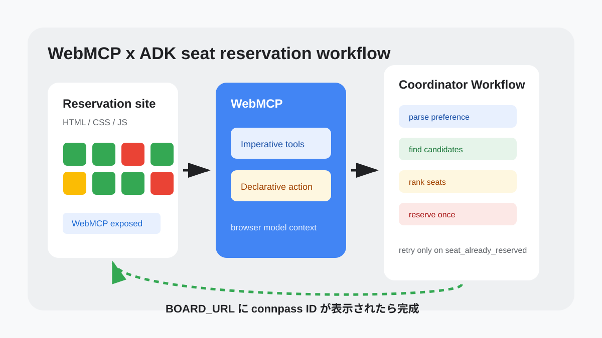
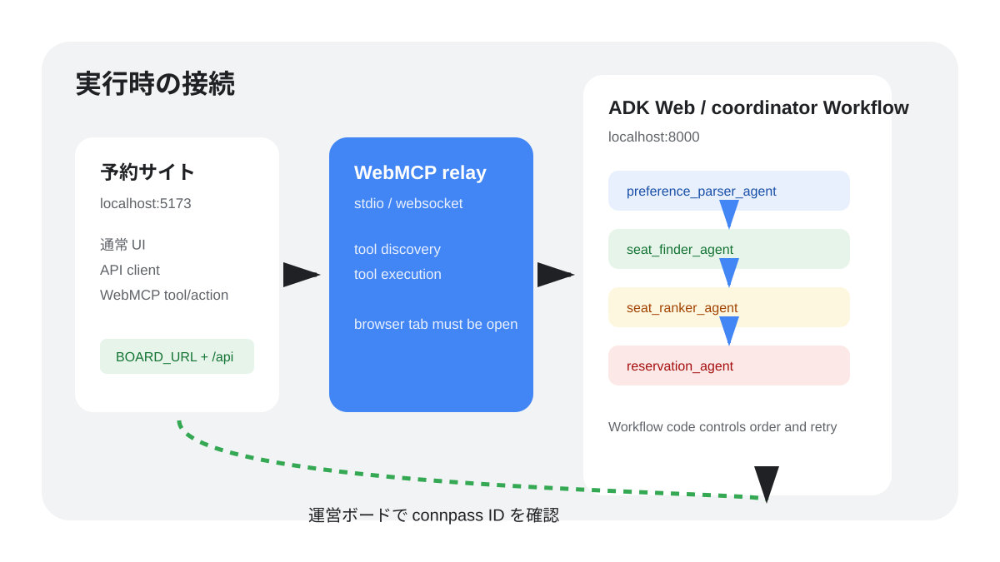
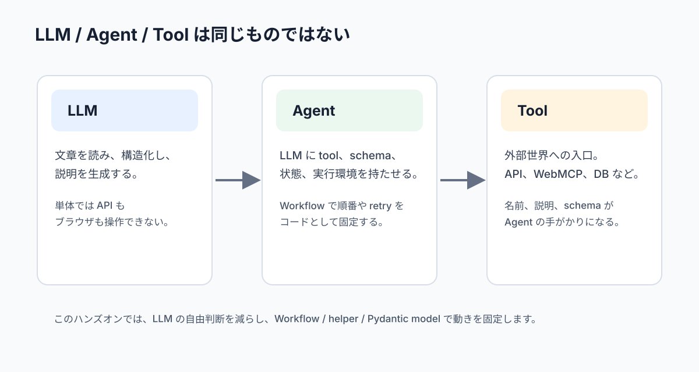
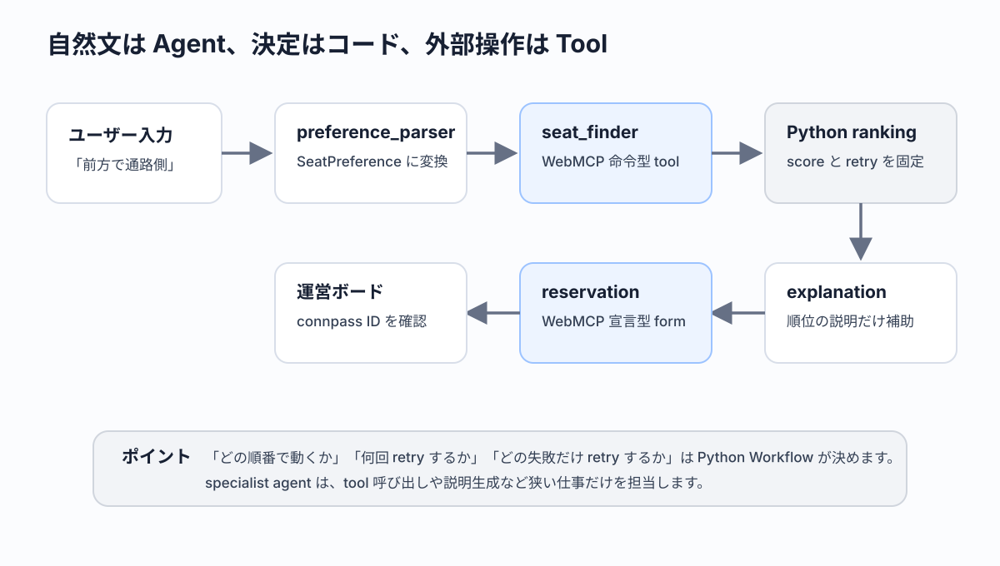

summary: WebMCP と Google ADK のA2A multi-agent で座席予約エージェントを作る
id: webmcp-adk
categories: Web, AI
environments: Web
status: Published
feedback link: https://github.com/googlecodelabs/your-first-pwapp/issues
author: GDG on Campus University of Osaka

# WebMCP x ADK で作る座席予約マルチエージェント

## はじめに

Duration: 0:07:00

このコードラボでは、すでに完成している座席予約サイトに WebMCP を追加し、Google ADK のA2A multi-agent からその Web ページを操作できるようにします。



### このコードラボで作るもの

完成すると、ADK Web で `coordinator` に「前方で通路側の席がいいです」と依頼すると、3つの A2A specialist service と coordinator Workflow が役割分担して座席を予約します。

`preference_parser_agent` は自然文の希望を構造化します。`seat_finder_agent` は命令型 WebMCP tool で空席を探します。`agents/shared/scoring.py` は候補席をスコア順に並べ、`explanation_agent` はその理由説明を補助します。`reservation_agent` は宣言型 WebMCP form tool で指定された 1 席を予約します。

`coordinator` は prompt ではなく Python の `Workflow` node として実行順を固定します。parser → finder A2A service → Python ranking → explanation A2A service → reservation A2A service の順に呼び、予約競合が起きた場合は ranking の次候補を試します。

最後に、運営がホストする `BOARD_URL` の予約閲覧ページで、自分の connpass ID が表示されることを確認します。

### このコードラボで学ぶこと

- LLM、Agent、Tool の役割を区別する方法
- API、MCP、WebMCP の違いを説明する方法
- 既存の Web サイトに WebMCP の入口を追加する方法
- 命令型 WebMCP tool で情報取得機能を公開する方法
- 宣言型 WebMCP form tool で予約フォームを公開する方法
- 自然文の希望を structured output に変換する方法
- finder / reservation / explanation を A2A service として分ける方法
- ADK の `Workflow` で A2A multi-agent の実行順をコードとして固定する方法
- 予約競合時に coordinator が再試行する流れを設計する方法

### 必要なもの

- Git
- Chrome または WebMCP 検証に使うブラウザ
- ターミナルまたは PowerShell
- VS Code などのエディタ
- Discord の `#260718_webmcp_agent` チャンネルを見られること

### 前提知識

- HTML / CSS / JavaScript の基本的な読み書き
- Python ファイルを開いて編集する基本操作
- ターミナルでコマンドを実行する基本操作

### このコードラボで扱わないこと

- 運営ホスト API の実装
- 管理 endpoint、リセット endpoint、認証認可
- 複数席の同時予約
- WebMCP ランタイムそのものの実装
- Vertex / Reasoning Engine deploy

本編では A2A multi-agent を扱います。Vertex / Reasoning Engine への deploy は Extra に置きます。

## セットアップする

Duration: 0:12:00

このステップでは、starting template を開き、依存関係と設定ファイルを準備します。

参加者が使う GitHub repository は次の2つです。

- template: https://github.com/gdg-jp/webmcp-adk-template
- example: https://github.com/gdg-jp/webmcp-adk-example

手を動かすときは template を使います。詰まったとき、完成形を確認したいとき、TA と一緒に差分を見るときだけ example を参照してください。

この codelab repository 内にも確認用として `webmcp-adk/repos/template` と `webmcp-adk/repos/example` を置いていますが、当日の参加者向け導線は GitHub の template repository です。

### テンプレートを開く

リポジトリのルートから、テンプレートディレクトリへ移動します。

```bash
cd webmcp-adk/repos/template
```

VS Code を使う場合は、このディレクトリを開きます。

```bash
code .
```

このコードラボでは、参加者向けの操作は `template` で行います。完成コードを確認したいときだけ、GitHub の example repository または `webmcp-adk/repos/example` を参照してください。

### setup script を実行する

macOS の場合は次を実行します。

```bash
./scripts/setup.sh
```

Windows の場合は次を実行します。

```bat
scripts\setup.bat
```

`setup` は Bun と uv を確認し、なければ自動でインストールします。そのあと `CONNPASS_ID` と `BOARD_URL` を聞き、`.env` と `public/config.js` を生成します。

**期待される出力:**

```text
セットアップが完了しました。
.env の GOOGLE_API_KEY を自分の Gemini API キーに変更してください。
```

### Gemini API key を設定する

`.env` を開き、`GOOGLE_API_KEY` を Discord の `#260718_webmcp_agent` に投稿された値へ変更します。

`.env`

```bash
GOOGLE_API_KEY=YOUR_GEMINI_API_KEY
CONNPASS_ID=your_connpass_id
BOARD_URL=https://example.com
WEB_URL=http://localhost:5173
```

`public/config.js` にはブラウザで使う値だけが入ります。Gemini API key はブラウザへ出しません。

> **Warning:** `.env` に書いた Gemini API key は公開しないでください。画面共有やコミットにも注意してください。

### 予約サイトを起動する

最初のターミナルで Web 側を起動します。

```bash
./scripts/start-web.sh
```

Windows の場合は次を実行します。

```bat
scripts\start-web.bat
```

ブラウザで `http://localhost:5173` を開きます。座席一覧が表示されれば、運営 API への接続はできています。

## 全体像を確認する

Duration: 0:12:00

このステップでは、今日の設計を確認します。コードを書く前に、どの部分が既存サイトで、どの部分を WebMCP / ADK として追加するのかを分けておくと迷いにくくなります。



### 既存サイトに WebMCP を足す

今回の Web 側は「すでに完成している座席予約サイト」です。HTML、CSS、API client、座席描画、フォーム送信、デバッグページは用意済みです。

あなたが追加するのは、既存サイトの機能を Agent に見つけてもらうための WebMCP 部分です。現実の開発でも、すでに動いている社内ツールや業務サイトに対して「Agent から使えるようにして」と頼まれることがあります。このコードラボは、その状況を小さく再現しています。

### 3 A2A specialist と coordinator Workflow の責務

今回の Agent は1つの巨大な instruction にすべてを詰め込みません。むしろ本編の完成コードでは `instruction=` パラメータを使わず、役割分担、schema、toolset、Workflow node、Python helper で動きを縛ります。

| Agent | 責務 | 使うもの |
| --- | --- | --- |
| `coordinator` | ユーザーの入口、実行順、retry 管理、最終応答 | ADK Workflow |
| `preference_parser_agent` | 自然文の希望を `SeatPreference` へ変換する | structured output |
| `seat_finder_agent` | 空席を調査し、最大3件の候補を理由つきで返す | 命令型 WebMCP |
| `agents/shared/scoring.py` | preference と候補を比較し、スコア順に並べる | Python helper |
| `reservation_agent` | 指定された1席を1回だけ予約する | 宣言型 WebMCP |

この分担にすると、WebMCP の2つの型と Agent の役割が対応します。調べる Agent は命令型 tool を使い、予約する Agent は宣言型 form tool を使います。希望を読む Agent と候補を順位付けする Agent は WebMCP を直接触らず、LLM が得意な構造化と比較判断だけを担当します。

### 本編と Extra の境界

本編では A2A multi-agent を作ります。`Workflow` の node から `RemoteA2aAgent` を持つ remote agent を順番に呼び出し、検索、予約、retry の流れを Python コードとして固定します。

本編では A2A を扱います。specialist agent を別プロセスの service として公開し、coordinator から RemoteA2aAgent で呼び出します。

## LLM、Agent、Tool を整理する

Duration: 0:10:00

このステップでは、これから書くコードの意味を確認します。用語を曖昧にしたまま実装すると、どのファイルが何を担当しているのか分かりにくくなります。



### LLM は出力を作る

LLM は、入力された文章や構造化データをもとに、次の文章や JSON のような出力を生成します。単体の LLM は、外部 API を勝手に呼んだり、ブラウザのボタンを押したりできません。

たとえば「前方で通路側がいい」と入力すると、LLM はその希望を理解できます。しかし、現在どの席が空いているかは、外部の予約システムを見なければ分かりません。

ここを混ぜてしまうと、Agent 開発が急に分かりにくくなります。LLM は「言葉を読む」「候補を説明する」「構造化された形へ寄せる」ことが得意です。一方で、「今の空席一覧を取得する」「予約 API を呼ぶ」「何回 retry するかを固定する」ことは、LLM の内側から自然に発生するわけではありません。

このハンズオンでは、LLM に任せる部分を意図的に狭くします。自然文の希望を `SeatPreference` に寄せるところ、WebMCP tool を呼び出すところ、Python が決めた ranking を説明するところは LLM の力を使います。逆に、スコア計算、retry 条件、最終成功条件は Python コードで固定します。

### Agent は Tool を使って行動する

Agent は LLM に tool、状態、実行ルールを持たせたアプリケーションです。Agent は「この情報が必要だから tool を呼ぶ」「失敗したから別の手段を試す」のような流れを作れます。

今回の `coordinator` は、ユーザーの希望を受け取り、`preference_parser_agent`、`seat_finder_agent`、Python の scoring helper、`reservation_agent` を順番に呼びます。予約済みだった場合は、Python ranking の次候補で再試行します。

ただし、この「順番」は自然言語のお願いとして書くのではなく、`Workflow` と Python node で固定します。ここが今回の設計の中心です。Agent が増えると、なんとなく「全部 LLM に相談して進める」形にしたくなりますが、ハンズオンでは再現性が大切です。どのファイルを直せば挙動が変わるのか、参加者が追えるようにします。

`coordinator` は入口です。`seat_finder_agent` は空席を調べる A2A service、`reservation_agent` は予約する A2A service、`explanation_agent` は説明を補助する A2A service です。service を分けることで、WebMCP の命令型 tool と宣言型 form tool の境界も見えやすくなります。

### Tool は外部世界との接点

Tool は Agent が外部世界へ触るための小さな関数です。今回の tool は WebMCP 経由でブラウザ上の予約サイトへつながります。

このコードラボでは、tool と Agent の責務を意図的に狭くします。`preference_parser_agent` は希望の構造化だけ、`seat_finder_agent` は検索だけ、`agents/shared/scoring.py` は順位付けだけ、`reservation_agent` は予約だけです。責務を狭くすると、長いプロンプトに頼らず、失敗したときに原因をコードから追いやすくなります。

Tool は「何でもできる便利関数」ではありません。名前、説明、入力 schema、戻り値の形が、Agent にとっての使い方になります。`list_available_seats` という tool 名なら「席を一覧する」ことが分かります。`reserve_seat` という form tool 名なら「予約という副作用がある」ことが分かります。

今回の WebMCP 実装では、既存の予約サイトにある低レイヤの関数を使い回します。`fetchSeats()`、`fetchSeatDetail()`、`fetchReservations()`、`reserveSeat()` はもともと人間向け UI のためにあります。WebMCP はそれを Agent からも見える入口として公開します。



### 今回の責務分担を先に覚える

この先の実装では、次の分担が何度も出てきます。

| 担当 | やること | やらないこと |
| --- | --- | --- |
| `preference_parser_agent` | 自然文を `SeatPreference` に寄せる | 空席検索、予約 |
| `seat_finder_agent` | 命令型 WebMCP tool で候補を集める | 最終順位決定、予約 |
| `agents/shared/scoring.py` | Python code で候補をスコアリングする | WebMCP tool 呼び出し |
| `reservation_agent` | 宣言型 WebMCP form tool で1席を予約する | 候補探し、retry 判断 |
| `coordinator` | 実行順、state、retry、最終応答を管理する | WebMCP tool の中身を実装する |

この表を覚えておくと、後半でファイルが増えても迷いにくくなります。特に「検索」と「予約」を同じ Agent に持たせないことが大切です。検索は読み取り、予約は状態変更です。状態変更を狭い場所へ閉じ込めると、当日のデバッグでも「どこで予約が走ったか」を追いやすくなります。

### 動かした時の想定動作

このステップではまだコードは動かしません。ここで期待する状態は、用語と役割の見通しが立っていることです。

この後の実装で `seat_finder_agent` が予約しようとしていたら、責務が広がりすぎています。`reservation_agent` が候補探しを始めたら、同じく責務がずれています。`coordinator` が retry 回数を持っていなければ、予約競合時の制御が曖昧になります。

つまり、この時点での成功条件は「どのファイルがどの責務を持つか」を説明できることです。

## MCP と WebMCP を整理する

Duration: 0:12:00

このステップでは、API、MCP、WebMCP の違いを確認します。

### API はアプリ同士の契約

API は、アプリケーション同士がデータをやり取りするための契約です。今回の予約サイトは `BOARD_URL + "/api"` にアクセスし、座席一覧や予約一覧を取得します。

API を使うとき、開発者は endpoint、method、request body、response body を知っている必要があります。アプリ側のコードは、その契約に合わせて `fetch` を書きます。

### MCP は Agent が tool を使うための契約

MCP は、Agent が tool を発見し、入力 schema を理解し、実行するための契約です。API がアプリケーション向けの接続口だとすると、MCP は Agent 向けの接続口です。

MCP の重要な点は、tool の名前、説明、入力 schema が Agent に伝わることです。Agent はそれを見て「この tool なら空席を取れそうだ」と判断できます。

### WebMCP は Web ページを Agent に見せる

WebMCP は Web ページ上の機能を Agent に見つけやすくします。通常の Web ページは人間がクリックする前提で作られています。WebMCP を追加すると、Web ページ上の関数やフォームが Agent から tool として見えるようになります。

今回の予約サイトでは、命令型 WebMCP で情報取得 tool を登録し、宣言型 WebMCP で予約フォームを form tool として公開します。

## 既存予約サイトを読む

Duration: 0:10:00

このステップでは、WebMCP を足す前の予約サイトを確認します。ここは実装済みなので、流れを読むだけで構いません。

### API client を確認する

`public/script.js` には次の関数が用意されています。

```js
export async function fetchSeats() {}
export async function fetchSeatDetail(seatId) {}
export async function reserveSeat({ seatId, displayName, note = "" }) {}
export async function fetchReservations() {}
```

それぞれの役割は次の通りです。

| 関数 | 役割 |
| --- | --- |
| `fetchSeats` | 座席一覧を取得する |
| `fetchSeatDetail` | 1席の詳細を取得する |
| `reserveSeat` | connpass ID で1席予約する |
| `fetchReservations` | 予約一覧を取得する |

WebMCP 実装では、この4関数を作り直しません。すでに存在する機能を Agent に公開することが今回の目的です。

### 座席タグを確認する

座席にはシンプルなタグを使います。

| タグ | 意味 |
| --- | --- |
| `front` | 前方の席 |
| `aisle` | 通路側の席 |
| `quiet` | 比較的静かな席 |
| `pair` | ペア参加者に向いている席 |

`pair` は2席同時予約ではありません。本編では1席だけ予約します。

## WebMCP を実装してデバッグする

Duration: 0:35:00

このステップでは、ブラウザが公開する WebMCP の入口を取得します。

### `modelContext` を返す

`public/script.js` の `modelContext()` を更新します。

ここで実装する `modelContext()` は、WebMCP の入口を1箇所に集めるための helper です。

後続の `registerTool()` と `HTML form 属性` は、毎回 `document.modelContext` を直接参照しません。まず `modelContext()` を呼び、WebMCP runtime が見つかるかを確認します。こうしておくと、ランタイム差分が出たときに直す場所が1箇所で済みます。

この関数では、次の順で候補を見ます。

```text
1. document.modelContext
2. window.modelContext
3. window.mcpb?.modelContext
4. どれもなければ null
```

`null` を返す可能性を残しているのは、通常の予約 UI と WebMCP を切り分けるためです。WebMCP が見つからない環境でも、座席一覧やフォーム送信は通常の Web アプリとして動きます。

`public/script.js`

```diff js
 export function modelContext() {
-  // TODO(Handson): Return the WebMCP model context exposed by the browser runtime.
-  return null;
+  return document.modelContext ?? window.modelContext ?? window.mcpb?.modelContext ?? null;
 }
```

> **Tips:** `??` は左側が `null` または `undefined` のときだけ右側を使う JavaScript の演算子です。WebMCP runtime の差分を吸収しながら、最後は `null` に落とすために使っています。

`document.modelContext` は WebMCP の入口です。ランタイムや検証環境によって名前が揺れる可能性があるため、`window.modelContext` や `window.mcpb?.modelContext` も見ています。

この関数が `null` を返す場合でも、通常の予約 UI は動きます。ただし Agent から WebMCP として見つけることはできません。

ここまで実装すると、`modelContext()` は次の状態になります。

`public/script.js`

```js
export function modelContext() {
  return document.modelContext ?? window.modelContext ?? window.mcpb?.modelContext ?? null;
}
```

この時点では、まだ命令型 tool も宣言型 form tool も用意していません。まず「WebMCP の入口を見つける」だけを完成させます。

### デバッグページで確認する

`http://localhost:5173/debug.html` を開き、WebMCP チェックを押します。まだ tool は登録していないため、ここでは `modelContext` の検出状態を確認します。

> **補足:** WebMCP ランタイムがないブラウザでは `modelContext` は未検出になります。本番の確認では WebMCP 対応ブラウザまたは local relay の起動状態を確認してください。

### 命令型 WebMCP を実装する

このステップでは、JavaScript から WebMCP tool を登録します。`seat_finder_agent` はこの tool を使って、空席や席詳細を取得します。

### 情報取得 tool を登録する

`registerImperativeWebMcpTools()` を次のように更新します。

この関数は、Agent がブラウザから情報を取得するための入口を登録します。

重要なのは、ここで新しい予約ロジックを書いていないことです。`fetchSeats()`、`fetchSeatDetail()`、`fetchReservations()` は既存の API client です。WebMCP の実装では、それらを Agent から呼べる tool として包みます。

今回登録する tool は3つです。

| tool | 役割 | 使う場面 |
| --- | --- | --- |
| `list_available_seats` | 空席候補を一覧する | finder の最初の調査 |
| `get_seat_detail` | 1席の詳細を取る | 候補の補足確認 |
| `list_reservations` | 予約状況を見る | 見えている競合の確認 |

この3つはすべて命令型 WebMCP です。JavaScript から `registerTool()` を呼び、tool 名、説明、入力 schema、実行 handler を登録します。

実装では、最初に `webMcpStatus()` を見ます。WebMCP runtime がない場合や、tool 登録 API がない場合に、例外ではなく `{ registered: false, reason: ... }` を返すためです。debug page はこの戻り値を表示できます。

`public/script.js`

```diff js
 export function registerImperativeWebMcpTools() {
-  // TODO(Handson): Register list_available_seats, get_seat_detail, and list_reservations.
-  return {
-    registered: false,
-    reason: "TODO(Handson): register imperative WebMCP tools",
-  };
+  const status = webMcpStatus();
+  if (!status.available) {
+    return { registered: false, reason: "document.modelContext is not available" };
+  }
+  if (webMcpRegistrationState.imperative) {
+    return { registered: true, reason: "already registered" };
+  }
+  if (!status.hasRegisterTool) {
+    return { registered: false, reason: "tool registration API is not available" };
+  }
+
+  registerTool(
+    {
+      name: "list_available_seats",
+      description: "List available seats. Optionally filter by front, aisle, quiet, or pair.",
+      inputSchema: {
+        type: "object",
+        properties: {
+          tag: {
+            type: "string",
+            enum: ["front", "aisle", "quiet", "pair"],
+          },
+        },
+      },
+    },
+    async ({ tag } = {}) => {
+      const seats = await fetchSeats();
+      return seats
+        .filter((seat) => seatIsAvailable(seat) && (!tag || seatTags(seat).includes(tag)))
+        .map(normalizeSeat);
+    },
+  );
+
+  registerTool(
+    {
+      name: "get_seat_detail",
+      description: "Get detailed information for a single seat ID.",
+      inputSchema: {
+        type: "object",
+        required: ["seatId"],
+        properties: {
+          seatId: { type: "string" },
+        },
+      },
+    },
+    async ({ seatId }) => fetchSeatDetail(seatId),
+  );
+
+  registerTool(
+    {
+      name: "list_reservations",
+      description: "List current reservations visible to this booking board.",
+      inputSchema: {
+        type: "object",
+        properties: {},
+      },
+    },
+    async () => fetchReservations(),
+  );
+
+  webMcpRegistrationState.imperative = true;
+  return { registered: true, reason: "registered" };
 }
```

> **Tips:** `registerTool(definition, handler)` の `definition` が Agent に見える説明で、`handler` が実際にブラウザで動く処理です。Agent は handler の中身ではなく、tool 名、description、inputSchema を手がかりに呼び出す tool を選びます。

ここでは3つの tool を登録しています。`list_available_seats` は候補探しの入口です。`get_seat_detail` は候補の詳細確認に使います。`list_reservations` は見えている予約状態を確認するときに使います。

### なぜ schema が必要か

Agent は JavaScript の関数本体を読むわけではありません。tool 名、説明、`inputSchema` を見て「どう呼べばよいか」を判断します。

たとえば `tag` に `front`、`aisle`、`quiet`、`pair` だけを許可すると、Agent は存在しない `near-door` のような値を入れにくくなります。schema は Agent にとっての入力フォームです。

ここまで実装すると、命令型 WebMCP 登録部分は次の状態になります。

`public/script.js`

```js
export function registerImperativeWebMcpTools() {
  const status = webMcpStatus();
  if (!status.available) {
    return { registered: false, reason: "document.modelContext is not available" };
  }
  if (webMcpRegistrationState.imperative) {
    return { registered: true, reason: "already registered" };
  }
  if (!status.hasRegisterTool) {
    return { registered: false, reason: "tool registration API is not available" };
  }

  registerTool(
    {
      name: "list_available_seats",
      description: "List available seats. Optionally filter by front, aisle, quiet, or pair.",
      inputSchema: {
        type: "object",
        properties: {
          tag: {
            type: "string",
            enum: ["front", "aisle", "quiet", "pair"],
          },
        },
      },
    },
    async ({ tag } = {}) => {
      const seats = await fetchSeats();
      return seats
        .filter((seat) => seatIsAvailable(seat) && (!tag || seatTags(seat).includes(tag)))
        .map(normalizeSeat);
    },
  );

  registerTool(
    {
      name: "get_seat_detail",
      description: "Get detailed information for a single seat ID.",
      inputSchema: {
        type: "object",
        required: ["seatId"],
        properties: {
          seatId: { type: "string" },
        },
      },
    },
    async ({ seatId }) => fetchSeatDetail(seatId),
  );

  registerTool(
    {
      name: "list_reservations",
      description: "List current reservations visible to this booking board.",
      inputSchema: {
        type: "object",
        properties: {},
      },
    },
    async () => fetchReservations(),
  );

  webMcpRegistrationState.imperative = true;
  return { registered: true, reason: "registered" };
}
```

`seat_finder_agent` は、この3つの tool だけを使います。予約 form tool はまだ使いません。

### 宣言型 WebMCP を実装する

このステップでは、予約フォームを WebMCP の宣言型 form tool として公開します。`reservation_agent` はこの form tool を使って、指定された1席を予約します。

### 予約フォームに属性を追加する

`public/index.html` の予約フォームを次のように更新します。

命令型 tool は「JavaScript から関数を登録する」形でした。宣言型 WebMCP は違います。既存の `<form>` に `toolname`、`tooldescription`、`toolautosubmit` を書き、Web ページ上の通常フォームを Agent から使える tool として公開します。

この form tool も、通常 UI の予約処理を作り直しません。`toolautosubmit` によりフォーム送信が発火し、既存の submit handler が `reserveSeat()` を呼びます。人間がフォームから予約しても、Agent が WebMCP form tool から予約しても、同じ低レイヤの予約関数を通る構造です。

`reservation_agent` は、この `reserve_seat` だけを使います。空席調査や候補選定はしません。

`public/index.html`

```diff html
       <section class="panel">
         <h2>予約</h2>
-        <form id="reservationForm" class="form" method="post">
+        <form
+          id="reservationForm"
+          class="form"
+          method="post"
+          toolname="reserve_seat"
+          tooldescription="Reserve exactly one seat for the configured connpass ID."
+          toolautosubmit
+        >
           <label>
             席 ID
             <input id="seatId" name="seatId" autocomplete="off" required />
           </label>
```

> **Tips:** 宣言型 WebMCP では、フォームの入力欄は通常の HTML と同じ `name` 属性で識別されます。今回なら `seatId`、`displayName`、`note` が Agent から渡せる入力になります。

命令型 tool は「関数を登録する」感覚が強い実装です。宣言型 form tool は、既存のフォームに意味を与える実装です。

今回の予約フォームは人間も使えます。WebMCP を追加すると、Agent も同じ予約機能を使えるようになります。これが「既存サイトに WebMCP を足す」感覚です。

### form 属性の意味を読む

`toolname` は、Agent から見える tool 名です。

```html
toolname="reserve_seat"
```

`tooldescription` は、Agent が「いつ使うべきか」を判断するための説明です。短くてもよいので、副作用があること、1席だけ予約すること、設定済みの connpass ID を使うことが伝わる文にします。

```html
tooldescription="Reserve exactly one seat for the configured connpass ID."
```

`toolautosubmit` は、Agent が form tool を呼んだときにフォーム送信まで進めるための属性です。本編では「Agent が席を予約する」ことが成功条件なので付けます。

### 現在のコードベース

ここまで進めると、Web 側の関係ファイルは次の状態になります。

```text
public/
  index.html      # 宣言型 WebMCP form 属性を追加したファイル
  script.js       # 通常 UI、API client、命令型 WebMCP tools
  debug.html      # デバッグ画面
  debug.js        # API / WebMCP チェック
  style.css       # 見た目
  config.js       # setup で生成される設定
```

この時点で、Web 側の WebMCP 実装は完成です。次は Python の ADK 側から、この WebMCP tool を見つけて使えるようにします。

### WebMCP をデバッグする

このステップでは、WebMCP の登録状態を確認します。

### デバッグページを開く

ブラウザで `http://localhost:5173/debug.html` を開きます。

**API チェック**を押すと、`fetchSeats` と `fetchReservations` が動くか確認できます。**WebMCP チェック**を押すと、`modelContext`、命令型 tool 登録、宣言型 form tool 登録の状態を確認できます。

**期待される状態:**

```text
OK connpassId
OK boardUrl
OK fetchSeats
OK fetchReservations
OK modelContext
OK registerImperativeWebMcpTools
OK 予約フォームの宣言型 WebMCP 属性
```

`modelContext` が NG の場合、WebMCP ランタイムまたは relay 側の問題です。`fetchSeats` が NG の場合、`BOARD_URL` または運営 API 側の問題です。切り分けのために、API と WebMCP は別々に確認します。

### 動かした時の想定動作

このステップが完了すると、通常の予約サイトとしての動きは変わらず、Agent から見える入口だけが増えます。

ブラウザで `http://localhost:5173/` を開くと、座席一覧が表示され、フォームから手動予約できます。これは WebMCP を追加する前からある通常 UI です。次に `http://localhost:5173/debug.html` を開いて WebMCP チェックを押すと、`modelContext`、命令型 tool、宣言型 form tool の状態が表示されます。

期待する見え方は次の通りです。

```text
WebMCP modelContext: OK
Imperative tools: OK
Declarative form tool: OK
reserve_seat form: OK
```

ここで NG が出ても、すぐに ADK 側へ進まないでください。ADK 側はブラウザで登録された WebMCP tool を使うため、ブラウザ側の登録が見えていない状態では specialist agent も tool を発見できません。

画面イメージとしては、通常の予約サイト、デバッグページ、運営ボードの3つをブラウザで開いておくと分かりやすくなります。手動予約ができること、debug page で WebMCP が OK になること、運営ボードで予約者 ID が表示されることを別々に確認します。

## ADK multi-agent の設計を確認する

Duration: 0:12:00

このステップでは、Python 側の構成を確認します。

### ディレクトリ構成

`agents/` は次の構成です。

```text
agents/
  _common.py
  coordinator/
    agent.py
    specialists.py
  preference_parser/
    agent.py
  seat_finder/
    agent.py
  explanation/
    agent.py
  reservation/
    agent.py
  shared/
    instructions.py
    models.py
    preference.py
    reservation.py
    scoring.py
    settings.py
    utils.py
```

`coordinator` が ADK Web で選ぶ root agent です。`seat_finder`、`reservation`、`explanation` は A2A service として別 port で起動し、`agents/coordinator/specialists.py` の `RemoteA2aAgent` proxy 経由で呼ばれます。

### 設定値を確認する

`agents/shared/settings.py` には、候補数と retry 回数があります。

`agents/shared/settings.py`

```python
MAX_SEAT_CANDIDATES = 3
MAX_RESERVATION_RETRIES = 2
```

候補数を変えたい場合は `MAX_SEAT_CANDIDATES` を変更します。競合時の再試行回数を変えたい場合は `MAX_RESERVATION_RETRIES` を変更します。

### 共通説明を確認する

`agents/shared/instructions.py` には、席タグの説明や共通制約があります。ファイル名は `instructions.py` ですが、本編の Agent 定義では `instruction=` パラメータに長文を入れません。教材用の共通テキストやメッセージ生成の材料として残しておきます。

このファイルを分けておくと、A2A specialist services と coordinator で同じ説明を使い回せます。タグの意味が agent ごとにずれると、parser、finder、explanation、coordinator の判断が食い違います。

## WebMCP toolset を実装する

Duration: 0:15:00

このステップでは、ADK から WebMCP local relay に接続する toolset を作ります。

### connection params を作る

`tools/webmcp_tools.py` の `build_webmcp_connection_params()` を更新します。

この関数は、ADK 側から WebMCP local relay を起動するための接続設定を作ります。

ブラウザ上の WebMCP tool は、Python プロセスから直接見えるわけではありません。ADK は MCP client として stdio server に接続し、その stdio server がブラウザ側の WebMCP runtime とつながります。

このコードラボでは、relay command を環境変数で差し替えられるようにします。

| 環境変数 | 役割 | 既定値 |
| --- | --- | --- |
| `WEB_URL` | 予約サイトの URL | `http://localhost:5173` |
| `WEBMCP_RELAY_COMMAND` | relay 起動コマンド | `bunx` |
| `WEBMCP_RELAY_ARGS` | relay に渡す引数 | `@mcp-b/webmcp-local-relay --url {WEB_URL}` |

この3つを分けておくと、当日の環境差分や relay 実装差分が出ても、Agent のコード全体を書き換えずに済みます。

`tools/webmcp_tools.py`

```diff python
 def build_webmcp_connection_params() -> StdioConnectionParams:
     """Build connection params for the local browser WebMCP relay."""
-    raise NotImplementedError(
-        "TODO(Handson): build StdioConnectionParams for the local WebMCP relay."
+    load_dotenv()
+
+    web_url = os.getenv("WEB_URL", "http://localhost:5173")
+    command = os.getenv("WEBMCP_RELAY_COMMAND", "bunx")
+    raw_args = os.getenv(
+        "WEBMCP_RELAY_ARGS",
+        f"@mcp-b/webmcp-local-relay --url {web_url}",
     )
+    args = shlex.split(raw_args)
+
+    return StdioConnectionParams(
+        server_params=StdioServerParameters(command=command, args=args)
+    )
```

> **Tips:** `load_dotenv()` が `.env` を読み込み、`shlex.split(...)` が環境変数の文字列を shell 風の引数リストへ変換します。relay の起動コマンドをコードに固定しすぎないことで、当日の差し替えがしやすくなります。

ADK の `McpToolset` は MCP server へ接続します。ここでは `bunx @mcp-b/webmcp-local-relay` を stdio server として起動し、ブラウザで開いている WebMCP ページへつなぎます。

ここまで実装すると、connection params は次の状態になります。

`tools/webmcp_tools.py`

```python
def build_webmcp_connection_params() -> StdioConnectionParams:
    """Build connection params for the local browser WebMCP relay."""

    load_dotenv()

    web_url = os.getenv("WEB_URL", "http://localhost:5173")
    command = os.getenv("WEBMCP_RELAY_COMMAND", "bunx")
    raw_args = os.getenv(
        "WEBMCP_RELAY_ARGS",
        f"@mcp-b/webmcp-local-relay --url {web_url}",
    )
    args = shlex.split(raw_args)

    return StdioConnectionParams(
        server_params=StdioServerParameters(command=command, args=args)
    )
```

この時点では、まだ finder 用 / reservation 用の toolset は作っていません。まず relay へ接続する低レイヤだけを完成させました。

### finder 用と reservation 用に分ける

同じ WebMCP relay に接続しますが、教材上は関数を分けます。

関数を分ける理由は、Agent ごとに責務を見やすくするためです。

`seat_finder_agent` は情報取得だけを行います。`reservation_agent` は予約 form tool だけを行います。両方が同じ WebMCP relay に接続するとしても、呼び出してよい tool は分けておく方が教材として読みやすくなります。

`tools/webmcp_tools.py`

```diff python
 def build_finder_webmcp_toolset() -> McpToolset:
-    raise NotImplementedError(
-        "TODO(Handson): build the finder WebMCP toolset with list/detail/reservation-list tools."
-    )
+    return _build_toolset(
+        ["list_available_seats", "get_seat_detail", "list_reservations"]
+    )
 
 
 def build_reservation_webmcp_toolset() -> McpToolset:
-    raise NotImplementedError(
-        "TODO(Handson): build the reservation WebMCP toolset with reserve_seat."
-    )
+    return _build_toolset(["reserve_seat"])
```

> **Tips:** finder 用と reservation 用で別関数にしておくと、Agent の責務と toolset の責務が対応します。ADK 側の tool filter が使えない場合でも、関数名と接続先を分けておけば「どの Agent が何を使うか」をコードで追えます。

ADK のバージョンによって tool filter の扱いが変わる可能性があります。そのため、関数名で意図を分け、toolset を組み立てる段階で「使ってよい tool」を制限します。

ここまで実装すると、`tools/webmcp_tools.py` の主要部分は次の状態になります。

`tools/webmcp_tools.py`

```python
def _build_toolset(tool_names: list[str]) -> McpToolset:
    """Create a toolset. Tool names are documented here and enforced by agent prompts."""

    try:
        return McpToolset(
            connection_params=build_webmcp_connection_params(),
            tool_filter=tool_names,
        )
    except TypeError:
        return McpToolset(connection_params=build_webmcp_connection_params())


def build_finder_webmcp_toolset() -> McpToolset:
    return _build_toolset(
        ["list_available_seats", "get_seat_detail", "list_reservations"]
    )


def build_reservation_webmcp_toolset() -> McpToolset:
    return _build_toolset(["reserve_seat"])
```

`tool_filter` が使える ADK バージョンでは tool 名で絞ります。使えない場合でも、finder と reservation の toolset 関数を分けることで、教材上の責務境界をコードに残します。

### 動かした時の想定動作

この時点では、まだ ADK Web から予約を実行しません。期待する状態は、Python 側が WebMCP local relay へ接続する準備を持っていることです。

後で `seat_finder_agent` が起動すると、`build_finder_webmcp_toolset()` 経由で `list_available_seats`、`get_seat_detail`、`list_reservations` が見えるようになります。`reservation_agent` が起動すると、`build_reservation_webmcp_toolset()` 経由で `reserve_seat` form tool が見えるようになります。

ここで失敗する場合、ブラウザ側ではなく Python と relay の接続を疑います。具体的には `bunx @mcp-b/webmcp-local-relay` が起動できるか、`.env` が読まれているか、Web ページを先に開いているかを確認します。

## 共有モデルを追加する

Duration: 0:14:00

このステップでは、specialist agent 間でやり取りする構造を定義します。

`create-multi-agent` の codelab でも、Workflow が複数の node をまたぐときは Pydantic model を使って「何を渡すのか」を明示しています。今回も同じ考え方です。

自然文のまま次の Agent に渡すこともできます。しかし、自然文だけにすると後続の Agent が毎回「この文章で一番大事な条件は何か」を読み直すことになります。`SeatPreference` や `RankedSeats` のような型を作っておくと、Workflow の途中で何が決まったかを見やすくできます。

### models.py を作る

`agents/shared/models.py` を確認します。

`agents/shared/models.py`

```python
from __future__ import annotations

from pydantic import BaseModel, Field


class SeatPreference(BaseModel):
    preferred_tags: list[str] = Field(default_factory=list)
    avoided_tags: list[str] = Field(default_factory=list)
    free_text: str = ""
    notes: list[str] = Field(default_factory=list)


class SeatCandidate(BaseModel):
    seatId: str
    label: str = ""
    tags: list[str] = Field(default_factory=list)
    availability: str = "unknown"
    detail: str = ""
    finderReason: str = ""


class SeatCandidates(BaseModel):
    candidates: list[SeatCandidate] = Field(default_factory=list)


class RankedSeat(BaseModel):
    seatId: str
    score: int = Field(ge=1, le=10)
    reason: str
    tradeoffs: list[str] = Field(default_factory=list)


class RankedSeats(BaseModel):
    rankedSeats: list[RankedSeat] = Field(default_factory=list)
    summary: str = ""


class TriedSeat(BaseModel):
    seatId: str
    reason: str = ""
    result: str = ""


class ReservationWorkflowResult(BaseModel):
    status: str
    triedSeats: list[TriedSeat] = Field(default_factory=list)
    finalSeatId: str | None = None
    message: str
```

このファイルは「Agent がどう考えるか」ではなく「Agent 同士が何を渡すか」を決めています。ここを明示すると、codelab の読者は Workflow の流れを追いやすくなります。

### SeatPreference

`SeatPreference` は、ユーザーの自然文希望を扱いやすくするための型です。

```python
class SeatPreference(BaseModel):
    preferred_tags: list[str] = Field(default_factory=list)
    avoided_tags: list[str] = Field(default_factory=list)
    free_text: str = ""
    notes: list[str] = Field(default_factory=list)
```

`preferred_tags` は「前方がいい」「通路側がいい」のような前向きな希望です。`avoided_tags` は「うるさい場所は避けたい」「出入りしにくい席は嫌だ」のような避けたい条件です。

このコードラボではタグを `front`, `aisle`, `quiet`, `pair` に絞ります。タグを絞ることで、explanation が比較しやすくなります。タグを増やす拡張は Extra に置きます。

### RankedSeat

`RankedSeat` は explanation の出力です。

```python
class RankedSeat(BaseModel):
    seatId: str
    score: int = Field(ge=1, le=10)
    reason: str
    tradeoffs: list[str] = Field(default_factory=list)
```

`score` は 1 から 10 です。ここでは厳密な統計スコアではなく、Agent が候補を比較して順番をつけるための目安です。

`tradeoffs` には「前方ではあるが通路側ではない」「静かだがペア向きタグはない」のような妥協点を入れます。最終応答で tradeoff を説明できると、Agent の判断が人間に伝わりやすくなります。

### settings.py を拡張する

`agents/shared/settings.py` を更新します。

この設定ファイルは、Workflow 全体の上限値を1箇所に集める場所です。

finder、explanation、coordinator のそれぞれに数値を直書きすると、変更時にずれます。たとえば finder は5件返すのに explanation は3件しか見ない、coordinator は2件しか retry しない、という状態が意図せず起きるかもしれません。

そこで、候補数、ランキング数、retry 回数を shared settings として置きます。

`agents/shared/settings.py`

```diff python
 MAX_SEAT_CANDIDATES = 3
+MAX_RANKED_SEATS = 3
 MAX_RESERVATION_RETRIES = 2
```

> **Tips:** finder の候補数、explanation の順位付け件数、coordinator の retry 回数は別の概念です。最初はすべて 3 件相当にそろえますが、定数を分けておくと後から安全に調整できます。

`MAX_SEAT_CANDIDATES` は finder が返す候補数です。`MAX_RANKED_SEATS` は explanation が順位付けして coordinator に渡す候補数です。

今はどちらも 3 です。値を分けておくと、将来 finder は5件拾い、explanation は3件に絞る、という拡張がしやすくなります。

ここまで実装すると、設定ファイルは次の状態になります。

`agents/shared/settings.py`

```python
MAX_SEAT_CANDIDATES = 3
MAX_RANKED_SEATS = 3
MAX_RESERVATION_RETRIES = 2
```

この値は、後続の specialist agent と coordinator Workflow から参照します。

### 動かした時の想定動作

このステップのコードは画面を直接変えません。期待する状態は、Workflow の途中結果を `SeatPreference`、`SeatCandidates`、`RankedSeats`、`ReservationWorkflowResult` として読めるようになることです。

ADK Web Inspector では、各 agent や node の出力が文字列として表示される場合があります。その場合でも、Python helper 側ではこの model に寄せて処理します。つまり、画面上の見え方が少し揺れても、Workflow の内部では同じ形にそろえる準備ができます。

## shared helper を実装する

Duration: 0:20:00

このステップでは、Agent に任せすぎていた判断を Python の helper に移します。

ここが今回のコード主体化の中心です。

LLM は自然文を読んだり、WebMCP tool を呼んだりできます。しかし、候補数の上限、タグの正規化、score の計算、retry してよい失敗の判定は、毎回同じ結果になってほしい処理です。

毎回同じであってほしい処理は、prompt ではなく Python code にします。

### utils.py を追加する

`agents/shared/utils.py` を作成します。

このファイルは ADK の出力を扱いやすい形へ変換します。Agent の出力は、文字列、Pydantic model、dict、イベントの parts など、実行経路によって形が揺れることがあります。

`dump()` と `text()` を用意しておくと、coordinator の中で毎回 `hasattr(...)` を書かなくて済みます。

`agents/shared/utils.py`

```python
from __future__ import annotations

import json
from typing import Any


def dump(value: Any) -> Any:
    if value is None:
        return None
    if hasattr(value, "model_dump"):
        return value.model_dump()
    if isinstance(value, list):
        return [dump(item) for item in value]
    if isinstance(value, tuple):
        return [dump(item) for item in value]
    if isinstance(value, dict):
        return {key: dump(item) for key, item in value.items()}
    return value


def text(value: Any) -> str:
    if value is None:
        return ""
    if isinstance(value, str):
        return value.strip()
    if hasattr(value, "model_dump_json"):
        return value.model_dump_json(indent=2)
    if isinstance(value, dict | list):
        return json.dumps(dump(value), ensure_ascii=False, indent=2)

    parts = getattr(value, "parts", None)
    if parts:
        return "\n".join(part.text for part in parts if getattr(part, "text", None)).strip()

    return str(value).strip()
```

この helper は目立ちませんが、Workflow をコードとして読みやすくする土台です。

### preference.py を追加する

`agents/shared/preference.py` を作成します。

parser agent は `SeatPreference` を返しますが、LLM の出力をそのまま後続へ渡すと、未対応タグや重複タグが混ざることがあります。

そこで `normalize_preference()` で次を保証します。

- `front / aisle / quiet / pair` 以外を除外する
- tag を lowercase にそろえる
- 重複を消す
- 空の場合は gentle default として `quiet` を入れる

`agents/shared/preference.py`

```python
SUPPORTED_TAGS = {"front", "aisle", "quiet", "pair"}
DEFAULT_PREFERRED_TAGS = ["quiet"]


def normalize_tags(values: list[str] | tuple[str, ...] | None) -> list[str]:
    tags: list[str] = []
    seen: set[str] = set()
    for value in values or []:
        tag = str(value).strip().lower()
        if tag in SUPPORTED_TAGS and tag not in seen:
            tags.append(tag)
            seen.add(tag)
    return tags
```

このような正規化は LLM に任せるより、コードで固定する方が向いています。

### scoring.py を追加する

`agents/shared/scoring.py` を作成します。

本編の順位決定は `explanation_agent` ではなく、Python の `score_candidate()` と `rank_seat_candidates()` が行います。

`score_candidate()` の考え方です。

```text
base score: 5
preferred tag に一致: +2
avoided tag に一致: -3
予約不可っぽい状態: -5
finderReason あり: +1
最後に 1〜10 に丸める
```

`agents/shared/scoring.py`

```python
def score_candidate(preference: SeatPreference, candidate: SeatCandidate) -> RankedSeat:
    tags = set(candidate.tags)
    preferred = set(preference.preferred_tags)
    avoided = set(preference.avoided_tags)
    matched = sorted(tags & preferred)
    avoided_hits = sorted(tags & avoided)

    score = 5
    score += len(matched) * 2
    score -= len(avoided_hits) * 3
    if candidate.availability.lower() in {"reserved", "unavailable", "false"}:
        score -= 5
    if candidate.finderReason:
        score += 1
    score = max(1, min(10, score))

    reason_bits = []
    if matched:
        reason_bits.append(f"matches preferred tags: {', '.join(matched)}")
    if not matched:
        reason_bits.append("keeps the request feasible even without a direct tag match")
    tradeoffs = [f"matches avoided tag: {tag}" for tag in avoided_hits]
    if not candidate.tags:
        tradeoffs.append("seat tags were not available in the finder output")

    return RankedSeat(
        seatId=candidate.seatId,
        score=score,
        reason="; ".join(reason_bits),
        tradeoffs=tradeoffs,
    )
```

score の式をコードにすると、参加者は「なぜこの席になったか」を読み解けます。ハンズオンが prompt 調整だけで終わらず、普通のプログラミングとして扱いやすくなります。

### reservation.py を追加する

`agents/shared/reservation.py` を作成します。

retry するかどうかは、reservation agent ではなく coordinator が判断します。その判断に使う関数が `is_reserved_conflict()` です。

`agents/shared/reservation.py`

```python
def is_reserved_conflict(value: Any) -> bool:
    normalized = text(value).lower()
    return "seat_already_reserved" in normalized or "already reserved" in normalized
```

この関数が `True` のときだけ、coordinator は次候補を試します。

API URL 間違い、Gemini API key 未設定、WebMCP relay 未接続のような失敗は retry しても直りません。だから retry 条件をコードで狭くします。

### 現在のコードベース

ここまでで、ADK 側の shared layer は次の構成になります。

```text
agents/shared/
  instructions.py
  models.py
  preference.py
  reservation.py
  scoring.py
  settings.py
  utils.py
```

このあと実装する specialist agent と coordinator Workflow は、この shared layer を使います。

### 動かした時の想定動作

このステップが完了すると、Agent の出力が多少揺れても Python 側で扱いやすくなります。

たとえば parser が `preferred_tags` に重複を返しても、`normalize_preference()` が重複を落とします。finder の出力が dict や model や text に揺れても、`coerce_seat_candidates()` が候補 list へ寄せます。予約失敗の文字列に `seat_already_reserved` が含まれていれば、`is_reserved_conflict()` が retry 対象として判定します。

参加者がここで見るべき成功条件は、画面ではなくコードの責務です。LLM の出力を信じ切らず、Workflow に渡す前に Python helper で整える構造になっていれば OK です。

## preference_parser_agent を実装する

Duration: 0:16:00

このステップでは、自然文を `SeatPreference` に変換する Agent を作ります。

なぜ parser を分けるのでしょうか。

1つの Agent が「希望を読む」「WebMCP で検索する」「候補を比較する」「予約する」まで全部やると、自然言語の制約が増えます。プロンプトで頑張るほど、どの失敗がどの責務に由来するのか見えにくくなります。

parser を分けると、最初に「ユーザーは何を望んでいるのか」を構造化できます。後続の finder と explanation は、その構造を見て動けます。

### agent.py を更新する

`agents/preference_parser/agent.py` を更新します。

この Agent は WebMCP tool を使いません。自然文を読み、`SeatPreference` の形で返すことだけに集中します。

そのため、ここで見るポイントは3つです。

- `description` と `SeatPreference` の field description が役割を表しているか
- `output_schema=SeatPreference` が指定されているか
- follow-up question をしない前提が schema と Workflow 側で吸収されているか

parser が聞き返しを始めると、Workflow が1ターンで終わらなくなります。このハンズオンでは、曖昧な希望は `notes` に残して先へ進めます。

`agents/preference_parser/agent.py`

```diff python
 preference_parser_agent = Agent(
     name="preference_parser_agent",
     model="gemini-2.0-flash",
     description=(
         "Convert a participant's seat request into SeatPreference. Supported tags are "
         "front, aisle, quiet, and pair. Put positive wishes in preferred_tags, unwanted "
         "conditions in avoided_tags, preserve nuance in free_text, and do not ask follow-up questions."
     ),
     mode="single_turn",
     output_schema=SeatPreference,
 )
```

> **Tips:** `output_schema=SeatPreference` が parser の出力形式を固定します。Agent の自由文回答をそのまま次へ渡すのではなく、`preferred_tags` や `avoided_tags` として扱える形にします。

`output_schema=SeatPreference` が重要です。これにより、Agent の出力は `SeatPreference` の形に寄せられます。

ここまで実装すると、`preference_parser_agent` は次の状態になります。

`agents/preference_parser/agent.py`

```python
preference_parser_agent = Agent(
    name="preference_parser_agent",
    model="gemini-2.0-flash",
    description=(
        "Convert a participant's seat request into SeatPreference. Supported tags are "
        "front, aisle, quiet, and pair. Put positive wishes in preferred_tags, unwanted "
        "conditions in avoided_tags, preserve nuance in free_text, and do not ask follow-up questions."
    ),
    mode="single_turn",
    output_schema=SeatPreference,
)
```

この時点で、自然文を構造化する準備ができました。次は、その希望をもとに空席候補を探す Agent を作ります。

### なぜ follow-up question をしないのか

本格的な予約 Agent なら、不足情報があれば聞き返す方が自然です。しかし90分ハンズオンでは、聞き返しを入れると Workflow が複雑になります。

今回は、曖昧な場合でも `notes` に「静かさは推測」「pair は明示なし」のような補足を入れ、先へ進みます。これにより、ADK Web で1回依頼したら最後まで流れる体験を優先します。

### 入力と出力の例

入力:

```text
前方で通路側、できれば静かな席がいいです。
```

期待する出力のイメージ:

```json
{
  "preferred_tags": ["front", "aisle", "quiet"],
  "avoided_tags": [],
  "free_text": "前方で通路側、できれば静かな席がいいです。",
  "notes": ["quiet は 'できれば' の弱い希望として扱う"]
}
```

この中間出力があると、explanation が「なぜこの席を選んだか」を説明しやすくなります。

### 動かした時の想定動作

ADK Web で最終実行したとき、parser は最初に呼ばれます。期待する出力は、自由文のままではなく `preferred_tags`、`avoided_tags`、`free_text`、`notes` を持つ `SeatPreference` です。

たとえば「前方で通路側」と入力した場合は、`preferred_tags` に `front` と `aisle` が入る想定です。ここで `preferred_tags` が空でも、`normalize_preference()` が最低限の補完を行います。つまり、parser は完璧である必要はありません。後続の helper と組み合わせて安定させます。

## seat_finder_agent を実装する

Duration: 0:14:00

このステップでは、空席調査担当の specialist agent を実装します。

### description と tools を設定する

`agents/seat_finder/agent.py` を更新します。

`seat_finder_agent` は WebMCP 命令型 tool を使う Agent です。

この Agent の責務は、候補を探すことです。予約はしません。順位付けもしすぎません。候補を最大3件に絞り、なぜ候補にしたのかを説明します。

ここで重要なのは、`tools=[build_finder_webmcp_toolset()]` を追加することです。これにより、finder はブラウザ側に登録した `list_available_seats`、`get_seat_detail`、`list_reservations` を使えるようになります。

`agents/seat_finder/agent.py`

```diff python
 seat_finder_agent = Agent(
     name="seat_finder_agent",
     model="gemini-2.0-flash",
     description=(
         "Use only imperative WebMCP tools to inspect the live seat board. Return raw facts "
         "about available single-seat candidates: seat IDs, labels, tags, availability, details, "
         "and visible reservation state. Do not reserve seats."
     ),
     mode="single_turn",
     tools=[
-        # TODO(Handson): Add build_finder_webmcp_toolset() after implementing it.
+        build_finder_webmcp_toolset(),
     ],
 )
```

> **Tips:** `tools=[build_finder_webmcp_toolset()]` を入れることで、この Agent だけが命令型 WebMCP tool を使えるようになります。予約側の toolset を渡さないことが、検索と予約の分離になります。

`seat_finder_agent` は予約しません。候補を探し、理由を添えて返すだけです。責務を狭くすることで、予約競合の処理を coordinator に集められます。

ここまで実装すると、`seat_finder_agent` は次の状態になります。

`agents/seat_finder/agent.py`

```python
seat_finder_agent = Agent(
    name="seat_finder_agent",
    model="gemini-2.0-flash",
    description=(
        "Use only imperative WebMCP tools to inspect the live seat board. Return raw facts "
        "about available single-seat candidates: seat IDs, labels, tags, availability, details, "
        "and visible reservation state. Do not reserve seats."
    ),
    mode="single_turn",
    tools=[build_finder_webmcp_toolset()],
)
```

この時点で、ブラウザ上の空席情報を Agent から取得できるようになります。

### 動かした時の想定動作

最終実行時、`seat_finder_agent` は A2A service として起動し、WebMCP relay 経由でブラウザ上の命令型 tool を呼びます。

期待する動きは、最初に空席一覧を取得し、必要に応じて席詳細や予約一覧を確認することです。ここでは予約は行いません。もし ADK Web Inspector で `reserve_seat` が finder 側から呼ばれていたら、toolset の分離が崩れています。

## explanation_agent を薄くする

Duration: 0:16:00

このステップでは、`explanation_agent` の役割を「順位決定」ではなく「説明補助」に寄せます。

今回の本編では、最終的な順位は Python の `agents/shared/scoring.py` が決めます。LLM に順位を任せると柔軟ですが、教材としては「なぜその順番になったか」「どこを直せば点数が変わるか」が見えにくくなります。

そこで、`rank_seat_candidates()` が候補を deterministic に並べ、`explanation_agent` はその結果を短く説明する補助役にします。

この分担にすると、順位がおかしいときは `score_candidate()` を見ればよく、説明文がおかしいときだけ `explanation_agent` を見ればよくなります。

### agent.py を更新する

`agents/explanation/agent.py` を更新します。

`explanation_agent` は WebMCP tool を持ちません。

また、候補を並べ替えません。Python workflow がすでに作った順位を受け取り、その理由を人間に読みやすくまとめるだけです。

ここで見るポイントは4つです。

- 候補外の seat ID を返さないこと
- Python ranking を並べ替えないこと
- WebMCP tool を持たないこと
- 説明が短く、予約結果に添えやすいこと

`agents/explanation/agent.py`

```diff python
 explanation_agent = Agent(
     name="explanation_agent",
     model="gemini-2.0-flash",
     description=(
         "Explain the Python-generated seat ranking without changing seat order, scores, "
         "seat IDs, candidates, or reservation decisions."
     ),
     mode="single_turn",
     output_schema=RankedSeats,
 )
```

> **Tips:** explanation には `tools` を渡しません。候補を増やす・取り直す・予約する役割ではなく、Python ranking の説明だけを担当するからです。

explanation には WebMCP tool を渡しません。ここを守ることで、WebMCP の宣言型・命令型の話と、Python scoring の話が分かれます。

ここまで実装すると、`explanation_agent` は次の状態になります。

`agents/explanation/agent.py`

```python
explanation_agent = Agent(
    name="explanation_agent",
    model="gemini-2.0-flash",
    description=(
        "Explain the Python-generated seat ranking without changing seat order, scores, "
        "seat IDs, candidates, or reservation decisions."
    ),
    mode="single_turn",
    output_schema=RankedSeats,
)
```

この時点で、Python ranking を説明する専門 Agent ができました。

### スコアの考え方

順位そのものは `agents/shared/scoring.py` の `score_candidate()` が決めます。

このコードラボの `score` は厳密な数式ではありません。参加者が理解しやすいよう、次の目安にします。

| score | 意味 |
| --- | --- |
| 9-10 | 希望タグにかなり一致し、懸念が少ない |
| 7-8 | 主要な希望に一致するが、小さな tradeoff がある |
| 5-6 | 一部一致するが、重要な希望が欠ける |
| 1-4 | 条件に合いにくい、または空席状態に懸念がある |

`score_candidate()` は、希望タグに一致したら加点し、避けたいタグに一致したら減点します。空席状態に懸念がある場合も減点します。

この点数設計はあえて素朴にしています。ハンズオン中に「なぜ A03 が上なのか」をコードで追えることを優先するためです。

### 入力と出力の例

Python helper には、coordinator が次のような構造を渡します。

```text
SeatPreference:
  preferred_tags = ["front", "aisle", "quiet"]
  avoided_tags = []

SeatCandidates:
  A03: tags = ["front", "aisle", "quiet"]
  B01: tags = ["aisle", "pair"]
  C05: tags = ["quiet"]
```

期待する Python ranking のイメージ:

```json
[
  {
    "seatId": "A03",
    "score": 10,
    "reason": "matches preferred tags: aisle, front, quiet",
    "tradeoffs": []
  },
  {
    "seatId": "B01",
    "score": 7,
    "reason": "matches preferred tags: aisle",
    "tradeoffs": []
  }
]
```

> **Tip:** 順位がおかしい場合は `explanation_agent` ではなく `score_candidate()` を見ます。説明が薄い場合だけ `explanation_agent` を調整します。

### 動かした時の想定動作

最終実行時、`explanation_agent` は Python がすでに作った ranking を説明します。期待する動きは、順位を変えず、seat ID を変えず、score を変えず、理由だけを読みやすくすることです。

ここで新しい候補席が増えたり、Python ranking と違う順番で返ってきたりする場合は、説明担当の責務が広がりすぎています。本編では ranking の正しさは `agents/shared/scoring.py` で確認し、説明の読みやすさだけを explanation 側で見ます。

## reservation_agent を実装する

Duration: 0:12:00

このステップでは、予約担当の specialist agent を実装します。

### 1席だけ予約する Agent にする

`agents/reservation/agent.py` を更新します。

`reservation_agent` は、状態を変える `reserve_seat` form tool を呼ぶ唯一の specialist agent です。

この Agent に許可する tool は `reserve_seat` だけです。検索 tool を渡さないことで、reservation が勝手に候補探しや retry をしないようにします。

予約は副作用があります。だからこそ、reservation agent の責務は「指定された seat ID を1回だけ試す」に絞ります。

`agents/reservation/agent.py`

```diff python
 reservation_agent = Agent(
     name="reservation_agent",
     model="gemini-2.0-flash",
     description=(
         "Use only the declarative WebMCP form tool reserve_seat to attempt the specified "
         "single-seat reservation once. Return the tool result so the Python workflow can inspect it."
     ),
     mode="single_turn",
     tools=[
-        # TODO(Handson): Add build_reservation_webmcp_toolset() after implementing it.
+        build_reservation_webmcp_toolset(),
     ],
 )
```

> **Tips:** reservation agent は `reserve_seat` を 1 回だけ呼びます。失敗時に次候補を選ぶ判断は coordinator Workflow に残すことで、副作用のある予約処理を追跡しやすくします。

`reservation_agent` は retry しません。指定された席を1回だけ予約し、成功または失敗を返します。retry を coordinator に置くことで、どの候補を試したかを coordinator が管理できます。

ここまで実装すると、`reservation_agent` は次の状態になります。

`agents/reservation/agent.py`

```python
reservation_agent = Agent(
    name="reservation_agent",
    model="gemini-2.0-flash",
    description=(
        "Use only the declarative WebMCP form tool reserve_seat to attempt the specified "
        "single-seat reservation once. Return the tool result so the Python workflow can inspect it."
    ),
    mode="single_turn",
    tools=[build_reservation_webmcp_toolset()],
)
```

この時点で、予約を1回だけ実行する専門 Agent ができました。次に coordinator で4つの specialist をつなぎます。

### 動かした時の想定動作

最終実行時、`reservation_agent` は指定された `seatId` を `reserve_seat` form tool へ渡します。期待する動きは、1席を1回だけ予約し、その結果を coordinator へ返すことです。

成功すれば `success` や予約済み seat ID が返ります。競合していれば `seat_already_reserved` を含む失敗が返ります。ここで次候補を探したり、勝手に retry したりしないことが重要です。retry は coordinator Workflow が担当します。

## coordinator を実装する

Duration: 0:18:00

このステップでは、ユーザーの入口になる root workflow を実装します。

ここで重要なのは、検索、予約、retry の流れを prompt に書かないことです。LLM に「この順番でやってね」とお願いするだけだと、うまくいくときは簡単ですが、失敗時の再現性が落ちます。

今回の coordinator は `Workflow` です。Python の `reserve_best_matching_seat` node が `preference_parser_agent`、`seat_finder_remote`、Python scoring helper、`explanation_remote`、`reservation_remote` を順番に呼びます。remote agent の中では `RemoteA2aAgent` が specialist A2A service を呼びます。

### Workflow に必要な import を確認する

`agents/coordinator/agent.py` では、`Agent` ではなく `Workflow` と `node` を使います。

`agents/coordinator/agent.py`

```diff python
 from __future__ import annotations
 
 from typing import Any
 
-from google.adk import Agent
-from google.adk.tools.agent_tool import AgentTool
+from google.adk import Context, Workflow
+from google.adk.workflow import node
 
 from agents.coordinator.specialists import (
     explanation_remote,
     seat_finder_remote,
     reservation_remote,
 )
 from agents.preference_parser.agent import preference_parser_agent
+from agents.shared.models import RankedSeat, SeatCandidates, SeatPreference, TriedSeat
+from agents.shared.preference import normalize_preference
+from agents.shared.reservation import build_failure_result, build_success_result, is_reserved_conflict
+from agents.shared.scoring import coerce_seat_candidates, rank_seat_candidates
 from agents.shared.settings import MAX_RANKED_SEATS, MAX_RESERVATION_RETRIES
+from agents.shared.utils import text
```

> **Tips:** `RemoteA2aAgent` の定義は `agents/coordinator/specialists.py` に分けます。`create-multi-agent` と同じく、coordinator 本体は Workflow の制御に集中します。

`Context` は workflow node の実行文脈です。`ctx.run_node(...)` を使うと、node の中から別の node や Agent を実行できます。

### Workflow の state 名を決める

Workflow では、途中結果を `ctx.state` に保存できます。

今回保存するのは、希望、候補、ランキング、試行履歴です。

`agents/coordinator/agent.py`

```diff python
+STATE_PREFERENCE = "seat_preference"
+STATE_CANDIDATES = "seat_candidates"
+STATE_RANKED_SEATS = "ranked_seats"
+STATE_TRIED_SEATS = "tried_seats"
```

> **Tips:** state は ADK Web の Inspector で途中状態を追うときにも役立ちます。失敗時に「parser は正しく動いたか」「finder は候補を返したか」「ranking は作られたか」を見分けやすくなります。

### Agent に渡す入力を組み立てる

specialist agent へ渡す文章は、coordinator 側の関数で組み立てます。

これにより、specialist agent に長い自然言語の workflow を持たせずに済みます。

`agents/coordinator/agent.py`

```diff python
+def build_finder_input(request_text: str, preference: SeatPreference) -> str:
+    return "\n\n".join(
+        [
+            "Find available seats for this participant.",
+            "Use the browser WebMCP tools to inspect the live reservation page.",
+            "Return seat IDs, labels, tags, availability, and a short reason.",
+            "Do not reserve a seat.",
+            "",
+            "Original request:",
+            request_text,
+            "Parsed preference:",
+            preference.model_dump_json(indent=2),
+        ]
+    )
+
+
+def build_explanation_input(
+    preference: SeatPreference,
+    candidates: SeatCandidates,
+    ranked_seats: list[RankedSeat],
+) -> str:
+    return "\n\n".join(
+        [
+            "The Python workflow has already ranked these seats. Do not reorder them.",
+            "Write a short explanation of the ranking for the final response.",
+            "Preference:",
+            preference.model_dump_json(indent=2),
+            "Candidates:",
+            candidates.model_dump_json(indent=2),
+            "Code ranking:",
+            "\n".join(f"{item.seatId}: score={item.score}; {item.reason}" for item in ranked_seats),
+        ]
+    )
```

> **Tips:** `build_explanation_input()` は explanation に順位を決めさせる入力ではありません。「すでに Python がこう並べたので説明して」と伝える入力です。

予約 agent へ渡す入力も、席 ID と ranking 理由だけに絞ります。

`agents/coordinator/agent.py`

```diff python
+def build_reservation_input(seat_id: str, preference: SeatPreference, ranked_seat: RankedSeat) -> str:
+    return "\n".join(
+        [
+            "Reserve exactly one seat through reserve_seat.",
+            f"seatId={seat_id}",
+            f"score={ranked_seat.score}",
+            f"reason={ranked_seat.reason}",
+            f"preferred_tags={', '.join(preference.preferred_tags)}",
+            "Attempt this seat once and return the tool result.",
+        ]
+    )
```

> **Tips:** 予約 agent に「次候補を探す」「retry する」という情報を渡さないのがポイントです。副作用のある予約処理は workflow が順番を管理します。

### Workflow node を実装する

ここから、Workflow の処理を小さな関数に分けます。

`reserve_best_matching_seat` に全部書くこともできます。しかし、参加者が読む教材としては、処理の境界が見えている方が理解しやすくなります。

ここでは次の順番をコードで固定します。

1. ユーザーの依頼文を文字列にする
2. `preference_parser_agent` を実行する
3. `seat_finder_remote` 経由で remote `seat_finder_agent` を実行する
4. `coerce_seat_candidates()` で候補を typed model に寄せる
5. `rank_seat_candidates()` で deterministic ranking を作る
6. `explanation_remote` 経由で remote `explanation_agent` に ranking の説明だけを依頼する
7. ranking の上位から最大 `1 + MAX_RESERVATION_RETRIES` 回まで `reservation_remote` 経由で remote `reservation_agent` を実行する
8. `seat_already_reserved` 以外なら完了として返す

`agents/coordinator/agent.py`

```diff python
+async def parse_preferences(ctx: Context, request_text: str) -> SeatPreference:
+    preference_output = await ctx.run_node(
+        preference_parser_agent,
+        node_input=request_text,
+        run_id="parse-preferences",
+        use_sub_branch=True,
+    )
+    preference = normalize_preference(preference_output, original_request=request_text)
+    ctx.state[STATE_PREFERENCE] = preference.model_dump()
+    return preference
+
+async def find_candidates(
+    ctx: Context,
+    request_text: str,
+    preference: SeatPreference,
+) -> SeatCandidates:
+    finder_output = await ctx.run_node(
+        seat_finder_remote,
+        node_input=build_finder_input(request_text, preference),
+        run_id="find-seats",
+        use_sub_branch=True,
+    )
+    candidates = coerce_seat_candidates(finder_output)
+    ctx.state[STATE_CANDIDATES] = candidates.model_dump()
+    return candidates
```
> **Tips:** `normalize_preference()` と `coerce_seat_candidates()` があるため、coordinator は LLM の戻り値をそのまま信じません。一度 typed model に寄せ、後続の処理が同じ形で読めるようにします。

次に ranking を作ります。

`agents/coordinator/agent.py`

```diff python
+async def rank_candidates(
+    ctx: Context,
+    preference: SeatPreference,
+    candidates: SeatCandidates,
+) -> list[RankedSeat]:
+    ranked_seats = rank_seat_candidates(preference, candidates, limit=MAX_RANKED_SEATS)
+    ctx.state[STATE_RANKED_SEATS] = [item.model_dump() for item in ranked_seats]
+
+    if ranked_seats:
+        await ctx.run_node(
+            explanation_remote,
+            node_input=build_explanation_input(preference, candidates, ranked_seats),
+            run_id="explain-ranking",
+            use_sub_branch=True,
+        )
+    return ranked_seats
```

> **Tips:** `explanation_remote` の結果を順位決定には使いません。順位決定は `rank_seat_candidates()` の戻り値です。remote agent は ADK Web Inspector で「説明用 specialist が呼ばれた」ことを見せるためにも残しています。

最後に予約を試します。

`agents/coordinator/agent.py`

```diff python
+async def reserve_ranked_candidates(
+    ctx: Context,
+    preference: SeatPreference,
+    ranked_seats: list[RankedSeat],
+) -> str:
+    tried_seats: list[TriedSeat] = []
+    max_attempts = 1 + MAX_RESERVATION_RETRIES
+
+    for ranked_seat in ranked_seats[:max_attempts]:
+        reservation_output = await ctx.run_node(
+            reservation_remote,
+            node_input=build_reservation_input(ranked_seat.seatId, preference, ranked_seat),
+            run_id=f"reserve-{ranked_seat.seatId}",
+            use_sub_branch=True,
+        )
+        tried = TriedSeat(
+            seatId=ranked_seat.seatId,
+            reason=ranked_seat.reason,
+            result=text(reservation_output),
+        )
+        tried_seats.append(tried)
+        ctx.state[STATE_TRIED_SEATS] = [item.model_dump() for item in tried_seats]
+
+        if not is_reserved_conflict(reservation_output):
+            result = build_success_result(
+                seat_id=ranked_seat.seatId,
+                preference=preference,
+                ranked_seat=ranked_seat,
+                tried_seats=tried_seats,
+                reservation_output=reservation_output,
+            )
+            return result.message
+
+    result = build_failure_result(
+        preference=preference,
+        ranked_seats=ranked_seats,
+        tried_seats=tried_seats,
+    )
+    return result.message
```

> **Tips:** retry 条件は `is_reserved_conflict()` だけです。認証情報がない、seat ID が不正、API endpoint が違う、といった失敗は retry しても直りません。だから `seat_already_reserved` だけを次候補 retry の対象にします。

最後に root node を書きます。

`agents/coordinator/agent.py`

```diff python
+@node(rerun_on_resume=True)
+async def reserve_best_matching_seat(ctx: Context, user_request: Any) -> str:
+    request_text = text(user_request) or text(ctx.user_content)
+    preference = await parse_preferences(ctx, request_text)
+    candidates = await find_candidates(ctx, request_text, preference)
+
+    if not candidates.candidates:
+        return "\n".join(
+            [
+                "条件に合う候補席を特定できませんでした。",
+                "",
+                f"希望タグ: {', '.join(preference.preferred_tags) or 'なし'}",
+                f"避けたいタグ: {', '.join(preference.avoided_tags) or 'なし'}",
+                "",
+                "front / aisle / quiet / pair などの条件を少し緩めて、もう一度依頼してください。",
+            ]
+        )
+
+    ranked_seats = await rank_candidates(ctx, preference, candidates)
+    if not ranked_seats:
+        return "候補席は見つかりましたが、ランキングを作成できませんでした。条件を少し変えてもう一度依頼してください。"
+
+    return await reserve_ranked_candidates(ctx, preference, ranked_seats)
+```

> **Tips:** この node が今回の制御の中心です。`ctx.run_node(...)` で parser と finder と reservation を呼び、ranking と retry は Python helper と `for` ループで決めます。

`rerun_on_resume=True` は `ctx.run_node(...)` を使う node で必要です。動的に子 node を実行する workflow は、中断や再開が起きたときに親 node を再実行できる必要があります。

### root Workflow を接続する

最後に、`START` から `reserve_best_matching_seat` へつなぎます。

`agents/coordinator/agent.py`

```diff python
-root_agent = Agent(
+root_agent = Workflow(
     name="coordinator",
-    model="gemini-2.0-flash",
-    description="Coordinates seat search and one-seat reservation for the hands-on.",
-...
-    tools=[
-        ...
+    description="Runs the coded seat search and reservation workflow.",
+    edges=[
+        ("START", reserve_best_matching_seat),
     ],
 )
```

> **Tips:** `edges=[("START", reserve_best_matching_seat)]` によって、ADK Web で `coordinator` に入力した内容が必ず Python node へ入ります。ここを `Agent` に戻すと、実行順が prompt 依存になってしまいます。

coordinator は「実行順を決める係」です。候補を探す判断は `seat_finder_agent`、1席予約は `reservation_agent` が担当します。ただし、どの順で呼ぶか、何回 retry するか、どのエラーだけ retry するかは Python コードが決めます。

ここまで実装すると、`coordinator` の完成形は次の状態になります。

`agents/coordinator/agent.py`

```python
from __future__ import annotations

from typing import Any

from google.adk import Context, Workflow
from google.adk.workflow import node

from agents.preference_parser.agent import preference_parser_agent
from agents.coordinator.specialists import (
    explanation_remote,
    seat_finder_remote,
    reservation_remote,
)
from agents.shared.models import RankedSeat, SeatCandidates, SeatPreference, TriedSeat
from agents.shared.preference import normalize_preference
from agents.shared.reservation import (
    build_failure_result,
    build_success_result,
    is_reserved_conflict,
)
from agents.shared.scoring import coerce_seat_candidates, rank_seat_candidates
from agents.shared.settings import MAX_RANKED_SEATS, MAX_RESERVATION_RETRIES
from agents.shared.utils import text

STATE_PREFERENCE = "seat_preference"
STATE_CANDIDATES = "seat_candidates"
STATE_RANKED_SEATS = "ranked_seats"
STATE_TRIED_SEATS = "tried_seats"


def build_finder_input(request_text: str, preference: SeatPreference) -> str:
    return "\n\n".join(
        [
            "Find available seats for this participant.",
            "Use the browser WebMCP tools to inspect the live reservation page.",
            "Return seat IDs, labels, tags, availability, and a short reason.",
            "Do not reserve a seat.",
            "",
            "Original request:",
            request_text,
            "Parsed preference:",
            preference.model_dump_json(indent=2),
        ]
    )


def build_explanation_input(
    preference: SeatPreference,
    candidates: SeatCandidates,
    ranked_seats: list[RankedSeat],
) -> str:
    return "\n\n".join(
        [
            "The Python workflow has already ranked these seats. Do not reorder them.",
            "Write a short explanation of the ranking for the final response.",
            "Preference:",
            preference.model_dump_json(indent=2),
            "Candidates:",
            candidates.model_dump_json(indent=2),
            "Code ranking:",
            "\n".join(f"{item.seatId}: score={item.score}; {item.reason}" for item in ranked_seats),
        ]
    )


def build_reservation_input(seat_id: str, preference: SeatPreference, ranked_seat: RankedSeat) -> str:
    return "\n".join(
        [
            "Reserve exactly one seat through reserve_seat.",
            f"seatId={seat_id}",
            f"score={ranked_seat.score}",
            f"reason={ranked_seat.reason}",
            f"preferred_tags={', '.join(preference.preferred_tags)}",
            "Attempt this seat once and return the tool result.",
        ]
    )


async def parse_preferences(ctx: Context, request_text: str) -> SeatPreference:
    parser_output = await ctx.run_node(
        preference_parser_agent,
        node_input=request_text,
        run_id="parse-preferences",
        use_sub_branch=True,
    )
    preference = normalize_preference(parser_output, original_request=request_text)
    ctx.state[STATE_PREFERENCE] = preference.model_dump()
    return preference


async def find_candidates(
    ctx: Context,
    request_text: str,
    preference: SeatPreference,
) -> SeatCandidates:
    finder_output = await ctx.run_node(
        seat_finder_remote,
        node_input=build_finder_input(request_text, preference),
        run_id="find-seats",
        use_sub_branch=True,
    )
    candidates = coerce_seat_candidates(finder_output)
    ctx.state[STATE_CANDIDATES] = candidates.model_dump()
    return candidates


async def rank_candidates(
    ctx: Context,
    preference: SeatPreference,
    candidates: SeatCandidates,
) -> list[RankedSeat]:
    ranked_seats = rank_seat_candidates(preference, candidates, limit=MAX_RANKED_SEATS)
    ctx.state[STATE_RANKED_SEATS] = [item.model_dump() for item in ranked_seats]

    if ranked_seats:
        await ctx.run_node(
            explanation_remote,
            node_input=build_explanation_input(preference, candidates, ranked_seats),
            run_id="explain-ranking",
            use_sub_branch=True,
        )
    return ranked_seats


async def reserve_ranked_candidates(
    ctx: Context,
    preference: SeatPreference,
    ranked_seats: list[RankedSeat],
) -> str:
    tried_seats: list[TriedSeat] = []
    max_attempts = 1 + MAX_RESERVATION_RETRIES

    for ranked_seat in ranked_seats[:max_attempts]:
        reservation_output = await ctx.run_node(
            reservation_remote,
            node_input=build_reservation_input(ranked_seat.seatId, preference, ranked_seat),
            run_id=f"reserve-{ranked_seat.seatId}",
            use_sub_branch=True,
        )
        tried = TriedSeat(
            seatId=ranked_seat.seatId,
            reason=ranked_seat.reason,
            result=text(reservation_output),
        )
        tried_seats.append(tried)
        ctx.state[STATE_TRIED_SEATS] = [item.model_dump() for item in tried_seats]

        if not is_reserved_conflict(reservation_output):
            result = build_success_result(
                seat_id=ranked_seat.seatId,
                preference=preference,
                ranked_seat=ranked_seat,
                tried_seats=tried_seats,
                reservation_output=reservation_output,
            )
            return result.message

    result = build_failure_result(
        preference=preference,
        ranked_seats=ranked_seats,
        tried_seats=tried_seats,
    )
    return result.message


@node(rerun_on_resume=True)
async def reserve_best_matching_seat(ctx: Context, user_request: Any) -> str:
    request_text = text(user_request) or text(ctx.user_content)
    preference = await parse_preferences(ctx, request_text)
    candidates = await find_candidates(ctx, request_text, preference)

    if not candidates.candidates:
        return "\n".join(
            [
                "条件に合う候補席を特定できませんでした。",
                "",
                f"希望タグ: {', '.join(preference.preferred_tags) or 'なし'}",
                f"避けたいタグ: {', '.join(preference.avoided_tags) or 'なし'}",
                "",
                "front / aisle / quiet / pair などの条件を少し緩めて、もう一度依頼してください。",
            ]
        )

    ranked_seats = await rank_candidates(ctx, preference, candidates)
    if not ranked_seats:
        return "候補席は見つかりましたが、ランキングを作成できませんでした。条件を少し変えてもう一度依頼してください。"

    return await reserve_ranked_candidates(ctx, preference, ranked_seats)


root_agent = Workflow(
    name="coordinator",
    description="Runs the coded seat search and reservation workflow.",
    edges=[
        ("START", reserve_best_matching_seat),
    ],
)
```

これで、実装パートの Python 側も一通りつながりました。ADK Web から選ぶ root は `coordinator` ですが、実際の処理は3つの A2A specialist service と coordinator Workflow node に分かれています。

### 動かした時の想定動作

`coordinator` を ADK Web から実行すると、処理は必ず `reserve_best_matching_seat` node に入ります。そこから parser、finder、Python ranking、explanation、reservation の順に進みます。

成功時の最終応答には、予約した席 ID、選定理由、予約者 connpass ID、運営ボードで確認する案内が入ります。失敗時には、試した候補、失敗理由、条件を緩める提案が入ります。

この時点での完成条件は、実行順が prompt 任せではなく Python code で固定されていることです。ADK Web Inspector で node の順番を見たとき、reservation が ranking より前に動いていなければ OK です。

## ADK Web で動かす

Duration: 0:10:00

このステップでは、ADK Web を起動して coordinator に話しかけます。

### ADK Web を起動する

予約サイトを開いたまま、別ターミナルで次を実行します。

```bash
make run
```

Windows の場合は次を実行します。

```bat
scripts\start-agent.bat
```

ブラウザで `http://localhost:8000` を開き、`coordinator` を選びます。

### 依頼を送る

ADK Web に次のように入力します。

```text
前方で通路側の席がいいです。空いている席を探して予約してください。
```

coordinator は `preference_parser_agent` に希望の構造化を依頼し、`seat_finder_agent` に候補探しを依頼し、Python の `rank_seat_candidates()` で順位付けし、最後に `reservation_agent` に予約を依頼します。

**期待される応答の形:**

```text
予約しました！

席: B-12
理由: 前方エリアで、通路側タグがあります
予約者: tanahiro2010

運営ボードで自分の connpass ID が表示されているか確認してください。
```

### 実行順を観察する

ADK Web では、最終応答だけでなく途中の tool / node 呼び出しも確認できます。

今回見たい順番は次です。

```text
coordinator Workflow
  -> preference_parser_agent
  -> seat_finder_agent
  -> explanation_agent
  -> reservation_agent
```

もし `explanation_agent` が呼ばれていない場合、coordinator の `reserve_best_matching_seat` node が古いままです。`agents/coordinator/agent.py` に `ctx.run_node(explanation_remote, ...)` が入っているか確認してください。

もし `reservation_agent` が先に呼ばれている場合、それは設計と違います。予約は ranking の後です。予約を急ぐほど競合に強くなりそうに見えますが、今回の教材では「なぜその席を選んだか」を説明できることを優先します。

### parser の出力を見る

`preference_parser_agent` の出力は、次のような情報を持つはずです。

```json
{
  "preferred_tags": ["front", "aisle"],
  "avoided_tags": [],
  "free_text": "前方で通路側の席がいいです。",
  "notes": []
}
```

ここで `preferred_tags` が空の場合は、`SeatPreference` の schema、parser の `description`、または `normalize_preference()` の補完ルールが弱い可能性があります。`front`, `aisle`, `quiet`, `pair` が field description と正規化処理に反映されているか確認してください。

逆に、ユーザーが言っていないタグが大量に入る場合は、parser が推測しすぎています。その場合は `normalize_tags()` と `SUPPORTED_TAGS` で余計な値を落とし、必要なら `SeatPreference` の field description を具体化します。

### finder の出力を見る

`seat_finder_agent` は WebMCP の命令型 tools を使います。

見るべき点は3つです。

1. `list_available_seats` が呼ばれているか
2. 必要に応じて `get_seat_detail` が呼ばれているか
3. `reserve_seat` を呼んでいないか

finder が `reserve_seat` を呼ぶ場合は責務違反です。`seat_finder_agent` に予約用 toolset が渡っていないか、`build_finder_webmcp_toolset()` が `reserve_seat` を含んでいないか確認してください。

### explanation の出力を見る

`explanation_agent` は WebMCP を直接使いません。

explanation の出力は次のような形を期待します。

```json
{
  "rankedSeats": [
    {
      "seatId": "A03",
      "score": 9,
      "reason": "front と aisle に一致する",
      "tradeoffs": ["quiet は明示されていない"]
    }
  ],
  "summary": "A03 が最も希望に近い"
}
```

`reason` が「良さそうだから」のように薄い場合、explanation が `SeatPreference` と候補タグを比較できていません。coordinator から explanation に渡している `Parsed preference` と `Finder output` を確認してください。

### reservation の出力を見る

`reservation_agent` は `reserve_seat` だけを使います。

期待する出力は、成功または失敗が分かる形です。

```json
{
  "status": "success",
  "seatId": "A03",
  "message": "reserved"
}
```

競合時は次のような情報が返る想定です。

```json
{
  "status": "failure",
  "seatId": "A03",
  "code": "seat_already_reserved",
  "message": "The seat is already reserved."
}
```

coordinator は `seat_already_reserved` のときだけ次候補を試します。認証失敗や API 接続失敗のようなエラーまで retry すると、原因が隠れてしまいます。

### うまくいったときの見え方

うまくいった実行では、最終応答に次が入ります。

- 予約した席 ID
- parser が解釈した希望
- explanation が選んだ理由
- 予約者 connpass ID
- `BOARD_URL` で確認する案内

この情報がそろっていれば、参加者は「予約できた」だけでなく「Agent がどう判断したか」も説明できます。

### うまくいかなかったときの見え方

失敗時は、次が表示されるようにします。

- 試した候補 seat ID
- 各候補の失敗理由
- parser の解釈
- explanation のランキング
- 条件を緩める提案

失敗応答が短すぎると、TA はどこを見ればよいか分からなくなります。教材では、成功時より失敗時の情報を厚くする方が親切です。

実際の席 ID は、運営 API の座席状態によって変わります。

### 予約競合と retry の完成実装を確認する

複数人で同時にハンズオンを進めると、Agent が選んだ席が予約直前に埋まることがあります。これは異常ではありません。

### retry の責務

retry は `reservation_agent` ではなく coordinator が管理します。

`reservation_agent` は指定された席を1回だけ予約します。失敗したら、失敗理由を返します。coordinator はその結果を見て、`seat_already_reserved` の場合だけ次候補を試します。

この分担にすると、どの候補を試したか、なぜ次へ進んだかを coordinator が最終応答で説明できます。

### なぜ reservation_agent で retry しないのか

`reservation_agent` に retry を入れると、一見便利です。しかし reservation agent は ranking の全体像を持っていません。どの候補が第1候補で、どの候補が第2候補なのかを知っているのは coordinator です。

retry は「次にどの候補を試すか」という判断を含みます。これは単なる予約 API の再実行ではありません。そのため、retry は coordinator Workflow の責務にします。

### ranking と retry の関係

Python の `rank_seat_candidates()` は最大3件の `rankedSeats` を返します。

coordinator は、その順番に予約を試します。

```text
rankedSeats:
  1. A03 score=10
  2. B01 score=8
  3. C05 score=6

reservation attempts:
  A03 -> seat_already_reserved
  B01 -> success
```

このとき最終応答では、A03 が第1候補だった理由と、A03 が予約済みだったため B01 を試したことを説明します。

### retry してよい失敗

retry してよいのは `seat_already_reserved` だけです。

| failure | retry するか | 理由 |
| --- | --- | --- |
| `seat_already_reserved` | する | 他の参加者が先に取っただけなので、次候補で成功する可能性がある |
| API URL 間違い | しない | 何度試しても直らない |
| Gemini API key 未設定 | しない | Agent 自体が動かない |
| WebMCP relay 未接続 | しない | ブラウザと relay の接続を直す必要がある |
| input schema mismatch | しない | form 属性確認または tool 呼び出しの実装を直す必要がある |

retry の条件を絞ると、問題が隠れにくくなります。

### 競合が起きた場合の見え方

当日は50人が同じ予約ボードを使うため、自然に競合が起きる可能性があります。ただし、ここで時間を使って意図的に競合を再現する必要はありません。retry 処理は coordinator の完成実装として最初から入れておきます。

もし競合が起きたら、ADK Web の実行ログでは次のように見えます。

1. Python ranking が第1候補を返した
2. `reservation_agent` が第1候補を予約しようとした
3. `reservation_agent` が `seat_already_reserved` を返した
4. `coordinator` が第2候補を予約しようとした
5. 最終応答に試した候補が表示された

この5つが見えれば、retry は正しく働いています。

### retry が動かないとき

retry が動かない場合、まず reservation agent の返す失敗文字列を見ます。

`agents/shared/reservation.py` の `is_reserved_conflict()` は、次の文字列を見ています。

```python
def is_reserved_conflict(value: Any) -> bool:
    normalized = text(value).lower()
    return "seat_already_reserved" in normalized or "already reserved" in normalized
```

本ハンズオンでは運営 API の error code を `seat_already_reserved` に揃える前提です。参加者がここを変える必要は基本的にありません。もし当日の API 仕様が変わった場合は、TA または講師が example 側の完成実装を更新します。

### 運営ボードで確認する

Discord の `#260718_webmcp_agent` に投稿された `BOARD_URL` を開きます。予約した席に自分の connpass ID が表示されていれば成功です。

### 成功したのにボードに出ない場合

Agent の最終応答だけで成功判断しないでください。

最終成功条件は、運営ボードに自分の connpass ID が表示されることです。

もし Agent が成功と言っているのにボードへ出ない場合は、次を確認します。

- `public/config.js` の `boardUrl`
- `.env` の `BOARD_URL`
- ブラウザで開いている予約サイトが最新の `public/config.js` を読んでいるか
- 予約 form tool が `reserveSeat()` を呼んでいるか
- connpass ID が setup で入力した値になっているか

特に `BOARD_URL` を貼り替えた後、古いブラウザタブを開きっぱなしにしていると、古い `public/config.js` の値で動くことがあります。ページを再読み込みしてください。

## トラブルシューティング

Duration: 0:12:00

このステップでは、詰まりやすいポイントを切り分けます。

### 予約サイトに席が出ない

`public/config.js` の `boardUrl` を確認します。`BOARD_URL` は運営ボードの URL です。API はコード側で `BOARD_URL + "/api"` として作られます。

ブラウザの DevTools で Network を開き、`/api/seats` にアクセスできているか確認します。

### WebMCP チェックが NG になる

`fetchSeats` が OK で `modelContext` が NG の場合、予約 API ではなく WebMCP ランタイム側の問題です。

`scripts/start-web.sh` が `@mcp-b/webmcp-local-relay` を起動できているか、ブラウザが WebMCP 検証に対応しているかを確認します。

### ADK Web に coordinator が出ない

`scripts/start-agent.sh` は `PYTHONPATH=.` を設定して `adk web agents --port 8000` を起動します。`agents/coordinator/__init__.py` と `agents/coordinator/agent.py` が存在するか確認してください。

Python import error が出る場合は、`uv sync` が完了しているか確認します。

### Agent が存在しない席を予約しようとする

`seat_finder_agent` に渡している toolset と、`coerce_seat_candidates()` の変換結果を確認します。「tool の結果だけを根拠にする」「存在しない席を推測しない」という制約は、候補抽出と ranking の入力チェックで守ります。

### 予約済みで失敗する

`seat_already_reserved` は想定内です。coordinator が次候補を試しているか確認します。すべて失敗した場合は、条件を緩めてもう一度依頼してください。

## 実装を読み解く

Duration: 0:18:00

ここまでで、予約まで動く状態になりました。

このステップでは、完成した実装を読み解きます。手を動かすだけなら前のステップまでで十分ですが、後から自分で WebMCP 対応サイトや ADK Workflow を作るには「なぜこのファイル分割にしたのか」を理解しておく必要があります。

### 既存サイトに WebMCP を足すという前提

今回の Web 側は、最初から WebMCP のために作ったサイトではありません。

通常の予約サイトとして必要な要素はすでにあります。

- 座席一覧を表示する
- 空席と予約済みを色分けする
- フォームから予約する
- API から最新状態を取得する
- エラーを画面に出す

WebMCP の実装は、これらの既存機能を Agent に公開する薄い層です。

この前提は大事です。現実の開発でも「すでにある管理画面を Agent から操作できるようにしてほしい」という依頼はあり得ます。そのとき、既存の business logic を壊さず、Agent 用の入口だけを足す設計が必要になります。

### public/script.js の読み方

`public/script.js` は、大きく5つに分かれています。

```text
config
  └─ public/config.js から connpassId / boardUrl を読む

API client
  ├─ fetchSeats
  ├─ fetchSeatDetail
  ├─ reserveSeat
  └─ fetchReservations

UI
  ├─ renderSeats
  ├─ updateSummary
  └─ form submit

WebMCP helpers
  ├─ modelContext
  ├─ registerTool
  └─ HTML form 属性

WebMCP registration
  ├─ registerImperativeWebMcpTools
  └─ 予約フォームの宣言型 WebMCP 属性
```

参加者が触るのは下の2つだけです。API client と UI は完成済みです。

### modelContext を薄く保つ

`modelContext()` は、WebMCP ランタイムが提供する `document.modelContext` を取得します。

ここで複雑な fallback を作り込まないのがポイントです。WebMCP 風の shim を作ると、ハンズオンの趣旨がぶれます。

```js
function modelContext() {
  return document.modelContext ?? null;
}
```

この関数は、WebMCP が使える環境かどうかを判断する入口です。通常 UI は `modelContext()` が `null` でも動くようにします。

### registerTool と HTML form 属性

ブラウザやライブラリの実装差分に備えて、登録 helper を用意しています。

```js
function registerTool(context, definition) {
  if (typeof context.registerTool === "function") {
    return context.registerTool(definition);
  }
  if (context.tools && typeof context.tools.register === "function") {
    return context.tools.register(definition);
  }
  throw new Error("No WebMCP tool registration API is available.");
}
```

この helper は WebMCP を偽装するためではありません。正式な登録 API の名前が実装やバージョンで違う場合に、教材側の差分を小さくするための層です。

### WebMCP の責務

命令型 WebMCP は、情報取得に使います。

```text
list_available_seats
get_seat_detail
list_reservations
```

宣言型 WebMCP は、予約 form tool に使います。

```text
reserve_seat
```

この分け方により、finder と reservation の責務が自然に分かれます。

### Agent 側の読み方

Agent 側は次の順番で読むと理解しやすいです。

```text
agents/shared/models.py
agents/shared/settings.py
agents/shared/preference.py
agents/shared/scoring.py
agents/shared/reservation.py
agents/shared/utils.py
tools/webmcp_tools.py
agents/preference_parser/agent.py
agents/seat_finder/agent.py
agents/explanation/agent.py
agents/reservation/agent.py
agents/coordinator/agent.py
```

最初に model、setting、shared helper を読むと、後続の Agent が何を期待しているか分かります。

### shared models は契約

`SeatPreference` や `RankedSeats` は、Agent 間の契約です。

LLM Agent は自然文を扱えますが、Workflow で複数の Agent をつなぐ場合、すべてを自然文にすると途中状態が曖昧になります。

型を置くと、次のような利点があります。

- codelab で説明しやすい
- ADK Web Inspector で途中出力を読みやすい
- TA が失敗箇所を切り分けやすい
- Extra で属性を増やしやすい

### specialist agent は狭くする

各 specialist agent は、できるだけ狭い責務にしています。

| Agent | しないこと |
| --- | --- |
| `preference_parser_agent` | WebMCP tool を呼ばない |
| `seat_finder_agent` | 予約しない |
| `explanation_agent` | WebMCP tool を呼ばない |
| `reservation_agent` | 候補探索や retry をしない |

この「しないこと」は自然言語の説明だけに頼らず、最終的には Python Workflow 側で守ります。

たとえば reservation agent が retry しないことは、予約用 toolset と coordinator の `for` loop で担保します。本当に retry 回数を決めているのは `reserve_ranked_candidates()` です。

### coordinator は考える Agent ではなく制御する Workflow

coordinator は LLM Agent ではありません。

```python
root_agent = Workflow(
    name="coordinator",
    description="Runs the coded seat search and reservation workflow.",
    edges=[
        ("START", reserve_best_matching_seat),
    ],
)
```

Workflow にすることで、処理順を prompt ではなくコードにできます。

今回の設計では、coordinator は次を担当します。

- どの specialist agent を呼ぶか
- どの順番で呼ぶか
- どの値を次の agent に渡すか
- どの失敗だけ retry するか
- 最終応答に何を含めるか

LLM に任せる部分とコードで縛る部分を分けることが、ADK Workflow の大事なポイントです。

## template と example を比較する

Duration: 0:14:00

このステップでは、`template` と `example` の対応関係を確認します。

ハンズオン中に詰まったら、完成形の同名ファイルを見る方針です。これはズルではありません。業務でも、動くサンプルを読んで差分を理解するのは普通の開発行為です。

### 比較する順番

おすすめの比較順は次です。

```text
public/script.js
tools/webmcp_tools.py
agents/shared/models.py
agents/shared/preference.py
agents/shared/scoring.py
agents/shared/reservation.py
agents/preference_parser/agent.py
agents/seat_finder/agent.py
agents/explanation/agent.py
agents/reservation/agent.py
agents/coordinator/agent.py
```

WebMCP 側を先に完成させ、そのあと ADK 側を完成させます。

### public/script.js の差分

template の `public/script.js` には、WebMCP 登録部分にだけ `TODO(Handson)` があります。

確認する関数は3つです。

```text
modelContext()
registerImperativeWebMcpTools()
public/index.html の #reservationForm
```

通常 UI や API client の差分を追い始めると時間が溶けます。今回の学習対象ではありません。

### tools/webmcp_tools.py の差分

ここでは、ADK から WebMCP relay へ接続する設定を見ます。

template では `NotImplementedError` になっています。

```python
raise NotImplementedError(
    "TODO(Handson): build StdioConnectionParams for the local WebMCP relay."
)
```

example では `.env` を読み、`bunx @mcp-b/webmcp-local-relay` を起動する `StdioConnectionParams` を返します。

この差分は、WebMCP と ADK をつなぐ低レイヤです。ここが動かないと、Agent はブラウザ上の tool を発見できません。

### shared helper の差分

コード主体で読む場合、最初に見るのは specialist agent の自然言語説明ではありません。

template と example の主な差分は shared helper です。

```text
agents/shared/preference.py
agents/shared/scoring.py
agents/shared/reservation.py
```

ここに、tag 正規化、candidate scoring、retry 判定、最終 message 作成の TODO があります。

この3つを実装すると、Agent の判断がかなり Python code に寄ります。

### preference_parser の差分

parser は WebMCP を直接使いません。

`output_schema=SeatPreference` は template にもあります。parser は自然文を構造化し、`normalize_preference()` が tag を整えます。

### seat_finder の差分

finder は WebMCP 命令型 toolset を持ちます。

template では `tools` がコメントになっています。

```python
tools=[
    # TODO(Handson): Add build_finder_webmcp_toolset() after implementing it.
]
```

example では次のようになります。

```python
tools=[build_finder_webmcp_toolset()]
```

この差分は小さいですが重要です。toolset を登録しないと、Agent は WebMCP の空席取得 tool を使えません。

### explanation の差分

explanation は WebMCP tool を持ちません。

本編の順位は `agents/shared/scoring.py` が決めます。

`explanation_agent` は Python が決めた順位を説明する補助役です。順位を変える役ではありません。

### reservation の差分

reservation は宣言型 WebMCP form tool 用の toolset を持ちます。

finder と同じく、template では tools がコメントです。example では `build_reservation_webmcp_toolset()` を登録します。

reservation agent は指定された席を1回だけ予約します。retry は coordinator の `reserve_ranked_candidates()` が管理します。

### coordinator の差分

coordinator は差分が一番大きいファイルです。

template では、Workflow node の中に大きめの TODO が残っています。

```python
# TODO(Handson): Rank candidates with Python code, then ask explanation_agent only for explanation.
# TODO(Handson): Attempt each ranked seat once, retrying only seat_already_reserved conflicts.
```

example では、`ctx.run_node(...)` と shared helper を組み合わせて実装されます。

このファイルは、codelab の ADK 側の山場です。細かい文法より、Workflow の流れを理解することを優先してください。

## コード制御を改善する

Duration: 0:14:00

このステップでは、完成後に Python helper を改善する観点を確認します。

ハンズオン中は、まず完成コードに近い helper を動かします。余裕があれば、score の式や retry 条件を自分で変えて挙動を見ます。

### `normalize_preference()` の改善

parser の失敗は、だいたい次の2種類です。

1. タグを拾わなすぎる
2. タグを推測しすぎる

拾わなすぎる場合は、parser の説明を少し足す方法もあります。ただし、後続に渡す前の正規化は `normalize_preference()` で固定します。

```text
出入りしやすい、端、通路に近い、立ちやすい -> aisle
前、スクリーンに近い、登壇者に近い -> front
落ち着く、集中したい、静かめ -> quiet
友達と近い、ペア、隣が空いているとよい -> pair
```

推測しすぎる場合は、`normalize_tags()` で未対応タグを落とします。

```python
if tag in SUPPORTED_TAGS and tag not in seen:
    tags.append(tag)
```

### `coerce_seat_candidates()` の改善

finder の失敗は、存在しない席を作ってしまうことです。

finder agent に注意を書くこともできますが、Workflow 側では `coerce_seat_candidates()` が seat ID を抽出します。

```python
SEAT_ID_PATTERN = re.compile(r"\b[A-Z][0-9]{1,3}\b|\bseat[-_][A-Za-z0-9-]+\b")
```

この正規表現を変えれば、運営 API の座席 ID 形式に合わせられます。

### `score_candidate()` の改善

順位の失敗は、score の式が希望をうまく表せていないことです。

たとえば前方を強くしたい場合は、tag ごとの重みを導入できます。

```python
TAG_WEIGHTS = {
    "front": 4,
    "aisle": 2,
    "quiet": 2,
    "pair": 1,
}
```

このように score の根拠をコードにすると、同じ入力に対して同じ順位になりやすく、TA も説明しやすくなります。

### `is_reserved_conflict()` の改善

retry の失敗は、retry してはいけないエラーまで再試行してしまうことです。

本編では `seat_already_reserved` だけを retry 対象にします。

```python
return "seat_already_reserved" in normalized or "already reserved" in normalized
```

運営 API の error code が増えた場合も、ここに条件を追加するだけで Workflow 全体の retry 方針を調整できます。

### coordinator Workflow の改善

coordinator の改善は prompt ではなくコードです。

たとえば retry 回数を変えたい場合は、自然言語の説明ではなく `MAX_RESERVATION_RETRIES` を変えます。

```python
MAX_RESERVATION_RETRIES = 2
```

候補数を増やしたい場合は、finder と explanation の設定を見ます。

```python
MAX_SEAT_CANDIDATES = 3
MAX_RANKED_SEATS = 3
```

Workflow の良いところは、このような制御がコードとして読めることです。

## WebMCP schema を設計として読む

Duration: 0:18:00

このステップでは、すでに実装した WebMCP の schema を設計書として読み直します。

ハンズオン中は、どうしても「このコードを貼れば動く」に意識が寄ります。しかし WebMCP の価値は、単に JavaScript 関数を外から呼べることではありません。Agent が見ても意味を理解できる形で、Web ページの機能を公開できることです。

schema は Agent に渡す「使い方の説明」です。名前、説明、入力、出力の形がそろっていると、Agent は自分で tool を選びやすくなります。逆に、名前が曖昧だったり、入力の意味が薄かったりすると、Agent は見当違いの tool を選ぶことがあります。

### tool 名は動詞から始める

命令型 WebMCP では、次の tool を登録しました。

- `list_available_seats`
- `get_seat_detail`
- `list_reservations`

どれも動詞から始まっています。

`available_seats` ではなく `list_available_seats` にしているのは、この tool が「何かを返す操作」だと分かるようにするためです。Agent は tool 名だけでなく description も読みますが、tool 名が分かりやすいほど選択が安定します。

良い名前の例です。

```text
list_available_seats
get_seat_detail
list_reservations
reserve_seat
```

避けたい名前の例です。

```text
seat
data
submit
do_reserve
api_call
```

`seat` や `data` は名詞だけなので、何が起きるのか分かりません。`submit` はフォーム送信の雰囲気はありますが、何を送信するのか分かりません。`api_call` は実装者視点の名前で、Agent から見た目的が薄い名前です。

### description は短く具体的に書く

description は長ければ良いわけではありません。

Agent が tool を選ぶときに必要なのは、次の情報です。

- 何をする tool か
- いつ使うべきか
- どの入力が必要か
- 返ってくる情報が何か
- 使ってはいけない場面があるか

たとえば `list_available_seats` の description は、次のような内容にします。

```text
List currently available seats from the booking site.
Use this before choosing a seat candidate.
```

この description は短いですが、用途が明確です。

さらに詳しく書くなら、次のようにします。

```text
List currently available seats from the booking site.
This tool returns seats that are visible as available at the time of the call.
Use it before selecting candidates.
Do not use it to reserve a seat.
```

最後の `Do not use it to reserve a seat.` が重要です。検索 tool と予約 form tool を分けているため、Agent が検索 tool に予約まで期待しないようにします。

### inputSchema は Agent への約束

`inputSchema` は「この tool を呼ぶときに、どの形の入力を渡してよいか」を表します。

たとえば `get_seat_detail` は `seatId` が必要です。

```js
inputSchema: {
  type: "object",
  properties: {
    seatId: {
      type: "string",
      description: "Detail target seat ID",
    },
  },
  required: ["seatId"],
}
```

ここで `required` に `seatId` を入れておくと、Agent は seat ID なしで詳細取得を呼びにくくなります。

`description` も意味があります。`seatId` が「表示ラベル」なのか「API の ID」なのかが曖昧だと、Agent は `A-01` と `前方の席` のどちらを渡すべきか迷います。

### 出力は構造化しやすい形にする

WebMCP tool の実行結果は、Agent が次の判断に使います。

そのため、返す値は人間向けの文章だけにしない方が扱いやすくなります。

扱いやすい返り値の例です。

```json
{
  "ok": true,
  "seats": [
    {
      "seatId": "A-01",
      "label": "A-01",
      "tags": ["front", "aisle"],
      "available": true
    }
  ]
}
```

扱いにくい返り値の例です。

```text
A-01 と A-02 が空いています。A-01 は前の方です。
```

文章だけでも LLM は読めます。しかし次の agent へ渡すとき、座席 ID の抽出やタグの比較が不安定になります。今回 `seat_finder_agent` と `explanation_agent` を分けているため、候補情報はなるべく構造を残して渡すのが大切です。

### schema は UI の代わりではない

WebMCP schema は、人間向け UI を置き換えるものではありません。

今回の予約サイトには、通常のフォーム送信処理があります。人間はフォームを見て席を選び、ボタンを押して予約できます。WebMCP は、その同じ機能を Agent からも見えるようにします。

つまり、このコードラボの状況は次のように考えると分かりやすいです。

```text
既存 UI:
  人間が見るための入口

WebMCP:
  Agent が見るための入口

API client:
  UI と WebMCP の両方から使われる低レイヤ
```

WebMCP だけを特別扱いすると、既存 UI とロジックが二重になります。今回の `script.js` では、通常 UI と WebMCP が同じ API client を使うようにしています。

### 宣言型 form tool はフォームの意味を公開する

`reserve_seat` は宣言型 WebMCP form tool として登録します。

ここでは「予約フォームに入力して submit する」という UI の意味を、Agent へ伝えます。

Agent から見ると、`reserve_seat` は単なる JavaScript 関数ではありません。Web ページ上に存在する予約操作として見えます。

この action には、少なくとも次の情報が必要です。

- 予約する seat ID
- 予約者の connpass ID
- 失敗時の error code
- 成功時の reservation 情報

今回の本編では 1 席だけ予約します。複数席の同時予約は Extra に回しています。

### 命令型 tool と宣言型 form tool を混ぜない

今回の分担は次の通りです。

| 種類 | 用途 | 使う Agent |
| --- | --- | --- |
| 命令型 WebMCP tool | 空席一覧、席詳細、予約一覧の取得 | `seat_finder_agent` |
| 宣言型 WebMCP form tool | 指定席の予約 | `reservation_agent` |

この分担を守ると、Agent 定義が単純になります。

`seat_finder_agent` は予約しません。

`reservation_agent` は検索しません。

`coordinator` はその両方を順番に呼びます。

### schema を変更したら helper も更新する

WebMCP schema を変えると、Agent 側だけでなく Python helper も影響を受けます。

たとえば `list_available_seats` の返り値に `distanceToScreen` を追加したとします。

その情報を ranking に使いたいなら、`SeatCandidate` と `score_candidate()` にも `distanceToScreen` の扱いを追加します。

schema だけ増やして helper を変えない場合、Python ranking は新しい情報を使いません。

逆に helper だけ変えて schema を変えない場合、存在しない情報を期待してしまいます。

この関係を覚えておくと、Extra の拡張がやりやすくなります。

## structured output を設計する

Duration: 0:18:00

このステップでは、`SeatPreference`、`SeatCandidate`、`RankedSeat`、`ReservationWorkflowResult` を、ただの Python class ではなく Agent 間の契約として読みます。

multi-agent では、Agent の数が増えるほど「何を渡したのか」が大切になります。自然文をそのまま次の Agent に渡し続けると、途中で解釈が揺れます。そこで、このコードラボでは structured output を使います。

### SeatPreference は希望の翻訳結果

`SeatPreference` は、ユーザーの自然文を座席選定で使いやすい形へ変換したものです。

例を見ます。

```text
前方で通路側、できれば静かな席がいいです。
```

この入力から、parser は次のような構造を返します。

```json
{
  "preferred_tags": ["front", "aisle", "quiet"],
  "avoided_tags": [],
  "free_text": "前方で通路側、できれば静かな席がいいです。",
  "notes": "quiet は必須ではなく、可能なら優先します。"
}
```

ここで重要なのは、ユーザーの希望を消していないことです。

`preferred_tags` は Agent が比較に使いやすい短いタグです。

`free_text` は元のニュアンスを残すための文字列です。

`notes` は、タグだけでは表しきれない補足です。

### タグは少なくする

本編のタグは次の4つに絞っています。

- `front`
- `aisle`
- `quiet`
- `pair`

タグを増やしすぎると、参加者が schema と scoring logic の両方を追いにくくなります。

最初は少ないタグで、Agent がどのように判断するかを観察する方が学びやすくなります。

Extra で増やすなら、次のようなタグが候補です。

- `power`
- `near_exit`
- `near_screen`
- `wide_desk`
- `group`

タグを増やすときは、WebMCP tool が返す seat data、`SeatPreference` の field description、`score_candidate()`、codelab の説明を一緒に更新します。

### SeatCandidate は finder の成果物

`SeatCandidate` は、finder が「この席は候補になりそう」と判断した結果です。

候補には、少なくとも次の情報が必要です。

- `seatId`
- `label`
- `tags`
- `availability`
- `detail`
- `finderReason`

`seatId` は予約 form tool に渡すために必要です。

`label` は人間に見せるために必要です。

`tags` は explanation が preference と比較するために必要です。

`availability` は競合や表示状態を説明するために必要です。

`detail` は tool から取れた補足情報を残すために必要です。

`finderReason` は「なぜ候補に入れたか」を人間が確認するために必要です。

### finder は順位を決めすぎない

`seat_finder_agent` は、空席を調べて候補を出す Agent です。

ここで完全な順位を決めてしまうと、`explanation_agent` の役割が薄くなります。

finder は次の範囲に集中します。

- 空席一覧を取る
- 必要なら席詳細を取る
- 予約一覧を見て状態を補足する
- 最大3件の候補を選ぶ
- 候補に入れた理由を書く

explanation は次の範囲に集中します。

- preference と候補を比較する
- score を付ける
- tradeoff を書く
- 最終順位を返す

この分離により、検索の失敗と判断の失敗を分けて見られます。

### RankedSeat は意思決定の説明

`RankedSeat` は、候補の順位と理由を表します。

```json
{
  "seatId": "A-01",
  "score": 9,
  "reason": "front と aisle を満たし、quiet タグもあります。",
  "tradeoffs": []
}
```

`score` は厳密な数式ではありません。

このコードラボでは、LLM が比較を説明しやすくするための目安です。

ただし、score を返すなら、理由も必ず返します。score だけだと、人間が納得できません。

### tradeoffs を書く理由

座席選びでは、希望がすべて満たされるとは限りません。

たとえば、前方の通路側は空いているが、静かな席ではない場合があります。

そのとき explanation は、次のような `tradeoffs` を返します。

```json
{
  "seatId": "A-03",
  "score": 7,
  "reason": "front と aisle を満たしています。",
  "tradeoffs": ["quiet タグはありません。"]
}
```

tradeoff があると、coordinator の最終応答が丁寧になります。

「A-03 を予約しました」だけではなく、「静かさは満たせませんでしたが、前方と通路側を優先しました」と説明できます。

### ReservationWorkflowResult は最終報告

`ReservationWorkflowResult` は、Workflow 全体の結果を表します。

成功時に必要な情報です。

- 成功したこと
- 予約した seat ID
- 試した seat ID
- connpass ID
- 運営ボードで確認する案内

失敗時に必要な情報です。

- 失敗したこと
- 試した seat ID
- それぞれの失敗理由
- 条件を緩める提案
- 再実行時に何を見るべきか

このモデルを明示しておくと、coordinator が最終応答で何を含めるべきかがぶれにくくなります。

### structured output は人間にも効く

structured output は Agent のためだけではありません。

ADK Web Inspector で実行結果を見るときにも効きます。

自然文の長いログだけが並んでいると、どこで何が起きたか追いにくくなります。

`SeatPreference` や `RankedSeats` のように形が決まっていると、次の観点で確認できます。

- parser は希望を正しくタグにできたか
- finder は候補を最大3件に絞ったか
- explanation は score と理由を返したか
- reservation は1回だけ予約したか
- coordinator は retry の履歴を残したか

ハンズオン中に詰まったら、まず structured output の境界を見ます。

### schema と prompt はセットで読む

Pydantic model だけ見ても、Agent の振る舞いは決まりません。

自然言語の説明だけ見ても、出力の形は保証されません。

この2つをセットで読むと、意図が分かります。

```text
Pydantic model:
  出力の形を決める

Agent description:
  その形に何を入れるかを決める
```

このコードラボでは、parser と explanation の2箇所で structured output を使っています。

parser は自然文を `SeatPreference` に変換します。

explanation は候補を `RankedSeats` に変換します。

この2つは、WebMCP を直接呼ばない Agent です。WebMCP tool の呼び出しをしない分、出力形式の設計に集中できます。

## coordinator Workflow の状態を追う

Duration: 0:18:00

このステップでは、`coordinator` の Python node を、上から順番に追います。

ここは今回の ADK 側で最も大切な場所です。prompt に「parser の次に finder、その次に explanation」と書くのではなく、Python コードで実行順を固定しています。

### Workflow が持つ責務

`coordinator` の責務は、専門家 Agent の実行順を決めることです。

具体的には、次を担当します。

- ユーザー入力を文字列へ変換する
- parser を呼ぶ
- finder を呼ぶ
- finder の候補から seat ID を取り出す
- explanation を呼ぶ
- explanation の順位から予約候補を決める
- reservation を候補ごとに呼ぶ
- `seat_already_reserved` のときだけ次候補へ進む
- 最終応答を組み立てる

この責務は、どれも「流れの制御」です。

席の良し悪しを判断するのは explanation です。

空席を調べるのは finder です。

予約を実行するのは reservation です。

coordinator は、それらをつなぎます。

### user_request を文字列化する

ADK Web から渡される入力は、単純な文字列とは限りません。

そのため、node の先頭で入力を文字列へ変換します。

```python
request_text = _textify(user_request or ctx.user_content)
```

この処理を入れておくと、ADK Web の入力形式が多少変わっても、後続の Agent へ渡す値を安定させられます。

### parser の出力は finder と explanation の両方で使う

parser の出力は、次の2箇所で使います。

- finder に「どんな席を探すべきか」を伝える
- explanation に「候補をどう比較するか」を伝える

このため、coordinator は parser output を保持します。

```python
preference_output = await ctx.run_node(
    preference_parser_agent,
    node_input=request_text,
    run_id="parse-preferences",
)
```

ここで `run_id` を付けておくと、ADK Web Inspector で実行ログを見たときに区別しやすくなります。

### finder には元の希望も渡す

finder には structured preference だけでなく、元の自然文も渡します。

理由は、parser が拾いきれなかったニュアンスを finder が参照できるようにするためです。

```text
User request:
前方で通路側、できれば静かな席がいいです。

Parsed preference:
{ ... }
```

このように渡すと、finder はタグと元文の両方を見られます。

ただし、finder は順位付けをしすぎません。

最大3件の候補を返すことに集中します。

### candidate ID を抽出する

finder の返り値から、coordinator は seat ID を取り出します。

ここでは `_extract_candidate_seat_ids` のような helper を使います。

helper を分ける理由は、finder output が dict、Pydantic model、テキストのどれで返ってきても、coordinator 本体を読みやすく保つためです。

candidate ID が空なら、予約へ進みません。

```python
if not candidate_ids:
    return "候補席が見つかりませんでした..."
```

候補がない状態で reservation を呼ぶと、存在しない席を予約しようとする失敗になります。

### explanation は候補を並べ替える

explanation には、ユーザー入力、parser output、finder output、candidate IDs を渡します。

explanation の仕事は、候補の順番を決めることです。

```python
explanation_output = await ctx.run_node(
    explanation_remote,
    node_input=explanation_input,
    run_id="rank-candidates",
)
```

explanation が seat ID を返せなかった場合は、finder の候補順を fallback として使います。

この fallback は、ハンズオン中の体験を守るためのものです。

explanation の実装が少し不完全でも、finder が候補を返していれば予約まで進める可能性があります。

### retry は ranked IDs に対して行う

予約の retry は、explanation が並べた seat ID に対して行います。

```python
for seat_id in ranked_ids[: 1 + MAX_RESERVATION_RETRIES]:
    ...
```

`MAX_RESERVATION_RETRIES = 2` の場合、最初の候補を含めて最大3席を試します。

ここで注意するのは、retry 回数と候補数の関係です。

```text
MAX_RANKED_SEATS = 3
MAX_RESERVATION_RETRIES = 2

最大で試す席:
  1席目 + retry 2回 = 3席
```

候補数が3、retry が2なら、ちょうど最大3候補を試せます。

### retry してよいエラーを限定する

coordinator は、すべての失敗で retry しません。

retry してよいのは `seat_already_reserved` の場合だけです。

理由は、次の通りです。

| error | retry するか | 理由 |
| --- | --- | --- |
| `seat_already_reserved` | する | 他参加者に先に取られただけなので次候補で解決できる |
| `invalid_seat_id` | しない | finder/explanation の実装や API との不整合を直す必要がある |
| `missing_connpass_id` | しない | 設定ミスなので次候補でも失敗する |
| `network_error` | しない | 通信やサーバー状態を確認する必要がある |

このように retry 条件を絞ると、失敗の原因が見えやすくなります。

### reservation は1回だけ呼ぶ

`reservation_agent` は、指定された seat ID を1回だけ予約します。

retry はしません。

別候補を試す判断もしません。

このルールがあるので、予約処理の副作用を追いやすくなります。

予約 form tool は状態を変える操作です。何度も勝手に呼ばれると、何が起きたか分かりにくくなります。

### final message は観察しやすく書く

coordinator の最終応答には、次を含めます。

- 予約した席 ID
- 選定理由
- 予約者 connpass ID
- 運営 `BOARD_URL` で確認する案内
- 失敗時は試した候補
- 失敗時は失敗理由
- 失敗時は条件を緩める提案

この情報があると、参加者は ADK Web の応答だけで状況を把握できます。

運営ボードに反映されたかどうかは、最後にブラウザで確認します。

### ADK Web Inspector で境界を見る

このステップでは、ADK Web で実行した後に、どこを見ると原因を切り分けられるかを確認します。

ADK Web の画面では、ユーザーの入力と Agent の応答だけでなく、tool 呼び出しや node の実行結果も確認できます。ハンズオン中にうまくいかないときは、最終応答だけを見ても原因が分かりません。境界ごとに見ます。

### まず実行順を見る

今回の期待される順番は次の通りです。

```text
coordinator
  -> preference_parser_agent
  -> seat_finder_agent
  -> explanation_agent
  -> reservation_agent
```

競合が起きた場合は、最後の reservation が複数回出ます。

```text
coordinator
  -> preference_parser_agent
  -> seat_finder_agent
  -> explanation_agent
  -> reservation_agent (A-01 failed: seat_already_reserved)
  -> reservation_agent (A-03 success)
```

この順番になっていない場合は、coordinator Workflow の実装を見ます。

### parser の出力を見る

parser の出力では、次を確認します。

- `preferred_tags` に意図したタグが入っているか
- `avoided_tags` に避けたい条件が入っているか
- `free_text` に元の希望が残っているか
- `notes` に補足があるか

たとえば「前方で通路側」と入力して `front` も `aisle` も入っていない場合、parser の `description` や `SeatPreference` の field description が弱い可能性があります。

逆に、ユーザーが言っていないタグがたくさん入る場合もあります。その場合は、field description を具体化し、`normalize_preference()` で unsupported tag を落とします。

### finder の tool 呼び出しを見る

finder では、WebMCP tool が呼ばれているかを確認します。

期待する tool は次の3つです。

- `list_available_seats`
- `get_seat_detail`
- `list_reservations`

少なくとも `list_available_seats` は呼ばれるはずです。

席詳細が必要な場合は `get_seat_detail` が呼ばれます。

予約状態の補足が必要な場合は `list_reservations` が呼ばれます。

tool が1つも呼ばれていない場合は、ADK 側の `build_finder_webmcp_toolset()` または browser relay の接続を確認します。

### explanation の出力を見る

explanation の出力では、次を確認します。

- `rankedSeats` が最大3件か
- 各 seat に `score` があるか
- `reason` が希望と候補情報に基づいているか
- `tradeoffs` がある場合に納得できるか

explanation が存在しない seat ID を返している場合は、explanation input に candidate IDs が渡っているか確認します。

candidate IDs を渡しているのに違う ID を返す場合は、`coerce_seat_candidates()` と ranking input の検証を強め、candidate IDs に含まれない seatId を Python 側で落とします。

### reservation の action 呼び出しを見る

reservation では、宣言型 WebMCP form tool `reserve_seat` が呼ばれているかを見ます。

確認する値です。

- `seatId`
- `connpassId`
- `ok`
- `errorCode`
- `reservation`

`connpassId` が空の場合は `public/config.js` または `.env` の生成を確認します。

`seatId` が空の場合は coordinator の ranked ID 抽出を確認します。

`errorCode` が `seat_already_reserved` の場合は、coordinator が次候補へ進むか確認します。

### 最終応答だけで判断しない

最終応答に「失敗しました」と出たとしても、原因はいくつかあります。

- parser が希望を取り違えた
- finder が候補を見つけられなかった
- WebMCP tool が見えていなかった
- explanation が候補外の seat ID を返した
- reservation が設定不足で失敗した
- 競合で全候補が取られた

そのため、必ず境界ごとの出力を見ます。

ハンズオンのデバッグでは、次の順で見ると早いです。

```text
1. Web ページが開いているか
2. debug page で WebMCP が OK か
3. ADK Web に coordinator が出るか
4. parser output が妥当か
5. finder が WebMCP tool を呼んだか
6. explanation が候補内の seat ID を返したか
7. reservation action が呼ばれたか
8. 運営ボードに connpass ID が出たか
```

### WebMCP debug page の読み方

このステップでは、`public/debug.html` の役割をもう少し詳しく見ます。

debug page は参加者が実装する対象ではありません。運営側で用意された、切り分け用のページです。

それでも仕組みを知っておくと、エラー対応が速くなります。

### debug page が確認するもの

debug page は、大きく3つを確認します。

- 設定
- API
- WebMCP

設定では、`public/config.js` から `connpassId` と `boardUrl` が読めているかを見ます。

API では、`fetchSeats` と `fetchReservations` が運営 API へ届くかを見ます。

WebMCP では、`modelContext()`、`registerImperativeWebMcpTools()`、``#reservationForm` の宣言型 WebMCP 属性` が動くかを見ます。

### 設定が NG の場合

設定が NG の場合、WebMCP 以前の問題です。

見る場所は次です。

- `public/config.js` が存在するか
- `window.HANDSON_CONFIG` が定義されているか
- `connpassId` が空ではないか
- `boardUrl` が Discord の値か

`setup` を実行していない場合、`public/config.js` がありません。

`BOARD_URL` を間違えた場合、API への接続が失敗します。

### API が NG の場合

API が NG の場合、通常の予約サイトとして動いていません。

見る場所は次です。

- `BOARD_URL` が正しいか
- `boardUrl + "/api"` が意図した base URL になっているか
- CORS エラーが出ていないか
- 運営サーバーが起動しているか
- ネットワークがつながっているか

API が NG の状態で WebMCP を直しても、予約は成功しません。

まず通常 UI が座席を表示できることを確認します。

### WebMCP が NG の場合

WebMCP が NG の場合、ブラウザ側の model context または relay の問題です。

見る場所は次です。

- WebMCP 対応ブラウザまたは検証用ランタイムを使っているか
- `document.modelContext` が存在するか
- `modelContext()` の TODO を実装したか
- `registerTool()` が正しく呼ばれているか
- `HTML form 属性` が正しく呼ばれているか
- `embed.js` や relay 接続が必要な場合に読み込まれているか

このハンズオンでは WebMCP 風 shim は使いません。必ず WebMCP の正式な検出・実行経路を使います。

### debug page は成功条件ではない

debug page が OK でも、最終成功ではありません。

debug page は「部品が見えている」ことを確認するページです。

最終成功条件は、運営 `BOARD_URL` の予約閲覧ページに自分の connpass ID が表示されることです。

debug page が OK で予約が失敗する場合は、Agent 側の実装を見る必要があります。

### debug page と ADK Web を並べて見る

おすすめの画面配置です。

```text
左: 予約サイト
中央: ADK Web
右: debug page または運営ボード
```

画面が狭い場合は、ブラウザタブを次の順に開きます。

```text
1. 予約サイト
2. debug page
3. ADK Web
4. 運営ボード
```

参加者が「何も動かない」と言っている場合、まず予約サイトのタブが開いているかを確認します。

WebMCP tool は、ブラウザ側のページが開かれていて、登録処理が実行されている間だけ見えるからです。

### 失敗パターンから逆算する

このステップでは、よくある失敗を症状から逆算します。

ハンズオンでは、50人が同時に進みます。すべての参加者が同じところで詰まるとは限りません。症状から見る場所を絞れるようにしておきます。

### 症状: 予約サイトに席が表示されない

まず WebMCP ではなく通常の Web アプリを疑います。

確認する場所です。

- `public/config.js`
- `BOARD_URL`
- ブラウザの Network tab
- 運営 API の状態

よくある原因です。

- `setup` を実行していない
- `BOARD_URL` の末尾やプロトコルが違う
- Discord の別チャンネルの URL を貼った
- 運営 API が一時的に落ちている

この症状では、Agent 側を直しても解決しません。

### 症状: debug page の API は OK だが WebMCP が NG

WebMCP 登録部分を疑います。

確認する場所です。

- `modelContext()`
- `registerImperativeWebMcpTools()`
- ``#reservationForm` の宣言型 WebMCP 属性`
- ブラウザコンソール
- WebMCP 対応ブラウザまたは relay

`document.modelContext` が `undefined` の場合は、WebMCP ランタイム側の問題です。

`modelContext()` が例外を投げる場合は、参加者の TODO 実装を見ます。

`registerTool()` だけ失敗する場合は、tool schema の形を見ます。

`HTML form 属性` だけ失敗する場合は、form 属性 や form 参照を見ます。

### 症状: ADK Web に coordinator が出ない

Python 側の import または ADK の起動を疑います。

確認する場所です。

- `.env`
- `agents/coordinator/agent.py`
- `agents/*/agent.py`
- `tools/webmcp_tools.py`
- 起動コマンドのログ

まず次の import 確認を実行します。

```bash
PYTHONPATH=. uv run python -c "from agents.coordinator.agent import root_agent; print(root_agent.name)"
```

**期待される出力:**

```text
coordinator
```

ここで失敗する場合は、ADK Web を起動しても同じ失敗になります。

### 症状: finder が tool を呼ばない

finder の tools 設定を疑います。

確認する場所です。

- `tools/webmcp_tools.py`
- `build_finder_webmcp_toolset()`
- `agents/seat_finder/agent.py`
- 予約サイトのタブが開いているか

`seat_finder_agent` に toolset が登録されていない場合、Agent は WebMCP tool を呼べません。

toolset が登録されていても、ブラウザ側に tool が登録されていなければ発見できません。

### 症状: ranking が候補外の席を返す

candidate 抽出と scoring helper を疑います。

確認する場所です。

- `coerce_seat_candidates()` の出力
- `rank_seat_candidates()` の入力
- `RankedSeat` の seatId

Python ranking は `SeatCandidates` に入っている席だけを並べます。

それでも候補外が出る場合は、finder 出力の parse が壊れています。

今回の example では、`coerce_seat_candidates()` で候補を作り、`rank_seat_candidates()` がその候補だけを並べます。

### 症状: reservation が毎回失敗する

予約 form tool と設定を疑います。

確認する場所です。

- ``#reservationForm` の宣言型 WebMCP 属性`
- `reserveSeat()`
- `connpassId`
- `seatId`
- `BOARD_URL`

`missing_connpass_id` の場合は、`setup` と `public/config.js` を見ます。

`invalid_seat_id` の場合は、finder/explanation/coordinator の seat ID を見ます。

`seat_already_reserved` の場合は、競合として扱い、次候補へ retry します。

### 症状: 成功と出たが運営ボードに出ない

最終確認は運営ボードです。

見る場所です。

- ボードの URL が正しいか
- 表示を更新したか
- 別の connpass ID で予約していないか
- 運営 API の反映に少し遅延がないか

ADK Web の応答だけで完成と判断しません。

必ず運営ボードで自分の connpass ID を確認します。

### 30秒で見るチェックリスト

時間がないときは、次だけ見ます。

```text
1. 予約サイトは開いているか
2. debug page で API は OK か
3. debug page で WebMCP は OK か
4. ADK Web に coordinator は出るか
5. finder は WebMCP tool を呼んだか
6. reservation は reserve_seat を呼んだか
7. errorCode は何か
```

これで大半の原因は絞れます。

### TA 向けデバッグメモ

このステップは、当日サポートする TA 向けのメモとしても使えます。

参加者が詰まったとき、最初からコードを全部読むと時間がかかります。症状に合わせて見る場所を固定しておくと、短い時間で助けやすくなります。

### 最初に聞くこと

参加者に最初に聞くことです。

- 予約サイトのタブは開いていますか
- debug page は OK ですか
- ADK Web に coordinator は出ていますか
- どんな自然文を送っていますか
- どの errorCode が出ていますか
- 運営ボードには何が表示されていますか

この6つで、Web 側、Agent 側、運営 API 側のどこを見るかが決まります。

### ファイルを開いてもらう順番

参加者の画面で見る順番です。

```text
1. public/config.js
2. public/script.js
3. tools/webmcp_tools.py
4. agents/seat_finder/agent.py
5. agents/explanation/agent.py
6. agents/reservation/agent.py
7. agents/coordinator/agent.py
```

最初から coordinator を見ると、問題が WebMCP 登録なのか Agent 接続なのか分かりにくいです。

Web 側から順に見ると、原因を上流から潰せます。

### TODO が残っていないかを見る

template には `TODO(Handson):` が残っています。

参加者が「実装したはず」と言っている場合でも、まず検索します。

```bash
rg "TODO\\(Handson\\)"
```

**期待される出力:**

```text
出力がなければ、主要 TODO は埋まっています。
```

TODO が残っている場合、codelab の該当ステップへ戻ります。

### example と比較する

どうしても分からない場合は、完成品と比較します。

```bash
diff -u agents/coordinator/agent.py ../example/agents/coordinator/agent.py
```

ただし、いきなり全ファイルを diff すると情報量が多すぎます。

症状に合うファイルだけ比較します。

```text
WebMCP が NG:
  public/script.js

finder が tool を呼ばない:
  tools/webmcp_tools.py
  agents/seat_finder/agent.py

explanation が変:
  agents/explanation/agent.py
  agents/coordinator/agent.py

予約が変:
  public/script.js
  agents/reservation/agent.py
  agents/coordinator/agent.py
```

### 参加者の理解を止めない

時間内に直すことは大切ですが、ただ完成コードを貼るだけだと学びが薄くなります。

TA が説明するときは、次の形にすると伝わりやすいです。

```text
今壊れている境界:
  finder から WebMCP tool が見えていない

見るファイル:
  tools/webmcp_tools.py
  agents/seat_finder/agent.py

直す理由:
  seat_finder_agent が空席を取得できないため
```

このように、症状、ファイル、理由をセットで伝えます。

### 進行を止めない判断

当日は50人規模を想定しています。

全員の環境を完全に直すまで本編を止めると、全体進行が崩れます。

次のように切り分けます。

```text
5分で直る:
  その場で修正する

10分以上かかりそう:
  TA が横で対応し、全体進行は続ける

環境依存が濃い:
  example を見ながら読み物として追ってもらう
```

この方針は、参加者の体験を守るためです。

### 共有するとよいログ

Discord に貼ってもらうと助かる情報です。

```text
OS:
ブラウザ:
BOARD_URL:
debug page の結果:
ADK Web の errorCode:
実行した自然文:
```

Gemini API key は貼らないように案内します。

## 当日の進行をイメージする

Duration: 0:14:00

このステップでは、90分の中でどこに時間を使うかを確認します。

このコードラボは長めに書いていますが、当日にすべてを読む必要はありません。講義パートで概念を軽く説明し、手を動かす部分は codelab を見ながら進めます。

### 90分の目安

当日の目安です。

| 時間 | 内容 |
| --- | --- |
| 0-10分 | 今日作るもの、LLM / Agent / Tool |
| 10-20分 | MCP / WebMCP、宣言型 / 命令型 |
| 20-30分 | setup、予約サイト起動 |
| 30-45分 | WebMCP 実装 |
| 45-65分 | ADK multi-agent 実装 |
| 65-80分 | ADK Web で実行、運営ボード確認 |
| 80-90分 | トラブル対応、Extra 紹介 |

進行が遅れている場合は、説明を codelab に寄せて、実装時間を確保します。

### 読む場所と手を動かす場所を分ける

参加者には、次のように伝えると進めやすくなります。

```text
読む:
  概念説明、設計理由、トラブルシューティング

手を動かす:
  diff block、コマンド、TODO(Handson)
```

この codelab は詳細解説を厚くしています。

全部をその場で読み切らなくても構いません。

詰まったとき、復習したいとき、Extra に進むときに戻って読めるようにしています。

### 完成条件を早めに共有する

完成条件はシンプルです。

```text
運営 BOARD_URL の予約閲覧ページに
自分の connpass ID が表示されること
```

ADK Web の応答だけでは完成ではありません。

実際の予約状態を運営ボードで確認します。

この条件を早めに共有すると、参加者が「何をもって成功か」を見失いにくくなります。

### 早く終わった参加者の行き先

早く終わった参加者には、次の順で案内します。

```text
1. debug page の実装を読む
2. explanation の重みを変更する
3. 座席タグを追加する
4. 複数席予約を設計する
5. Vertex deploy を試す
```

本編のコードを大きく壊さずに試せるものから順に並べています。

### 途中で止まった参加者の行き先

途中で止まった参加者には、まず example を見てもらいます。

このハンズオンでは、完成コードを隠しません。

ただし、完成コードを貼って終わりではなく、差分を見て「どの境界を直したのか」を確認します。

```text
template:
  自分が埋めるコード

example:
  完成形の参照

codelab:
  なぜそのコードを書くかの説明
```

この3つを行き来するのが、今回の学び方です。

## Extra の設計方針を読む

Duration: 0:14:00

このステップでは、Extra をどう広げるかを整理します。

Extra は本編の後に自由に試す部分です。本編で扱った WebMCP、structured output、Workflow、specialist agent の考え方を崩さず、少しずつ拡張します。

### Extra は本編を壊さず足す

Extra の基本方針です。

```text
本編:
  1席予約
  3 A2A specialist
  A2A Workflow
  WebMCP declarative + imperative

Extra:
  重みを変える
  タグを増やす
  複数席にする
  A2A に分離する
  評価を追加する
```

本編の完成条件は変えません。

まず1席予約を成功させます。

その後で拡張します。

### 重み付きランキング

重み付きランキングでは、explanation に計算の観点を渡します。

例です。

```text
front: 3点
aisle: 3点
quiet: 2点
pair: 1点
```

ユーザーが「静かな席を最優先」と言った場合は、`quiet` の重みを上げます。

この拡張では、主に次を変更します。

- `SeatPreference`
- `explanation_agent`
- coordinator から explanation へ渡す input
- codelab の説明

WebMCP tool 自体は、そのまま使える場合が多いです。

### 座席タグの追加

座席タグを追加する場合は、WebMCP と Agent の両方を更新します。

たとえば `power` を追加するなら、次を見ます。

- 運営 API が `power` を返すか
- `fetchSeats` がタグを保持しているか
- `list_available_seats` の返り値に含まれるか
- `SEAT_TAG_GUIDE` に説明があるか
- parser が `power` を認識するか
- explanation が `power` を評価するか

タグは単語を増やすだけではありません。

Agent がそのタグをどう判断に使うかまで書く必要があります。

### 複数席予約

複数席予約は、見た目より難しい拡張です。

難しい理由です。

- 隣席の定義が必要
- 一部だけ予約できた場合の扱いが必要
- 競合時の retry が複雑になる
- API と WebMCP form tool の input が変わる
- 成功条件の表示が変わる

そのため、本編では1席に絞っています。

複数席予約をやる場合は、まず設計だけ書きます。

```text
reserve_seats(seatIds: string[], connpassId: string)
```

このような action に変えると、reservation agent も coordinator も変わります。

### A2A service の deploy

本編ではすでに A2A service をローカルで起動しています。Extra では deploy 先を変えます。

本編の coordinator Workflow では、次のように呼びます。

```python
await ctx.run_node(seat_finder_remote, node_input=finder_input)
```

deploy 後も coordinator は RemoteA2aAgent として扱います。

ただし、いきなり全 service を deploy する必要はありません。

最初に切り出しやすいのは、次のどちらかです。

- `seat_finder_agent`
- `explanation_agent`

finder は WebMCP toolset の接続が必要なので、環境依存が出ます。

explanation は WebMCP を直接使わないため、deploy の練習に向いています。

### 評価と prompt 改善

Agent を増やすと、動いたかどうかだけでなく、判断の質も見たくなります。

評価の観点です。

- 希望タグを正しく抽出できたか
- 空席候補を見落としていないか
- score と reason が一致しているか
- tradeoff を正直に書いているか
- 予約失敗時の提案が具体的か

最初は自動評価ではなく、手元の例文で確認するだけでも効果があります。

```text
例1: 前方で通路側
例2: 静かな席がいい
例3: 友達と近くがいい
例4: どこでもいいが空いている席
例5: 通路側は避けたい
```

これらを ADK Web に投げて、parser、finder、explanation、reservation の境界を見ます。

## Extra: デバッグページの中身を読む

Duration: 0:10:00

`public/debug.html` はハンズオン中の切り分け用ページです。参加者が作る対象ではありませんが、仕組みを読むと WebMCP の登録状態が分かりやすくなります。

### API と WebMCP を分けて見る

API チェックは `fetchSeats` と `fetchReservations` を呼びます。これは通常の Web アプリとしての確認です。

WebMCP チェックは `webMcpStatus()`、`registerImperativeWebMcpTools()`、``#reservationForm` の宣言型 WebMCP 属性` を呼びます。これは Agent から見える入口の確認です。

この2つを分けているのは、原因を切り分けるためです。API が壊れているのか、WebMCP の登録が壊れているのかを同時に疑うと、デバッグが難しくなります。

### debug page を読む順番

`public/debug.html` は1ファイルの見た目ですが、実際には `public/debug.js` が状態確認を担当しています。

読む順番は次がおすすめです。

```text
1. debug.html で表示される領域を確認する
2. debug.js で各チェック関数を見る
3. script.js の API client と WebMCP 登録関数へ戻る
4. ブラウザコンソールで実行結果を見る
```

いきなり `script.js` 全体を読むと、通常 UI、API client、WebMCP 登録が混ざって見えます。debug page から読むと「どの部品をチェックしているか」が先に分かります。

### 設定チェックを見る

設定チェックでは、`window.HANDSON_CONFIG` を確認します。

この値は `public/config.js` によって定義されます。

```js
window.HANDSON_CONFIG = {
  connpassId: "your_connpass_id",
  boardUrl: "https://example.com",
};
```

ここで見るべきことは、Gemini API key ではありません。

ブラウザ側に必要なのは、予約者 ID と運営ボードの URL です。

Gemini API key は Python 側の `.env` に置き、ブラウザには出しません。

### API チェックを見る

API チェックでは、通常の予約サイトとして必要な関数を呼びます。

代表的な関数です。

- `fetchSeats()`
- `fetchReservations()`
- `fetchSeatDetail(seatId)`
- `reserveSeat(seatId)`

WebMCP が失敗しているように見えても、API が失敗しているだけのことがあります。

たとえば `BOARD_URL` を間違えていると、WebMCP tool は登録できても、その中で呼ぶ API が失敗します。

この場合、Agent から見ると tool call が失敗したように見えます。しかし根本原因は WebMCP ではなく API base URL です。

### WebMCP チェックを見る

WebMCP チェックでは、次の3つが重要です。

- `modelContext()` が model context を返すか
- `registerImperativeWebMcpTools()` が tool を登録できるか
- ``#reservationForm` の宣言型 WebMCP 属性` が action を登録できるか

この3つは、ハンズオンで参加者が実装する主要 TODO と対応しています。

debug page が `modelContext` で止まるなら、WebMCP runtime または `modelContext()` の実装を見ます。

imperative だけ失敗するなら、`registerTool()` の schema を見ます。

declarative だけ失敗するなら、`HTML form 属性` と予約フォームの対応を見ます。

### debug page に追加してよい表示

早く終わった場合、debug page に表示を増やすのも良い練習です。

たとえば次を追加できます。

- 現在の `BOARD_URL`
- `boardUrl + "/api"` の実際の値
- 取得できた席数
- 取得できた予約数
- 登録した WebMCP tool 名
- 最後に呼ばれた予約 form tool の結果

ただし、Gemini API key は表示しません。

debug page は便利ですが、秘密情報を表示する場所ではありません。

### Agent 側のログと対応させる

debug page の結果は、ADK Web Inspector のログと対応させて見ます。

```text
debug page:
  registerImperativeWebMcpTools OK

ADK Web:
  seat_finder_agent が list_available_seats を呼ぶ
```

この2つがつながると、ブラウザ側登録から Agent 側呼び出しまで見通せます。

もし debug page は OK なのに Agent が tool を見つけられない場合は、relay や toolset 接続を疑います。

もし debug page も NG なら、まずブラウザ側の WebMCP 登録を直します。

### 追加課題: debug page に簡易診断を出す

余裕があれば、debug page に「次に見る場所」を表示できます。

例です。

```text
API: OK
WebMCP modelContext: NG

次に見る場所:
  public/script.js の modelContext()
  WebMCP 対応ブラウザ / relay の状態
```

この表示があると、TA も参加者も次の行動を選びやすくなります。

実装する場合は、`debug.js` に診断メッセージを組み立てる関数を追加します。

ただし、本編の完成条件ではありません。

## Extra: 重み付きランキングに拡張する

Duration: 0:12:00

本編では、`agents/shared/scoring.py` が候補を 1 から 10 のスコアで並べます。さらに発展させるなら、タグごとの重みを明示し、希望に対する点数をより説明しやすくできます。

### 追加する観点

たとえば次のような属性を増やせます。

- `power`: 電源が近い
- `near_exit`: 出入りしやすい
- `near_screen`: スクリーンが見やすい
- `group`: グループ参加に向いている

重み付きランキングを入れる場合も、WebMCP の schema と Pydantic model、scoring helper を同時に更新します。tool が返す情報と Python helper が期待する情報がずれると、判断が不安定になります。

### なぜ重みを明示するのか

本編の explanation は、候補と preference を見て score を返します。

この score は説明可能ですが、数式として固定されているわけではありません。

重みを明示すると、次の利点があります。

- 同じ希望に対して順位が安定しやすい
- なぜその席を選んだか説明しやすい
- ユーザーの「最優先」を反映しやすい
- 評価しやすい

たとえば、次の希望を考えます。

```text
前方が最優先です。通路側ならなお嬉しいです。
```

この場合、`front` と `aisle` を同じ重みにすると、ユーザーの「最優先」が薄くなります。

重みを使うなら、次のようにできます。

```json
{
  "front": 5,
  "aisle": 2,
  "quiet": 1,
  "pair": 0
}
```

これにより、front を満たす席が上位に来やすくなります。

### SeatPreference に weight を足す案

重みを扱うなら、`SeatPreference` に `tag_weights` を追加する案があります。

`agents/shared/models.py`

```python
class SeatPreference(BaseModel):
    preferred_tags: list[str] = Field(default_factory=list)
    avoided_tags: list[str] = Field(default_factory=list)
    free_text: str = ""
    notes: str = ""
    tag_weights: dict[str, int] = Field(default_factory=dict)
```

この変更を入れると、parser は希望タグだけでなく、どのタグを強く優先するかも返せます。

ただし、モデルを増やすと schema、description、helper の変換処理も変える必要があります。

`preference_parser_agent` には、次のような指示を追加します。

```text
If the user strongly prioritizes a tag, put a larger integer weight in tag_weights.
Use 1 as a weak preference and 5 as a very strong preference.
Do not invent weights for tags that are not implied by the user request.
```

### explanation に計算方針を渡す案

もう1つの案は、`SeatPreference` はそのままにして、coordinator から explanation へ「重み表」を渡す方法です。

```json
{
  "defaultWeights": {
    "front": 3,
    "aisle": 3,
    "quiet": 2,
    "pair": 1
  }
}
```

この方法は、parser の出力を変えずに試せます。

一方で、ユーザーごとの「最優先」を細かく反映するには弱くなります。

学習目的なら、まず default weights を `score_candidate()` に書き、その後 `tag_weights` へ広げるのが進めやすいです。

### explanation の理由を点数と対応させる

重み付き ranking では、reason に点数の根拠を含めます。

良い reason の例です。

```text
front を満たして +3、aisle を満たして +3、quiet は満たさないため +0。
合計点が高く、希望の中心である前方と通路側を満たしています。
```

避けたい reason の例です。

```text
良さそうだからです。
```

score があるなら、score の理由も必要です。

参加者が運営ボードで自分の席を見たとき、「なぜこの席になったか」が説明できる状態を目指します。

### avoided_tags の扱い

重み付き ranking では、避けたい条件も重要です。

たとえば「通路側は避けたい」と言われた場合、`aisle` は加点ではなく減点対象になります。

方針の例です。

```text
preferred_tags:
  一致したら加点

avoided_tags:
  一致したら大きく減点

free_text:
  タグでは表しきれない補足として reason に反映
```

`avoided_tags` を無視すると、ユーザーが避けたい席を選んでしまいます。

parser の段階で「避けたい」と「欲しい」を分ける意味はここにあります。

### 実験用の入力例

重み付き ranking を試すときは、入力例を固定します。

```text
前方が最優先で、できれば通路側がいいです。
静かな席が最優先です。前方かどうかは気にしません。
通路側は避けたいです。見やすい席がいいです。
友達と近くがいいですが、1席だけ予約してください。
どこでもいいので空いている席をお願いします。
```

これらを ADK Web に入れて、parser の weight、finder の候補、explanation の score を見ます。

期待と違う場合は、まず parser が希望を正しく構造化しているかを確認します。

parser が正しいのに順位が変なら、`score_candidate()` を直します。

### 完成の目安

重み付き ranking の完成目安です。

- ユーザーの最優先条件が score に強く反映される
- `avoided_tags` が減点される
- reason に点数の根拠が書かれる
- tradeoffs に満たせなかった希望が書かれる
- 競合時も次候補の理由が説明できる

ここまでできると、単に「予約できる Agent」から「判断を説明できる Agent」に近づきます。

## Extra: 複数席予約に拡張する

Duration: 0:12:00

本編では1席だけ予約しました。複数席予約を扱うには、API、WebMCP form tool、Pydantic model、Workflow の retry/rollback 処理をすべて変える必要があります。

### 変える場所

- `reserveSeat` を複数席対応にする
- `reserve_seat` を `reserve_seats` にする
- フォームに `name="seatIds"` の入力を追加する
- `seat_finder_agent` が隣接席を探す
- `reservation_agent` が複数席の成功/失敗を返す
- coordinator が部分成功をどう扱うか決める

複数席は面白いですが、本編に入れると競合処理が急に難しくなります。そのため今回は Extra にしています。

### まず要件を決める

複数席予約を始める前に、要件を決めます。

最低限決めることです。

- 何席まで同時に予約できるか
- 隣席でなければならないか
- 近くならよいのか
- 一部だけ予約できた場合を成功とするか
- 予約者 ID は1つでよいか
- 友人の connpass ID も必要か

この要件を決めずに実装すると、coordinator の retry が複雑になります。

たとえば「2席欲しいが、1席だけでもよい」という条件と、「2席そろわないなら失敗」という条件では、成功判定が違います。

### pair タグとの違い

本編の `pair` タグは、複数席予約そのものではありません。

`pair` は「隣席が空いていてペア向き」という判断材料です。

本編では予約するのは1席だけです。

複数席予約に広げる場合、`pair` は次のように使えます。

```text
pair タグあり:
  複数席候補の探索を優先する

pair タグなし:
  1席予約では問題ないが、複数席候補としては弱い
```

`pair` を「2席同時予約済み」と解釈しないように注意します。

### API の形を考える

複数席予約では、予約 API の形が変わります。

単純な案です。

```http
POST /api/reservations
Content-Type: application/json

{
  "seatIds": ["A-01", "A-02"],
  "connpassId": "your_connpass_id"
}
```

返り値の案です。

```json
{
  "ok": true,
  "reservationId": "rsv_123",
  "reservedSeatIds": ["A-01", "A-02"]
}
```

一部失敗を表すなら、次のような形も考えられます。

```json
{
  "ok": false,
  "errorCode": "partial_conflict",
  "reservedSeatIds": [],
  "failedSeatIds": ["A-02"]
}
```

この形を決めると、WebMCP form tool と reservation agent の設計も決まります。

### WebMCP form tool の inputSchema

複数席では、`seatId` ではなく `seatIds` を受け取ります。

```js
inputSchema: {
  type: "object",
  properties: {
    seatIds: {
      type: "array",
      items: { type: "string" },
      description: "Reservation target seat IDs",
    },
  },
  required: ["seatIds"],
}
```

ここで `seatIds` を空配列にしない validation も必要です。

WebMCP schema は入力の形を伝えますが、実際の安全確認は `reserveSeats()` 側でも行います。

### finder の探索が変わる

複数席予約では、finder が「候補席」ではなく「候補グループ」を返す必要があります。

例です。

```json
{
  "groupId": "A-01+A-02",
  "seatIds": ["A-01", "A-02"],
  "tags": ["front", "pair"],
  "finderReason": "前方で隣り合う2席です。"
}
```

この場合、`SeatCandidate` ではなく `SeatGroupCandidate` のようなモデルを追加する方が分かりやすくなります。

既存の `SeatCandidate` に無理やり `seatIds` を足すと、1席と複数席の意味が混ざります。

### explanation の比較が変わる

複数席では、explanation も候補グループを比較します。

比較観点です。

- 希望タグを満たすか
- 必要な席数を満たすか
- 隣接しているか
- 片方だけ希望に合う場合をどう扱うか
- 競合時の代替候補があるか

たとえば2席のうち1席だけが通路側の場合、それを良いとするか、弱いとするかを決める必要があります。

この判断を曖昧にすると、explanation の reason がぶれます。

### coordinator の retry が変わる

1席予約では、retry は seat ID のリストを順番に試せば済みます。

複数席予約では、retry は seat group のリストを試します。

```text
1回目:
  ["A-01", "A-02"]

2回目:
  ["B-04", "B-05"]

3回目:
  ["C-02", "C-03"]
```

ここで一部だけ予約できる API の場合、rollback やキャンセルの扱いも考える必要があります。

今回の本編で複数席を扱わないのは、この副作用設計が急に難しくなるためです。

### UI の表示も変わる

複数席予約では、予約フォームの UI も変わります。

1席なら select box で十分です。

複数席なら、チェックボックス、座席表から複数選択、人数入力などが必要になります。

ただし、Extra として Agent 側だけ試すなら、UI は最小限でも構いません。

WebMCP form tool と API client を先に作り、UI は後で改善できます。

### 小さく始める案

最初の複数席 Extra は、次の制約で始めると扱いやすいです。

```text
予約席数:
  2席固定

条件:
  隣り合う席のみ

一部成功:
  失敗扱い

retry:
  次の seat group を試す
```

この制約なら、1席予約の構造を保ったまま拡張できます。

## Extra: A2A services を deploy する

Duration: 0:15:00

本編では、A2A services をローカル port で起動しました。

次の発展として、specialist services を Vertex / Reasoning Engine などの外部 runtime へ deploy できます。

### ローカルと deploy 後の違い

ローカルでは、coordinator は次の URL を見ます。

```text
SEAT_FINDER_A2A_URL=http://localhost:8101
RESERVATION_A2A_URL=http://localhost:8102
EXPLANATION_A2A_URL=http://localhost:8103
```

deploy 後は、この URL を deploy 先の Agent Card URL または service base URL に差し替えます。

`remote_agent_card_url()` は、base URL、`/.well-known/agent-card.json`、`/v1/card` のどれを渡しても Agent Card URL に寄せる helper です。

### 何を deploy するか

最初に deploy しやすいのは `explanation_agent` です。

理由は、WebMCP を直接使わないからです。

`explanation_agent` は、Python ranking と候補情報を受け取り、説明だけを返します。ブラウザや relay に依存しないため、外部 runtime に出しても考えることが少なくなります。

次に試しやすいのは、新しい specialist service の追加です。

たとえば `accessibility_agent` を追加し、見やすさ、出入りのしやすさ、混雑しにくさを別軸で説明させることができます。

`seat_finder_agent` と `reservation_agent` は WebMCP toolset を使うため、ブラウザ側との接続をどう扱うかも考える必要があります。

### deploy で増える観点

外部 runtime に出すと、次の観点が増えます。

- Agent Card URL
- endpoint の公開範囲
- timeout
- 認証
- ログ
- 障害時の fallback

本編ではこの複雑さを避けるため、ローカル A2A services にしています。

### coordinator の見え方

deploy しても、coordinator の考え方は変えません。

coordinator は引き続き `RemoteA2aAgent` として使います。

```python
seat_finder_remote = RemoteA2aAgent(
    name="seat_finder_agent",
    agent_card=remote_agent_card_url("SEAT_FINDER_A2A_URL", "http://localhost:8101"),
)
```

変えるのは `.env` の URL です。

Workflow の流れ自体を prompt に戻さないことが大切です。

### deploy 後の完成目安

完成の目安です。

- coordinator は引き続き Workflow
- specialist は A2A service として Agent Card を返す
- `.env` の A2A URL を deploy 先に差し替えられる
- ADK Web Inspector で remote 呼び出しが確認できる
- 予約の最終成功条件は運営ボードで確認する

### deploy しても WebMCP は本物を使う

WebMCP を置き換える話ではありません。

`seat_finder_agent` や `reservation_agent` が Web ページの tool を使う場合は、deploy 後も WebMCP の正式な検出・実行経路を使います。

WebMCP 風 shim に置き換えない、という本編の方針は Extra でも同じです。

この状態までできれば、A2A multi-agent から distributed multi-agent への入口が見えます。

## 復習用語集

Duration: 0:08:00

このステップでは、コードラボで出てきた用語を短く振り返ります。

当日の実装中にすべてを覚える必要はありません。詰まったときに、このページへ戻って確認してください。

### LLM

入力から出力を生成するモデルです。

このコードラボでは、希望文の解釈、候補の比較、応答文の生成に使います。

LLM 単体は、予約 API を直接呼べません。

外部世界に触るには tool が必要です。

### Agent

LLM に tool、schema、状態、実行環境を持たせたアプリケーションです。

今回の specialist agent は、役割ごとに分けています。

```text
preference_parser_agent:
  希望を構造化する

seat_finder_agent:
  WebMCP tool で候補を探す

explanation_agent:
  候補を順位付けする

reservation_agent:
  WebMCP form tool で予約する
```

### Tool

Agent が外部世界へ触るための入口です。

今回の tool は WebMCP 経由でブラウザ上の予約サイトへつながります。

tool は、名前、description、input schema が分かりやすいほど Agent から使いやすくなります。

### MCP

Agent が tool を発見し、schema を読み、実行するためのプロトコルです。

API がアプリケーション同士の接続口だとすると、MCP は Agent と tool の接続口です。

### WebMCP

Web ページ上の機能を Agent へ公開する仕組みです。

通常の Web サイトは人間がクリックする前提で作られています。

WebMCP を足すと、同じ機能を Agent からも見つけられるようになります。

### 命令型 WebMCP

JavaScript から tool を登録する形です。

今回の情報取得 tool は命令型です。

`seat_finder_agent` が空席一覧、席詳細、予約一覧を取得するために使います。

### 宣言型 WebMCP

フォームや action の意味を公開する形です。

今回の予約 form tool は宣言型です。

`reservation_agent` が指定席を1回だけ予約するために使います。

### Workflow

Agent の実行順を Python コードで固定する仕組みです。

今回の `coordinator` は Workflow です。

prompt に「この順番で進めて」とお願いするのではなく、node の中で parser、finder、explanation、reservation を順番に呼びます。

### structured output

Agent の出力を Pydantic model などの決まった形にすることです。

このコードラボでは、希望の構造化と候補の順位付けで使います。

structured output によって、Agent 間で渡す情報が読みやすくなります。

### retry

失敗時に別候補を試すことです。

今回 retry するのは `seat_already_reserved` の場合だけです。

設定ミスや存在しない seat ID のような失敗では retry しません。

### 最終成功条件

ADK Web の応答だけでは完成ではありません。

運営 `BOARD_URL` の予約閲覧ページに、自分の connpass ID が表示されたら完成です。

## おめでとうございます！

Duration: 0:05:00

このコードラボでは、既存の予約サイトに WebMCP を追加し、ADK のA2A multi-agent から座席を予約しました。

### 学んだこと

- LLM、Agent、Tool の役割を区別する方法
- API、MCP、WebMCP の違いを説明する方法
- 既存の Web サイトに WebMCP の入口を追加する方法
- 命令型 WebMCP tool で情報取得機能を公開する方法
- 宣言型 WebMCP form tool で予約フォームを公開する方法
- ADK の `Workflow` でA2A multi-agent の実行順をコードとして固定する方法
- 予約競合時に coordinator が再試行する流れを設計する方法

### 次のステップ

- `webmcp-adk/repos/example` と自分のコードを比較する
- Extra の重み付きランキングに挑戦する
- 任意の specialist agent を A2A service として切り出す
- WebMCP の実行環境差分を確認し、ランタイムに合わせて登録 helper を調整する
