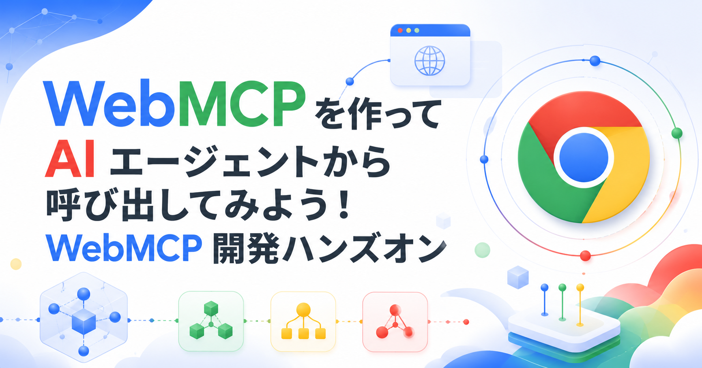
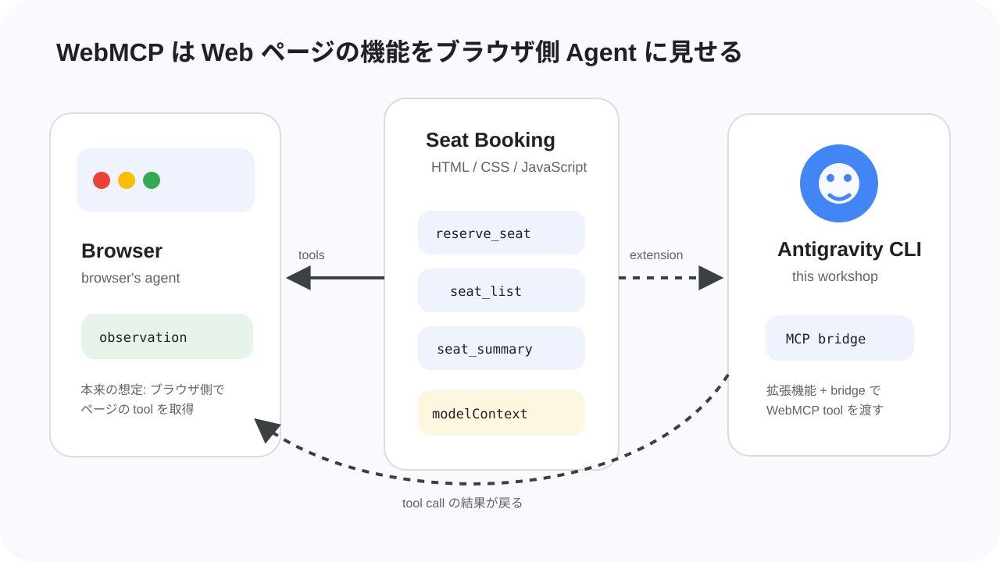
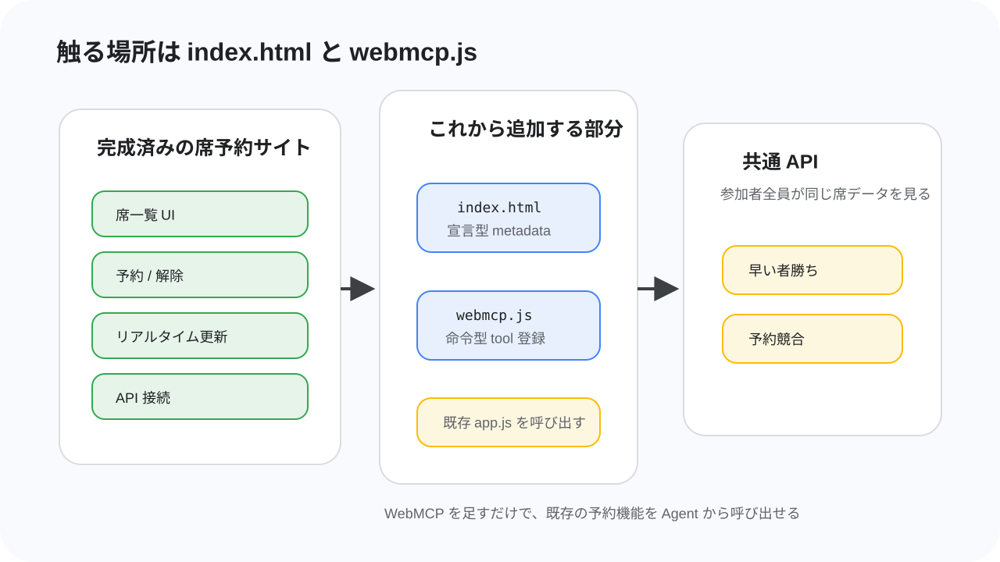
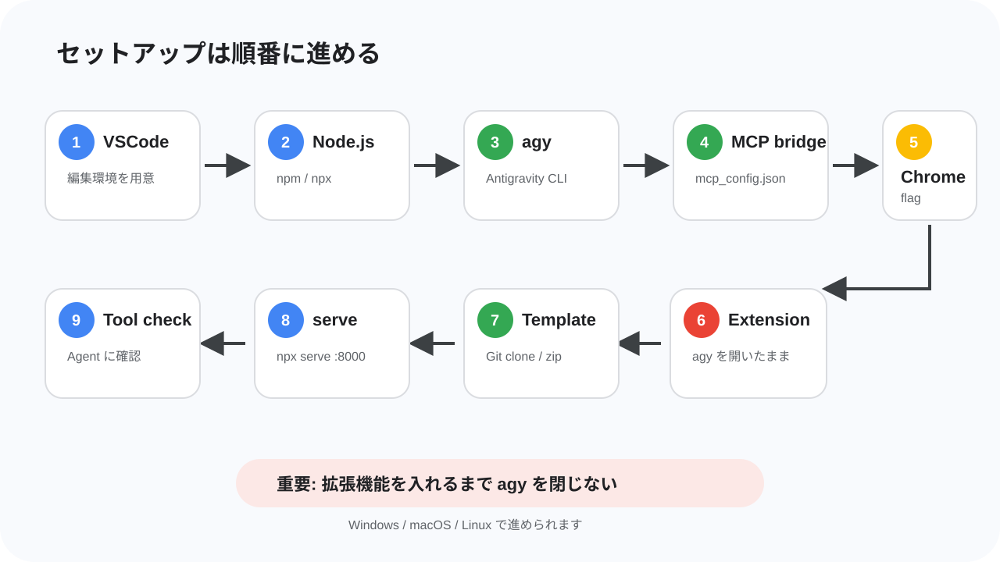

summary: WebMCP を使って席予約サイトを AI エージェントから呼び出すハンズオン
id: webmcp-agent
categories: Web, AI
environments: Web
status: Published
feedback link: https://github.com/googlecodelabs/your-first-pwapp/issues
author: GDG on Campus University of Osaka

# WebMCPを使ってAIエージェントから呼び出してみよう！

## はじめに

Duration: 0:08:00



このコードラボでは、席予約サイトに WebMCP の入口を追加し、Antigravity CLI の AI エージェントから席の状況確認や予約操作をできるようにします。

完成すると、あなたは AI エージェントに「空いている席を見て、connpass ID `alice_123` で前の方の席を予約して」のように依頼できます。エージェントは Web ページに用意された tool を見つけ、席予約サイトの機能を呼び出して予約を進めます。

### このコードラボで作るもの

このハンズオンでは、参加者用の席予約サイトに WebMCP を実装します。開始時点のサイトには、席一覧、予約、予約解除、共通 API への接続、リアルタイム更新の基本機能がすでに入っています。

あなたが追加するのは、サイトの機能を AI エージェントから扱いやすくするための WebMCP の宣言です。通常のユーザーは画面上のフォームやボタンを使って予約しますが、WebMCP を追加すると、エージェントは「席一覧を取得する」「指定した席を予約する」「自分の予約を確認する」といった機能を tool として扱えるようになります。

このハンズオンでは参加者全員が共通の API につながります。そのため、ほかの人が予約した席はあなたの画面でも埋まり、同じ席を同時に狙うと早い者勝ちの競合も起きます。AI エージェントに頼んだ予約がうまく通るか、別の人に先を越されるかまで含めて、リアルタイムな Web アプリと AI エージェントがつながる感覚を体験します。

### このコードラボで学ぶこと

- WebMCP が目指している、ブラウザ側の Agent に Web ページの機能を tool として見せる標準仕様の入口
- MCP と WebMCP の違い
- スクレイピングや画面操作だけではなく WebMCP を使う意味
- `document.modelContext.registerTool()` を使った命令型 WebMCP の基本
- HTML フォームに metadata を付ける宣言型 WebMCP の考え方
- Antigravity CLI、MCP bridge、Chrome 拡張機能を組み合わせて WebMCP tool を確認する方法

### 必要なもの

- Windows、macOS、または Linux の PC
- Google Chrome 最新版
- Visual Studio Code または同等のエディタ
- Node.js と npm
- Antigravity CLI
- Git、または zip ファイルを展開できる環境
- GitHub からファイルをダウンロードできるネットワーク
- connpass ID

> **補足:** PC やエディタ、ターミナル操作に慣れていなくても大丈夫です。詰まったら近くの TA に声をかけてください。このハンズオンでは、全員が同時に同じ速度で終わることよりも、実際に AI エージェントと Web がつながる体験を優先します。

### 前提知識

- HTML のタグを見たことがある
- JavaScript の関数やオブジェクトを少し見たことがある
- ブラウザで開発者向けの実験機能を有効にすることに抵抗がない
- ターミナルや PowerShell にコマンドを貼り付けて実行できる
- やる気がある

### このコードラボで扱わないこと

- 席予約バックエンド API の実装
- 本番運用向けの認証、監査、セキュリティ設計
- 任意の AI エージェント / 任意のブラウザでの動作保証

このハンズオンでは Antigravity CLI を使います。別の Agent で試すことは止めませんが、動かない場合は自己責任です。まずはハンズオンの手順どおり Antigravity CLI で進めてください。

## WebMCP の概要

Duration: 0:18:00



このステップでは、実装に入る前に WebMCP の考え方を確認します。WebMCP はまだ実験段階の仕様ですが、「Web ページの機能を、ブラウザ側の Agent が呼び出せる tool として扱う」という重要な方向性を持っています。

### WebMCP とは

WebMCP は、Web アプリケーションが自分の機能を JavaScript ベースの tool として提供するための仕様です。2026年7月時点では [WebMCP Draft Community Group Report](https://webmachinelearning.github.io/webmcp/) として公開されており、W3C Standard でも W3C Standards Track でもありません。つまり、現時点では正式な Web 標準として安定しているものではなく、仕様策定と実装実験が進んでいる段階です。

WebMCP の主な想定は、ブラウザが提供する Agent、またはブラウザにホストされた拡張機能やプラグイン経由の Agent が、表示中の Web ページから tool を見つけて呼び出すことです。Web ページは「このページでは席一覧を取得できる」「このフォームで予約できる」のような機能を、名前、説明、入力スキーマ、実行処理と一緒に公開します。

今回のハンズオンでは、ブラウザ内蔵 Agent そのものではなく、Antigravity CLI、MCP bridge、Chrome 拡張機能を組み合わせて WebMCP を試します。これは公式仕様の最終形を完全に再現するものではありませんが、ページ側が tool を用意し、Agent 側がそれを見つけて呼び出す流れを体験するための構成です。

### 今回扱う tool

今回の席予約サイトでは、次のような tool を扱います。

| tool | 役割 | 種類 |
| --- | --- | --- |
| `seat_summary` | 合計席数、空席数、予約済み数を取得する | 命令型 |
| `seat_list` | 全席の状態を取得する | 命令型 |
| `my_reservation` | 指定した参加者 ID の予約状態を取得する | 命令型 |
| `cancel_reservation` | 指定した参加者 ID の予約を解除する | 命令型 |
| `reserve_seat` | HTML フォームを使って席を予約する | 宣言型 |

エージェントにとって重要なのは、画面上のボタンの位置ではありません。重要なのは「どんな名前の機能があり、何を入力すると、どんな結果が返るか」です。WebMCP はその情報を Web ページ側から明示するための入口になります。

### 命令型 WebMCP

命令型 WebMCP では、JavaScript から `document.modelContext.registerTool()` を呼び出して tool を登録します。仕様では、Secure Context の `Document.modelContext` として `ModelContext` が追加され、`ModelContext` は `registerTool(tool, options)` と `ontoolchange` を持ちます。

`registerTool()` は、tool の名前、説明、入力スキーマ、実行関数を受け取り、Agent が呼び出せる tool として登録します。`ontoolchange` は tool の追加や変更をブラウザ側に知らせるためのイベントハンドラーです。`registerTool()` の `options` には、登録解除に使える `signal` と、tool を見せる origin を制御する `exposedTo` があります。

また、WebMCP API へのアクセスは Permissions Policy の `tools` feature で制御され、仕様上の default allowlist は `'self'` です。細かい権限制御は今回の実装範囲外ですが、「ページが勝手にどこへでも tool を見せられる」ものではなく、ブラウザ側の権限モデルと一緒に設計されている点は押さえておきます。

`ModelContextTool` の主な項目は次のとおりです。

| 項目 | 必須 | 説明 |
| --- | --- | --- |
| `name` | 必須 | tool の識別子。仕様上は 1〜128 文字で、英数字、`_`、`-`、`.` を使えます。 |
| `title` | 任意 | UI 表示向けの人間が読みやすいラベルです。 |
| `description` | 必須 | tool が何をするかを自然言語で説明します。Agent が使いどころを判断する材料になります。 |
| `inputSchema` | 任意 | tool に渡す入力を JSON Schema として表します。 |
| `execute` | 必須 | tool が呼び出されたときに実行される関数です。非同期処理もできます。 |
| `annotations` | 任意 | `readOnlyHint` や `untrustedContentHint` など、tool の性質を伝える metadata です。 |

`readOnlyHint: true` は、その tool が状態を変更せず、データを読むだけであることを示す hint です。今回なら、席一覧や予約状況の取得には付けます。一方、予約解除のように状態を変える tool には付けません。

### 宣言型 WebMCP

宣言型 WebMCP は、HTML の `form` と form-associated elements を tool として扱う提案です。フォームに tool 名や説明、入力項目の説明を追加し、フォーム構造から JSON Schema を合成して、Agent が「このフォームはこの入力で呼び出せる」と理解できるようにします。

ただし、2026年7月時点の仕様本文では、宣言型 WebMCP の章は TODO で、explainer draft を参照する状態です。explainer では、フォームから JSON Schema を作ること、フォーム送信後の応答を `SubmitEvent#respondWith()` などで返すことが提案されていますが、命令型 API ほど仕様本文にまとまっているわけではありません。

このハンズオンでは、講師が用意した Chrome 拡張機能が読む属性として、次の metadata を使います。

| 属性 | 付ける場所 | 説明 |
| --- | --- | --- |
| `toolname` | `form` | Agent に見せる tool 名です。例: `reserve_seat` |
| `tooldescription` | `form` | そのフォームが何をする tool なのかを説明します。 |
| `toolparamdescription` | `input` や `select` | 各入力項目が何を表すのかを説明します。 |

> **Warning:** ここで使う宣言型属性名は、確定済みの標準属性として扱うものではありません。このハンズオン用の拡張機能実装が読み取る属性として使います。

### MCP との違い

MCP は、AI エージェントが外部ツールやサービスとつながるためのプロトコルです。多くの場合、MCP server はローカルプロセス、社内サービス、クラウド上の API ラッパーとして動き、エージェントランタイムから呼び出されます。

WebMCP は、Web ページ自身がブラウザ側の Agent に能力を見せる点が違います。Web アプリの画面、ログイン状態、既存の JavaScript ロジック、フォーム、ユーザー操作と同じ文脈で tool を提供できます。仕様でも、WebMCP を使うページは「バックエンドではなくクライアントサイド script で tool を実装する MCP server」のように考えられる、と説明されています。

| 観点 | MCP | WebMCP |
| --- | --- | --- |
| tool の置き場所 | 外部の MCP server | Web ページ |
| 主な呼び出し元 | AI エージェントの runtime | ブラウザ内蔵 Agent やブラウザ経由の Agent |
| Web UI との距離 | Web ページとは別の場所にあることが多い | 表示中のページの状態やロジックに近い |
| 今回の使い方 | `webmcp-bridge-mcp` が Antigravity CLI と Chrome をつなぐ | 席予約サイトが WebMCP tool を公開する |

### スクレイピングではだめなのか

AI エージェントは画面を読み、クリックし、入力することもできます。ですが、スクレイピングや画面操作だけに頼ると、HTML 構造、ボタンの文言、画面サイズ、スクロール位置、非同期更新のタイミングが少し変わるだけで壊れやすくなります。

WebMCP では、Web アプリ側が「この機能はこういう名前で、こういう入力を受け取り、こういう意味を持つ」と明示します。Agent はページを推測するのではなく、ページが公開した構造化された情報を見て操作できます。正式な仕様として採択され、ブラウザ実装が進めば、ブラウザ側の Agent はページが提供する tool をより自然に扱えるようになることが期待されます。

今回の構成でも、この利点の一部を体験できます。Chrome 拡張機能が Web ページの WebMCP 情報を読み取り、MCP bridge が Antigravity CLI に渡すことで、エージェントは「どの CSS セレクタをクリックするか」ではなく「どの tool をどの引数で呼ぶか」を考えられます。席予約のようにリアルタイムで状態が変わる画面では、この違いが特に効いてきます。

WebMCP は便利な一方で、tool の説明や出力が Agent の判断に影響するため、セキュリティやプライバシーの注意も必要です。仕様では、tool metadata への悪意ある指示、tool 出力による prompt injection、実際の挙動と説明の不一致などがリスクとして扱われています。このコードラボでは本番設計までは扱いませんが、WebMCP は「AI が触るための入口」でもあることを意識して進めます。

## 今回作る席予約システム

Duration: 0:12:00



このステップでは、今回使う席予約サイトの構成と、参加者が編集する場所を確認します。

### 開始時点で完成しているもの

配布される席予約サイトには、Web アプリとして動くための基本機能がすでに入っています。席を表示する UI、参加者 ID を入力して予約するフォーム、予約解除、共通 API との通信、ほかの参加者の操作を反映するリアルタイム更新は、最初から動く状態です。

そのため、このハンズオンでゼロから予約サイトを作る必要はありません。あなたが担当するのは、既存のサイトに WebMCP の入口を追加し、AI エージェントからその機能を呼び出せるようにする部分です。

### 参加者が編集するファイル

参加者が編集する主なファイルは、次の 2 つです。

| ファイル | 何をするか |
| --- | --- |
| `index.html` | 予約フォームに宣言型 WebMCP の metadata を追加します。 |
| `webmcp.js` | 命令型 WebMCP tool を登録します。 |

`index.html` では、予約用のフォームに `toolname`、`tooldescription`、`toolparamdescription` を追加します。これにより、Chrome 拡張機能が「このフォームは予約用 tool として使える」と読み取れるようになります。

`webmcp.js` は新しく作成するファイルです。ここでは `document.modelContext.registerTool()` を使って、席一覧、席サマリー、自分の予約確認、予約解除の tool を登録します。既存の予約ロジックや API 通信は `app.js` 側にあるため、`webmcp.js` ではそれらを呼び出す入口を作ります。

### 共通 API とリアルタイム更新

席予約サイトは、当日用に用意された共通 API に接続します。参加者全員が同じ席データを見ているため、誰かが予約すると、ほかの参加者の画面にも反映されます。

この仕組みによって、AI エージェントに頼んだ予約が必ず成功するとは限りません。エージェントが席一覧を見た直後に別の人が同じ席を予約することもあります。その場合、API は予約の競合を返し、エージェントや画面はその結果を受け取ります。

このコードラボでは、そうした「Web アプリの状態はリアルタイムに変わる」「AI エージェントもその中で判断する」という状況を体験します。WebMCP の tool は、固定されたデモデータではなく、実際に変化する Web アプリの入口になります。

### 完成後の流れ

完成後の流れは次のようになります。

1. Chrome で席予約サイトを開きます。
2. 席予約サイトが WebMCP tool を登録します。
3. Chrome 拡張機能がページの WebMCP 情報を読み取ります。
4. `webmcp-bridge-mcp` が Antigravity CLI に tool を渡します。
5. AI エージェントが席の状況を見て、必要なら予約フォームを使って予約します。

リセットが入ったときは、講師が会場で案内します。案内があったら、ページを再読み込みし、必要に応じて Antigravity CLI を再起動してください。

## セットアップ

Duration: 0:25:00



このステップでは、WebMCP tool を Antigravity CLI から使うための環境を準備します。順番が重要です。特に、Chrome 拡張機能を追加する前に Antigravity CLI を起動し、そのまま閉じないでください。

> **Warning:** 拡張機能を追加する前後で Antigravity CLI を閉じないでください。今回使う拡張機能は Agent との接続に WebSocket を使います。CLI を閉じると WebSocket ホストも止まり、拡張機能側の接続処理が失敗することがあります。閉じてしまった場合は、もう一度 `agy` を実行して起動し直します。

### VSCode を用意する

コードを編集するために、Visual Studio Code などのエディタを使います。すでに使い慣れたエディタがある人はそれで構いません。

まだエディタが入っていない場合は、[Visual Studio Code の公式サイト](https://code.visualstudio.com/) からインストールしてください。Windows、macOS、Linux のいずれでも使えます。

### Node.js と npm を確認する

まず Node.js と npm が使えるか確認します。

macOS や Linux の場合はターミナル、Windows の場合は PowerShell を開きます。

```bash
node -v
npm -v
```

**期待される出力:**

```text
v20.x.x
10.x.x
```

バージョン番号が表示されれば成功です。`command not found` や `node は認識されていません` のような表示が出る場合は、Node.js をインストールします。

Windows で `winget` が使える場合:

```powershell
winget install OpenJS.NodeJS.LTS
```

macOS で Homebrew が使える場合:

```bash
brew install node
```

Ubuntu / Debian 系 Linux の場合:

```bash
curl -fsSL https://deb.nodesource.com/setup_20.x | sudo -E bash -
sudo apt-get install -y nodejs
```

どれも使えない場合は、[Node.js 公式サイト](https://nodejs.org/) から LTS 版をインストールしてください。インストール後、ターミナルまたは PowerShell を開き直して `node -v` をもう一度実行します。

### Antigravity CLI をインストールする

Antigravity CLI をインストールします。OS に合わせて、次のどれかを実行してください。

macOS / Linux:

```bash
curl -fsSL https://antigravity.google/cli/install.sh | bash
```

Windows PowerShell:

```powershell
irm https://antigravity.google/cli/install.ps1 | iex
```

Windows CMD:

```cmd
curl -fsSL https://antigravity.google/cli/install.cmd -o install.cmd && install.cmd && del install.cmd
```

インストール後、ターミナルまたは PowerShell を開き直し、次のコマンドで起動確認をします。

```bash
agy --version
```

**期待される出力:**

```text
agy ...
```

> **Troubleshooting:** `agy` コマンドが見つからない場合は、インストール後にターミナルを開き直してください。それでも動かない場合は、インストールログや PATH の状態を確認します。

### WebMCP bridge MCP を設定する

Antigravity CLI から Chrome 側の WebMCP tool を使うために、MCP bridge を設定します。

設定ファイルは `.gemini/config/mcp_config.json` です。なければ作成します。

macOS / Linux:

```bash
mkdir -p ~/.gemini/config
code ~/.gemini/config/mcp_config.json
```

Windows PowerShell:

```powershell
mkdir $env:USERPROFILE\.gemini\config -Force
notepad $env:USERPROFILE\.gemini\config\mcp_config.json
```

開いたファイルに、次の内容を貼り付けます。

`mcp_config.json`

```json
{
  "mcpServers": {
    "webmcp": {
      "command": "npx",
      "args": ["-y", "webmcp-bridge-mcp"]
    }
  }
}
```

この設定により、Antigravity CLI は `npx -y webmcp-bridge-mcp` を MCP server として起動できるようになります。

> **補足:** bridge のソースコードは [webmcp-bridge-mcp](https://github.com/tanahiro2010/webmcp-bridge-mcp) にあります。このハンズオンでは中身を読む必要はありません。

### Antigravity CLI を起動する

Antigravity CLI を起動します。

```bash
agy
```

起動できたら、次のように聞いて tool が認識されているか確認します。

```text
webmcp に関するツールは接続されてる？
```

この時点では、まだ席予約サイトを開いていないため、席予約用の tool は見えなくても構いません。`webmcp` bridge に関する tool や接続の説明が返ってくれば、まずは成功です。

> **Warning:** ここから Chrome 拡張機能の追加が終わるまで、Antigravity CLI を閉じないでください。閉じてしまった場合は、もう一度 `agy` を実行して起動し直します。

### Chrome の WebMCP flag を有効にする

Chrome を最新版にアップデートします。その後、アドレスバーに次を入力します。

```text
chrome://flags/#enable-webmcp-testing
```

表示された **WebMCP Testing** の flag を **Enabled** に変更します。変更したら Chrome を再起動します。

**期待される状態:**

```text
WebMCP Testing: Enabled
```

flag が見つからない場合は、Chrome が古い可能性があります。Chrome を更新してからもう一度開いてください。

### Chrome 拡張機能を追加する

次に、Antigravity CLI と Chrome をつなぐ拡張機能を追加します。

拡張機能は [webmcp-bridge-extension](https://github.com/tanahiro2010/webmcp-bridge-extension) の Releases から入手します。当日は講師が使用する release を案内します。

1. Chrome で拡張機能の release ページを開きます。
2. 講師が指定したファイルをダウンロードします。
3. Chrome の拡張機能管理画面を開きます。
4. 開発者モードを有効にします。
5. ダウンロードした拡張機能を追加します。

この作業中も Antigravity CLI は開いたままにしてください。もし閉じてしまった場合は、`agy` を実行して起動し直してから、拡張機能の接続状態を確認します。

### Git を確認する

template repo を取得するために Git を使います。Git が入っているか確認します。

```bash
git --version
```

**期待される出力:**

```text
git version 2.x.x
```

Git がない場合、OS に合わせてインストールします。

Windows:

```powershell
winget install Git.Git
```

macOS:

```bash
xcode-select --install
```

Ubuntu / Debian 系 Linux:

```bash
sudo apt-get update
sudo apt-get install -y git
```

Git を入れたくない、または時間がかかる場合は zip ダウンロードで進めます。

### template repo を取得する

Git が使える場合は、作業しやすい場所で次を実行します。

```bash
git clone https://github.com/tanahiro2010/ticket-booking-template.git
cd ticket-booking-template
```

**期待される出力:**

```text
Cloning into 'ticket-booking-template'...
```

Git を使わない場合は、[ticket-booking-template](https://github.com/tanahiro2010/ticket-booking-template) を開き、**Code** → **Download ZIP** から zip をダウンロードします。ダウンロードした zip を展開し、展開したフォルダをエディタで開きます。

### フォルダをエディタで開く

Antigravity のエディタ画面、VSCode、または普段使っているエディタで `ticket-booking-template` フォルダを開きます。

VSCode では、メニューから **File** → **Open Folder...** を選び、`ticket-booking-template` フォルダを選択します。ターミナルでフォルダに移動できている場合は、次のコマンドでも開けます。

```bash
code .
```

> **Troubleshooting:** フォルダの場所がわからない場合は、近くの TA に声をかけてください。Windows では「ダウンロード」フォルダに zip が残っていることが多いです。macOS では Finder の「ダウンロード」から展開済みフォルダを探します。

### 席予約サイトを起動する

template repo のフォルダで、Node.js の簡易 HTTP サーバーを起動します。

```bash
npx --yes serve . -l 8000
```

**期待される出力:**

```text
Accepting connections at http://localhost:8000
```

ブラウザで次を開きます。

```text
http://localhost:8000
```

席予約サイトが表示され、API の状態が接続中になれば成功です。参加者 ID には connpass ID を入力してください。

### ここまでの確認

この時点で、次の状態になっていればセットアップ完了です。

- Antigravity CLI が `agy` で起動している
- `webmcp-bridge-mcp` が MCP server として設定されている
- Chrome の `chrome://flags/#enable-webmcp-testing` が有効になっている
- Chrome 拡張機能が追加されている
- `ticket-booking-template` をエディタで開いている
- `http://localhost:8000` で席予約サイトが表示される

次のステップから、いよいよ `index.html` と `webmcp.js` を編集して WebMCP を実装します。
