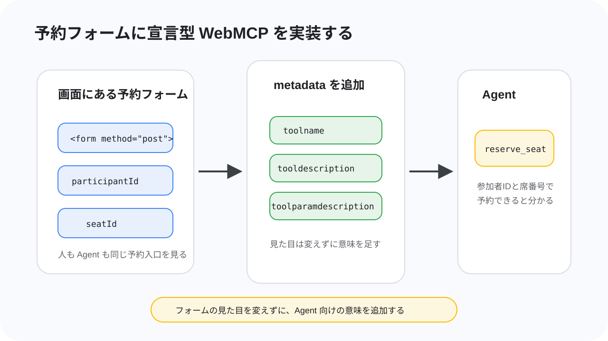
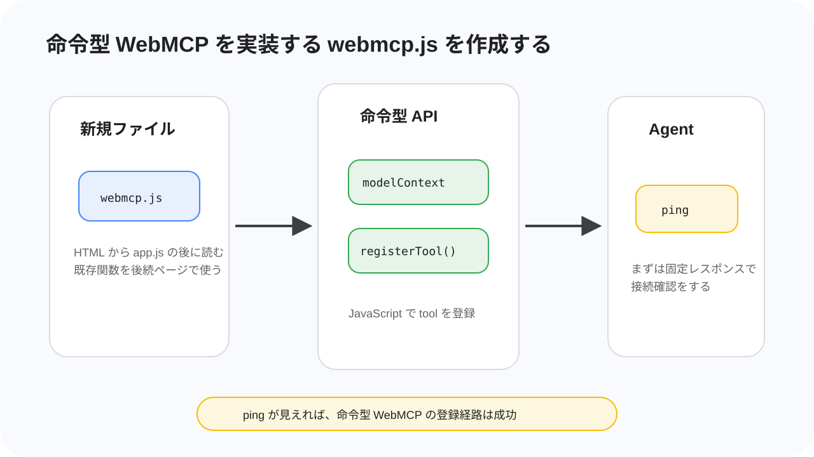
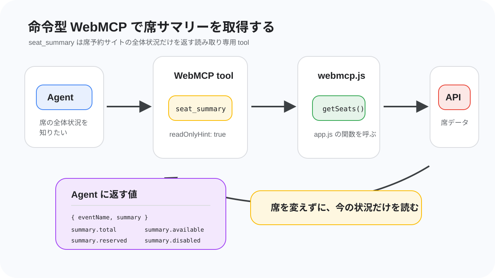
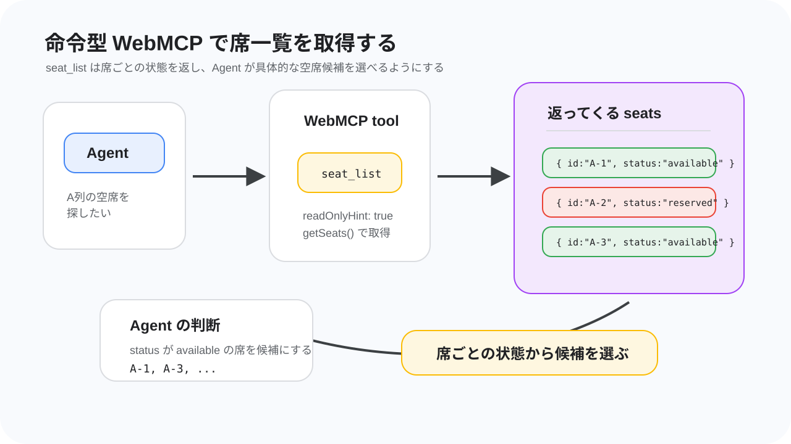
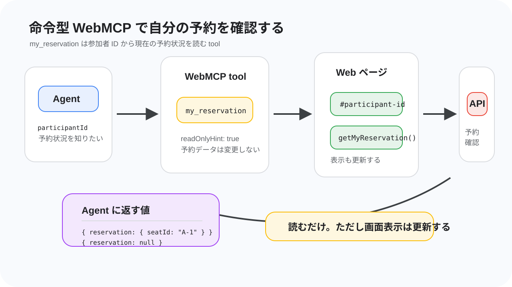
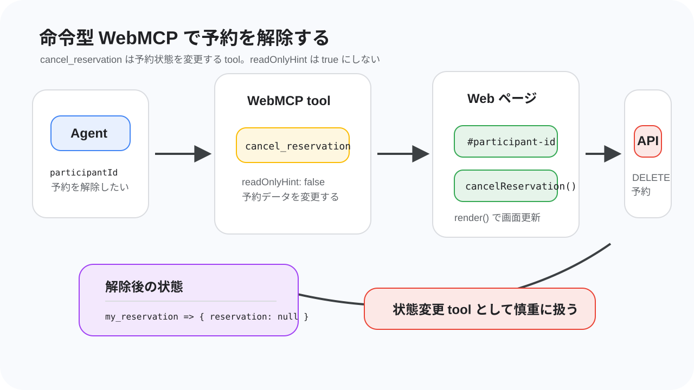
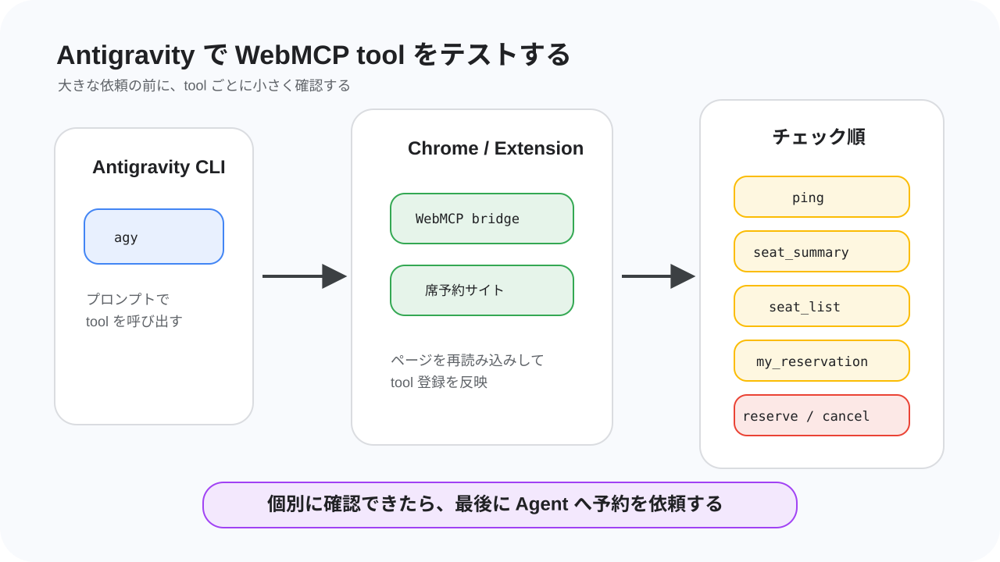
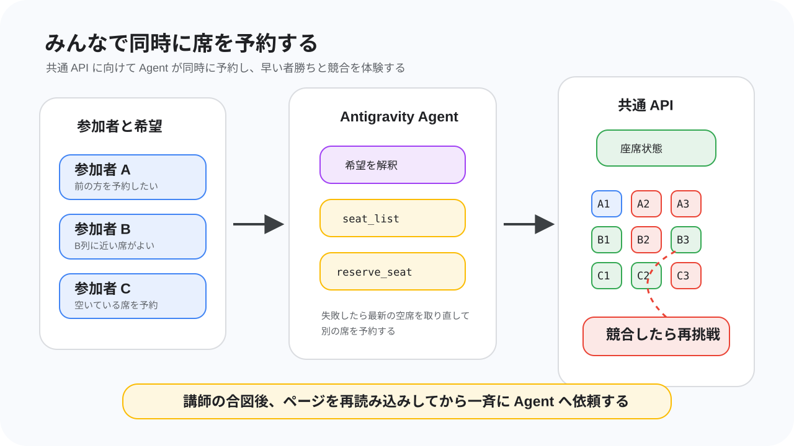
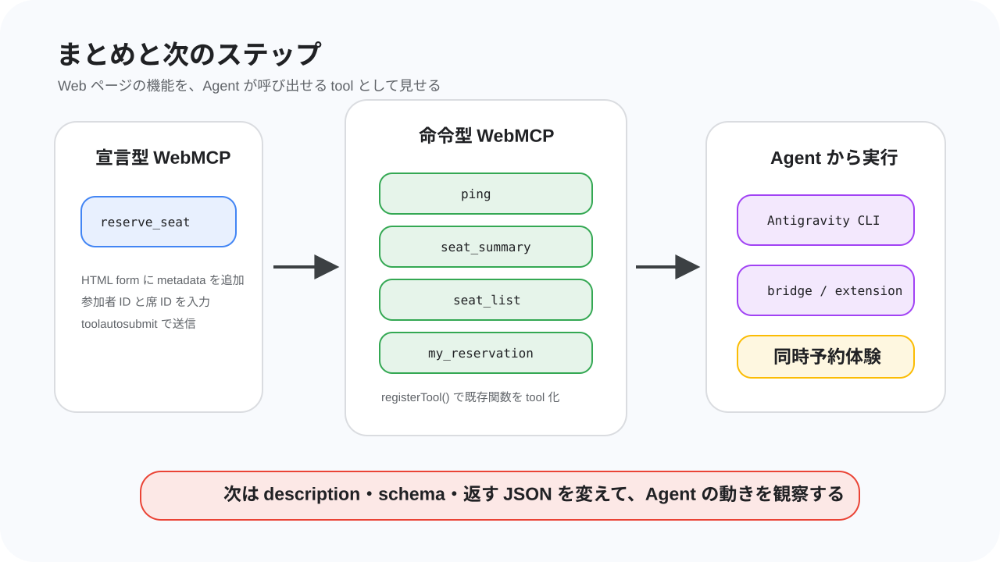

summary: WebMCP を使って席予約サイトを AI エージェントから呼び出すハンズオン
id: webmcp-agent
categories: Web, AI
environments: Web
status: Published
feedback link: https://github.com/googlecodelabs/your-first-pwapp/issues
author: GDG on Campus University of Osaka

# WebMCPを使ってAIエージェントから呼び出してみよう！

## はじめに

Duration: 0:08:00


このコードラボでは、席予約サイトに WebMCP の入口を追加し、Antigravity CLI の AI エージェントから席の状況確認や予約操作をできるようにします。

完成すると、あなたは AI エージェントに「空いている席を見て、connpass ID `alice_123` で前の方の席を予約して」のように依頼できます。エージェントは Web ページに用意された tool を見つけ、席予約サイトの機能を呼び出して予約を進めます。

### このコードラボで作るもの

このハンズオンでは、参加者用の席予約サイトに WebMCP を実装します。開始時点のサイトには、席一覧、予約フォーム、予約解除、共通 API への接続の基本機能がすでに入っています。

あなたが追加するのは、サイトの機能を AI エージェントから扱いやすくするための WebMCP の宣言です。通常のユーザーは画面上のフォームやボタンを使って予約しますが、WebMCP を追加すると、エージェントは「席一覧を取得する」「指定した席を予約する」「自分の予約を確認する」といった機能を tool として扱えるようになります。

このハンズオンでは参加者全員が共通の API につながります。そのため、同じ席を同時に狙うと早い者勝ちの競合も起きます。AI エージェントに頼んだ予約がうまく通るか、別の人に先を越されるかまで含めて、実際に変化する Web アプリのデータと AI エージェントがつながる感覚を体験します。

### このコードラボで学ぶこと

- WebMCP が目指している、ブラウザ側の Agent に Web ページの機能を tool として見せる標準仕様の入口
- MCP と WebMCP の違い
- スクレイピングや画面操作だけではなく WebMCP を使う意味
- `document.modelContext.registerTool()` を使った命令型 WebMCP の基本
- HTML フォームに metadata を付ける宣言型 WebMCP の考え方
- Antigravity CLI、MCP bridge、Chrome 拡張機能を組み合わせて WebMCP tool を確認する方法

### 必要なもの

- Windows、macOS、または Linux の PC
- Google Chrome 最新版
- Visual Studio Code または同等のエディタ
- Node.js と npm
- Antigravity CLI
- Git、または zip ファイルを展開できる環境
- GitHub からファイルをダウンロードできるネットワーク
- connpass ID

> **補足:** PC やエディタ、ターミナル操作に慣れていなくても大丈夫です。詰まったら近くの TA に声をかけてください。このハンズオンでは、全員が同時に同じ速度で終わることよりも、実際に AI エージェントと Web がつながる体験を優先します。

### 前提知識

- HTML のタグを見たことがある
- JavaScript の関数やオブジェクトを少し見たことがある
- ブラウザで開発者向けの実験機能を有効にすることに抵抗がない
- ターミナルや PowerShell にコマンドを貼り付けて実行できる
- やる気がある

### このコードラボで扱わないこと

- 席予約バックエンド API の実装
- 本番運用向けの認証、監査、セキュリティ設計
- 任意の AI エージェント / 任意のブラウザでの動作保証

このハンズオンでは Antigravity CLI を使います。別の Agent で試すことは止めませんが、動かない場合は自己責任です。まずはハンズオンの手順どおり Antigravity CLI で進めてください。

## WebMCP の概要

Duration: 0:18:00


このステップでは、実装に入る前に WebMCP の考え方を確認します。WebMCP はまだ実験段階の仕様ですが、「Web ページの機能を、ブラウザ側の Agent が呼び出せる tool として扱う」という重要な方向性を持っています。

### WebMCP とは

WebMCP は、Web アプリケーションが自分の機能を JavaScript ベースの tool として提供するための仕様です。2026年7月時点では [WebMCP Draft Community Group Report](https://webmachinelearning.github.io/webmcp/) として公開されており、W3C Standard でも W3C Standards Track でもありません。つまり、現時点では正式な Web 標準として安定しているものではなく、仕様策定と実装実験が進んでいる段階です。

WebMCP の主な想定は、ブラウザが提供する Agent、またはブラウザにホストされた拡張機能やプラグイン経由の Agent が、表示中の Web ページから tool を見つけて呼び出すことです。Web ページは「このページでは席一覧を取得できる」「このフォームで予約できる」のような機能を、名前、説明、入力スキーマ、実行処理と一緒に公開します。

今回のハンズオンでは、ブラウザ内蔵 Agent そのものではなく、Antigravity CLI、MCP bridge、Chrome 拡張機能を組み合わせて WebMCP を試します。これは公式仕様の最終形を完全に再現するものではありませんが、ページ側が tool を用意し、Agent 側がそれを見つけて呼び出す流れを体験するための構成です。

### 今回扱う tool

今回の席予約サイトでは、次のような tool を扱います。

| tool | 役割 | 種類 |
| --- | --- | --- |
| `seat_summary` | 合計席数、空席数、予約済み数を取得する | 命令型 |
| `seat_list` | 全席の状態を取得する | 命令型 |
| `my_reservation` | 指定した参加者 ID の予約状態を取得する | 命令型 |
| `cancel_reservation` | 指定した参加者 ID の予約を解除する | 命令型 |
| `reserve_seat` | HTML フォームを使って席を予約する | 宣言型 |

エージェントにとって重要なのは、画面上のボタンの位置ではありません。重要なのは「どんな名前の機能があり、何を入力すると、どんな結果が返るか」です。WebMCP はその情報を Web ページ側から明示するための入口になります。

### 命令型 WebMCP

命令型 WebMCP では、JavaScript から `document.modelContext.registerTool()` を呼び出して tool を登録します。仕様では、Secure Context の `Document.modelContext` として `ModelContext` が追加され、`ModelContext` は `registerTool(tool, options)` と `ontoolchange` を持ちます。

`registerTool()` は、tool の名前、説明、入力スキーマ、実行関数を受け取り、Agent が呼び出せる tool として登録します。`ontoolchange` は tool の追加や変更をブラウザ側に知らせるためのイベントハンドラーです。`registerTool()` の `options` には、登録解除に使える `signal` と、tool を見せる origin を制御する `exposedTo` があります。

また、WebMCP API へのアクセスは Permissions Policy の `tools` feature で制御され、仕様上の default allowlist は `'self'` です。細かい権限制御は今回の実装範囲外ですが、「ページが勝手にどこへでも tool を見せられる」ものではなく、ブラウザ側の権限モデルと一緒に設計されている点は押さえておきます。

`ModelContextTool` の主な項目は次のとおりです。

| 項目 | 必須 | 説明 |
| --- | --- | --- |
| `name` | 必須 | tool の識別子。仕様上は 1〜128 文字で、英数字、`_`、`-`、`.` を使えます。 |
| `title` | 任意 | UI 表示向けの人間が読みやすいラベルです。 |
| `description` | 必須 | tool が何をするかを自然言語で説明します。Agent が使いどころを判断する材料になります。 |
| `inputSchema` | 任意 | tool に渡す入力を JSON Schema として表します。 |
| `execute` | 必須 | tool が呼び出されたときに実行される関数です。非同期処理もできます。 |
| `annotations` | 任意 | `readOnlyHint` や `untrustedContentHint` など、tool の性質を伝える metadata です。 |

`readOnlyHint: true` は、その tool が状態を変更せず、データを読むだけであることを示す hint です。今回なら、席一覧や予約状況の取得には付けます。一方、予約解除のように状態を変える tool には付けません。

### 宣言型 WebMCP

宣言型 WebMCP は、HTML の `form` と form-associated elements を tool として扱う提案です。フォームに tool 名や説明、入力項目の説明を追加し、フォーム構造から JSON Schema を合成して、Agent が「このフォームはこの入力で呼び出せる」と理解できるようにします。

ただし、2026年7月時点の仕様本文では、宣言型 WebMCP の章は TODO で、explainer draft を参照する状態です。explainer では、フォームから JSON Schema を作ること、フォーム送信後の応答を `SubmitEvent#respondWith()` などで返すことが提案されていますが、命令型 API ほど仕様本文にまとまっているわけではありません。

このハンズオンでは、講師が用意した Chrome 拡張機能が読む属性として、次の metadata を使います。

| 属性 | 付ける場所 | 説明 |
| --- | --- | --- |
| `toolname` | `form` | Agent に見せる tool 名です。例: `reserve_seat` |
| `tooldescription` | `form` | そのフォームが何をする tool なのかを説明します。 |
| `toolautosubmit` | `form` | Agent が値を埋めたあと、このフォームを自動送信することを示します。 |
| `toolparamdescription` | `input` や `select` | 各入力項目が何を表すのかを説明します。 |

> **Warning:** ここで使う宣言型属性名は、確定済みの標準属性として扱うものではありません。このハンズオン用の拡張機能実装が読み取る属性として使います。

### MCP との違い

MCP は、AI エージェントが外部ツールやサービスとつながるためのプロトコルです。多くの場合、MCP server はローカルプロセス、社内サービス、クラウド上の API ラッパーとして動き、エージェントランタイムから呼び出されます。

WebMCP は、Web ページ自身がブラウザ側の Agent に能力を見せる点が違います。Web アプリの画面、ログイン状態、既存の JavaScript ロジック、フォーム、ユーザー操作と同じ文脈で tool を提供できます。仕様でも、WebMCP を使うページは「バックエンドではなくクライアントサイド script で tool を実装する MCP server」のように考えられる、と説明されています。

| 観点 | MCP | WebMCP |
| --- | --- | --- |
| tool の置き場所 | 外部の MCP server | Web ページ |
| 主な呼び出し元 | AI エージェントの runtime | ブラウザ内蔵 Agent やブラウザ経由の Agent |
| Web UI との距離 | Web ページとは別の場所にあることが多い | 表示中のページの状態やロジックに近い |
| 今回の使い方 | `webmcp-bridge-mcp` が Antigravity CLI と Chrome をつなぐ | 席予約サイトが WebMCP tool を公開する |

### スクレイピングではだめなのか

AI エージェントは画面を読み、クリックし、入力することもできます。ですが、スクレイピングや画面操作だけに頼ると、HTML 構造、ボタンの文言、画面サイズ、スクロール位置、非同期更新のタイミングが少し変わるだけで壊れやすくなります。

WebMCP では、Web アプリ側が「この機能はこういう名前で、こういう入力を受け取り、こういう意味を持つ」と明示します。Agent はページを推測するのではなく、ページが公開した構造化された情報を見て操作できます。正式な仕様として採択され、ブラウザ実装が進めば、ブラウザ側の Agent はページが提供する tool をより自然に扱えるようになることが期待されます。

今回の構成でも、この利点の一部を体験できます。Chrome 拡張機能が Web ページの WebMCP 情報を読み取り、MCP bridge が Antigravity CLI に渡すことで、エージェントは「どの CSS セレクタをクリックするか」ではなく「どの tool をどの引数で呼ぶか」を考えられます。席予約のように他の参加者と同じデータを扱う画面では、この違いが特に効いてきます。

WebMCP は便利な一方で、tool の説明や出力が Agent の判断に影響するため、セキュリティやプライバシーの注意も必要です。仕様では、tool metadata への悪意ある指示、tool 出力による prompt injection、実際の挙動と説明の不一致などがリスクとして扱われています。このコードラボでは本番設計までは扱いませんが、WebMCP は「AI が触るための入口」でもあることを意識して進めます。

## 今回作る席予約システム

Duration: 0:12:00


このステップでは、今回使う席予約サイトの構成と、参加者が編集する場所を確認します。

### 開始時点で完成しているもの

配布される席予約サイトには、Web アプリとして動くための基本機能がすでに入っています。席を表示する UI、参加者 ID と席番号を入力して予約するフォーム、予約解除、共通 API との通信は、最初から動く状態です。

そのため、このハンズオンでゼロから予約サイトを作る必要はありません。あなたが担当するのは、既存のサイトに WebMCP の入口を追加し、AI エージェントからその機能を呼び出せるようにする部分です。

### 参加者が編集するファイル

参加者が編集する主なファイルは、次の 2 つです。

| ファイル | 何をするか |
| --- | --- |
| `index.html` | 予約フォームに宣言型 WebMCP の metadata を追加します。 |
| `webmcp.js` | 命令型 WebMCP tool を登録します。 |

`index.html` では、予約用のフォームに `toolname`、`tooldescription`、`toolautosubmit`、`toolparamdescription` を追加します。これにより、Chrome 拡張機能が「このフォームは予約用 tool として使える」と読み取れるようになります。

`webmcp.js` は新しく作成するファイルです。ここでは `document.modelContext.registerTool()` を使って、席一覧、席サマリー、自分の予約確認、予約解除の tool を登録します。既存の予約ロジックや API 通信は `app.js` 側にあるため、`webmcp.js` ではそれらを呼び出す入口を作ります。

### 共通 API と予約競合

席予約サイトは、当日用に用意された共通 API に接続します。参加者全員が同じ席データを見ているため、誰かが予約すると、ほかの参加者の画面にも反映されます。

この仕組みによって、AI エージェントに頼んだ予約が必ず成功するとは限りません。エージェントが席一覧を見た直後に別の人が同じ席を予約することもあります。その場合、API は予約の競合を返し、エージェントや画面はその結果を受け取ります。

このコードラボでは、そうした「Web アプリの状態は他の参加者の操作で変わる」「AI エージェントもその中で判断する」という状況を体験します。WebMCP の tool は、固定されたデモデータではなく、実際に変化する Web アプリの入口になります。

### 完成後の流れ

完成後の流れは次のようになります。

1. Chrome で席予約サイトを開きます。
2. 席予約サイトが WebMCP tool を登録します。
3. Chrome 拡張機能がページの WebMCP 情報を読み取ります。
4. `webmcp-bridge-mcp` が Antigravity CLI に tool を渡します。
5. AI エージェントが席の状況を見て、必要なら予約フォームを使って予約します。

リセットが入ったときは、講師が会場で案内します。案内があったら、ページを再読み込みし、必要に応じて Antigravity CLI を再起動してください。

## セットアップ

Duration: 0:25:00


このステップでは、WebMCP tool を Antigravity CLI から使うための環境を準備します。順番が重要です。特に、Chrome 拡張機能を追加する前に Antigravity CLI を起動し、そのまま閉じないでください。

> **Warning:** 拡張機能を追加する前後で Antigravity CLI を閉じないでください。今回使う拡張機能は Agent との接続に WebSocket を使います。CLI を閉じると WebSocket ホストも止まり、拡張機能側の接続処理が失敗することがあります。閉じてしまった場合は、もう一度 `agy` を実行して起動し直します。

### VSCode を用意する

コードを編集するために、Visual Studio Code などのエディタを使います。すでに使い慣れたエディタがある人はそれで構いません。

まだエディタが入っていない場合は、[Visual Studio Code の公式サイト](https://code.visualstudio.com/) からインストールしてください。Windows、macOS、Linux のいずれでも使えます。

### Node.js と npm を確認する

まず Node.js と npm が使えるか確認します。

macOS や Linux の場合はターミナル、Windows の場合は PowerShell を開きます。

```bash
node -v
npm -v
```

**期待される出力:**

```text
v20.x.x
10.x.x
```

バージョン番号が表示されれば成功です。`command not found` や `node は認識されていません` のような表示が出る場合は、Node.js をインストールします。

Windows で `winget` が使える場合:

```powershell
winget install OpenJS.NodeJS.LTS
```

macOS で Homebrew が使える場合:

```bash
brew install node
```

Ubuntu / Debian 系 Linux の場合:

```bash
curl -fsSL https://deb.nodesource.com/setup_20.x | sudo -E bash -
sudo apt-get install -y nodejs
```

どれも使えない場合は、[Node.js 公式サイト](https://nodejs.org/) から LTS 版をインストールしてください。インストール後、ターミナルまたは PowerShell を開き直して `node -v` をもう一度実行します。

### Antigravity CLI をインストールする

Antigravity CLI をインストールします。OS に合わせて、次のどれかを実行してください。

macOS / Linux:

```bash
curl -fsSL https://antigravity.google/cli/install.sh | bash
```

Windows PowerShell:

```powershell
irm https://antigravity.google/cli/install.ps1 | iex
```

Windows CMD:

```cmd
curl -fsSL https://antigravity.google/cli/install.cmd -o install.cmd && install.cmd && del install.cmd
```

インストール後、ターミナルまたは PowerShell を開き直し、次のコマンドで起動確認をします。

```bash
agy --version
```

**期待される出力:**

```text
agy ...
```

> **Troubleshooting:** `agy` コマンドが見つからない場合は、インストール後にターミナルを開き直してください。それでも動かない場合は、インストールログや PATH の状態を確認します。

### WebMCP bridge MCP を設定する

Antigravity CLI から Chrome 側の WebMCP tool を使うために、MCP bridge を設定します。

設定ファイルは `.gemini/config/mcp_config.json` です。なければ作成します。

macOS / Linux:

```bash
mkdir -p ~/.gemini/config
code ~/.gemini/config/mcp_config.json
```

Windows PowerShell:

```powershell
mkdir $env:USERPROFILE\.gemini\config -Force
notepad $env:USERPROFILE\.gemini\config\mcp_config.json
```

開いたファイルに、次の内容を貼り付けます。

`mcp_config.json`

```json
{
  "mcpServers": {
    "webmcp": {
      "command": "npx",
      "args": ["-y", "webmcp-bridge-mcp"]
    }
  }
}
```

この設定により、Antigravity CLI は `npx -y webmcp-bridge-mcp` を MCP server として起動できるようになります。

> **補足:** bridge のソースコードは [webmcp-bridge-mcp](https://github.com/tanahiro2010/webmcp-bridge-mcp) にあります。このハンズオンでは中身を読む必要はありません。

### Antigravity CLI を起動する

Antigravity CLI を起動します。

```bash
agy
```

起動できたら、次のように聞いて tool が認識されているか確認します。

```text
webmcp に関するツールは接続されてる？
```

この時点では、まだ席予約サイトを開いていないため、席予約用の tool は見えなくても構いません。`webmcp` bridge に関する tool や接続の説明が返ってくれば、まずは成功です。

> **Warning:** ここから Chrome 拡張機能の追加が終わるまで、Antigravity CLI を閉じないでください。閉じてしまった場合は、もう一度 `agy` を実行して起動し直します。

### Chrome の WebMCP flag を有効にする

Chrome を最新版にアップデートします。その後、アドレスバーに次を入力します。

```text
chrome://flags/#enable-webmcp-testing
```

表示された **WebMCP Testing** の flag を **Enabled** に変更します。変更したら Chrome を再起動します。

**期待される状態:**

```text
WebMCP Testing: Enabled
```

flag が見つからない場合は、Chrome が古い可能性があります。Chrome を更新してからもう一度開いてください。

### Chrome 拡張機能を追加する

次に、Antigravity CLI と Chrome をつなぐ拡張機能を追加します。

拡張機能は [webmcp-bridge-extension](https://github.com/tanahiro2010/webmcp-bridge-extension) の Releases から入手します。当日は講師が使用する release を案内します。

1. Chrome で拡張機能の release ページを開きます。
2. 講師が指定したファイルをダウンロードします。
3. Chrome の拡張機能管理画面を開きます。
4. 開発者モードを有効にします。
5. ダウンロードした拡張機能を追加します。

この作業中も Antigravity CLI は開いたままにしてください。もし閉じてしまった場合は、`agy` を実行して起動し直してから、拡張機能の接続状態を確認します。

### Git を確認する

template repo を取得するために Git を使います。Git が入っているか確認します。

```bash
git --version
```

**期待される出力:**

```text
git version 2.x.x
```

Git がない場合、OS に合わせてインストールします。

Windows:

```powershell
winget install Git.Git
```

macOS:

```bash
xcode-select --install
```

Ubuntu / Debian 系 Linux:

```bash
sudo apt-get update
sudo apt-get install -y git
```

Git を入れたくない、または時間がかかる場合は zip ダウンロードで進めます。

### template repo を取得する

Git が使える場合は、作業しやすい場所で次を実行します。

```bash
git clone https://github.com/tanahiro2010/ticket-booking-template.git
cd ticket-booking-template
```

**期待される出力:**

```text
Cloning into 'ticket-booking-template'...
```

Git を使わない場合は、[ticket-booking-template](https://github.com/tanahiro2010/ticket-booking-template) を開き、**Code** → **Download ZIP** から zip をダウンロードします。ダウンロードした zip を展開し、展開したフォルダをエディタで開きます。

### フォルダをエディタで開く

Antigravity のエディタ画面、VSCode、または普段使っているエディタで `ticket-booking-template` フォルダを開きます。

VSCode では、メニューから **File** → **Open Folder...** を選び、`ticket-booking-template` フォルダを選択します。ターミナルでフォルダに移動できている場合は、次のコマンドでも開けます。

```bash
code .
```

> **Troubleshooting:** フォルダの場所がわからない場合は、近くの TA に声をかけてください。Windows では「ダウンロード」フォルダに zip が残っていることが多いです。macOS では Finder の「ダウンロード」から展開済みフォルダを探します。

### 席予約サイトを起動する

template repo のフォルダで、Node.js の簡易 HTTP サーバーを起動します。

```bash
npx --yes serve . -l 8000
```

**期待される出力:**

```text
Accepting connections at http://localhost:8000
```

ブラウザで次を開きます。

```text
http://localhost:8000
```

席予約サイトが表示され、席一覧が表示されれば成功です。参加者 ID には connpass ID を入力してください。

### ここまでの確認

この時点で、次の状態になっていればセットアップ完了です。

- Antigravity CLI が `agy` で起動している
- `webmcp-bridge-mcp` が MCP server として設定されている
- Chrome の `chrome://flags/#enable-webmcp-testing` が有効になっている
- Chrome 拡張機能が追加されている
- `ticket-booking-template` をエディタで開いている
- `http://localhost:8000` で席予約サイトが表示される

次のステップから、いよいよ `index.html` と `webmcp.js` を編集して WebMCP を実装します。

## 予約フォームに宣言型 WebMCP を実装する

Duration: 0:10:00



このステップでは、予約用の HTML フォームに宣言型 WebMCP の metadata を追加します。これにより、AI エージェントは「参加者 ID と席番号を渡すと、席を予約できるフォームがある」と理解できるようになります。

ここで触るファイルは `index.html` だけです。JavaScript はまだ書きません。

### 宣言型 WebMCP で何をするか

開始時点の `index.html` には、参加者 ID と席番号を入力して予約するフォームがあります。人間はこのフォームを見て「ここから予約できる」と分かりますが、Agent にはフォームの意味をもう少し明示してあげる必要があります。

通常のフォームには、送信先の `action`、送信方法の `method`、入力欄の `name` などがあります。宣言型 WebMCP では、そこに「このフォームはどんな tool なのか」「各入力欄は何を表すのか」という説明を足します。

今回追加する属性は次の 4 種類です。

| 属性 | 付ける場所 | 役割 |
| --- | --- | --- |
| `toolname` | `form` | Agent から見える tool の名前です。 |
| `tooldescription` | `form` | tool が何をするかを説明します。 |
| `toolautosubmit` | `form` | Agent が値を埋めたあと、このフォームを自動送信することを示します。 |
| `toolparamdescription` | `input` | 入力パラメータの意味を説明します。 |

> **Warning:** これらの属性名は、2026年7月時点で確定済みの標準属性として扱うものではありません。このハンズオンでは、講師が用意した Chrome 拡張機能が読み取る属性として使います。

### `index.html` の予約フォームを探す

VSCode で `index.html` を開き、`<h2>予約する</h2>` を検索します。

見つかるフォームは、ページ上部の「予約する」セクションにあります。次のような形です。

`index.html`

```html
<section>
  <h2>予約する</h2>
  <form
    action="http://localhost:8787/api/reservations"
    method="post"
  >
```

このフォームは画面にも表示されます。席の状況には、クリックできる座席マップも用意されていますが、今回の編集では見た目やクリック操作は変えません。Agent が読み取るための metadata だけを追加します。

### フォームに tool の名前・説明・自動送信を追加する

まず、`form` に `toolname`、`tooldescription`、`toolautosubmit` を追加します。

`index.html` の予約フォームを、次の diff のように編集します。

```diff html
         <form
           action="http://localhost:8787/api/reservations"
           method="post"
+          toolname="reserve_seat"
+          tooldescription="参加者IDと席番号を指定して席を予約する。"
+          toolautosubmit
         >
```

`toolname` は Agent から見える tool 名です。ここでは `reserve_seat` にします。

`tooldescription` は、Agent が「この tool はいつ使うものか」を判断するための説明です。短くてもよいですが、何を入力して何をする tool なのかが分かる文にします。

`toolautosubmit` は、Agent がフォームの入力値を埋めたあとに、そのフォームを自動で送信するための属性です。今回の予約フォームでは、参加者 ID と席番号が入ったら、そのまま予約 API に送信してよいものとして扱います。

> **Warning:** `toolautosubmit` は、人間の確認を挟まずにフォーム送信まで進めるための属性です。今回のようなハンズオン用の席予約では便利ですが、購入確定、送金、削除などの重要操作では、Agent の判断ミスがそのまま実行につながる可能性があります。

### 参加者 ID の説明を追加する

次に、参加者 ID の `input` に `toolparamdescription` を追加します。

`participantId` は、予約する人を識別するための ID です。このハンズオンでは connpass ID を使います。

```diff html
        <label>
          参加者ID
          <input
            id="participant-id"
            name="participantId"
            required
            pattern="[A-Za-z0-9_\-]{1,64}"
+           toolparamdescription="予約する参加者のID。"
          />
        </label>
```

`name="participantId"` は、実際にフォーム送信されるパラメータ名です。`toolparamdescription` は、そのパラメータが何を意味するかを Agent に伝える説明です。

### 席番号の説明を追加する

続けて、席番号の `input` にも `toolparamdescription` を追加します。

```diff html
        <label>
          席番号
          <input
            name="seatId"
            required
            pattern="[A-J]-([1-9]|10)"
            placeholder="A-5"
+           toolparamdescription="予約する席のID。例: A-5。"
          />
        </label>
```

席番号は `A-5` のような形式です。説明に例を入れておくと、Agent が入力形式を推測しやすくなります。

### 完成形を確認する

編集後のフォームは、次のようになります。

`index.html`

```html
<form
  action="http://localhost:8787/api/reservations"
  method="post"
  toolname="reserve_seat"
  tooldescription="参加者IDと席番号を指定して席を予約する。"
  toolautosubmit
>
  <label>
    参加者ID
    <input
      id="participant-id"
      name="participantId"
      required
      pattern="[A-Za-z0-9_\-]{1,64}"
      toolparamdescription="予約する参加者のID。"
    />
  </label>
  <label>
    席番号
    <input
      name="seatId"
      required
      pattern="[A-J]-([1-9]|10)"
      placeholder="A-5"
      toolparamdescription="予約する席のID。例: A-5。"
    />
  </label>
  <input type="hidden" name="source" value="webmcp" />
  <button type="submit">予約する</button>
</form>
```

ここまでで、予約フォームは `reserve_seat` tool として説明できる状態になりました。

### 自動送信と手動送信の違いを知る

このハンズオンで使う拡張機能では、`toolautosubmit` が付いた宣言型フォームを `webmcp_call_tool` で呼び出すと、入力値を埋めたあとにフォームが自動送信されます。つまり、Agent が `participantId` と `seatId` を渡すだけで、予約処理まで進みます。

一方、`toolautosubmit` が付いていないフォームでは、値を埋めたあとに送信を確定する必要があります。今回の拡張機能と bridge には、そのための `webmcp_submit_tool` という MCP tool も用意されています。

ただし、`webmcp_submit_tool` はこのハンズオン用拡張機能の polyfill 実装に対する機能です。ブラウザに WebMCP がネイティブ実装された場合、宣言型フォームの実行は人間のクリックや確認で止まることがあり、その場合は `webmcp_submit_tool` の出番自体がありません。

> **Warning:** `webmcp_submit_tool` は、本来人間の確認を要求するフォーム送信を Agent が明示的に進めるための経路です。便利な一方で、安全機構を迂回できる経路でもあります。このコードラボでは `toolautosubmit` を使うため、同じフォームに対して `webmcp_submit_tool` を追加で呼び出す必要はありません。

### ブラウザで表示が壊れていないことを確認する

保存したら、ブラウザで席予約サイトを再読み込みします。

```text
http://localhost:8000
```

**期待される状態:**

- 画面の見た目は編集前と変わらない
- 「予約する」フォームが表示される
- 座席マップと席一覧が表示される
- 座席マップの空席をクリックすると、フォームの席番号に `A-1` のような席 ID が入力される

HTML に追加した metadata は画面には表示されません。見た目を変えずに、Agent が読み取るための意味だけを追加しました。

> **Troubleshooting:** 画面が崩れた場合は、`form`、`input`、`label` の閉じタグが消えていないか確認してください。HTML の属性は、タグの `>` より前に追加します。

次のステップでは、命令型 WebMCP 用の `webmcp.js` を作成し、JavaScript から tool を登録します。

## 命令型 WebMCP を実装する webmcp.js を作成する

Duration: 0:10:00



このステップでは、命令型 WebMCP を書くための `webmcp.js` を作成します。まずは席予約の処理には触れず、動作確認用の小さな `ping` tool を登録します。

`ping` tool が Agent から見えれば、`webmcp.js` が読み込まれ、`document.modelContext.registerTool()` が呼び出せていることを確認できます。

### 命令型 WebMCP で何をするか

前のステップでは、HTML フォームに metadata を追加して、宣言型 WebMCP の `reserve_seat` tool を用意しました。

ここからは JavaScript で tool を登録する命令型 WebMCP を使います。命令型 WebMCP では、`document.modelContext.registerTool()` に tool の名前、説明、入力 schema、実行する関数を渡します。

このステップでは、次のことをします。

- `webmcp.js` を新規作成する
- `index.html` から `webmcp.js` を読み込む
- WebMCP が使えるか確認する
- `ping` tool を登録する
- Antigravity から `ping` を呼び出して動作確認する

### `webmcp.js` を作成する

`index.html` や `app.js` と同じフォルダに、`webmcp.js` というファイルを新しく作成します。

まずは次の内容を書きます。

`webmcp.js`

```js
// WebMCP 命令型 tool

async function registerImperativeTools() {
  if (!document.modelContext?.registerTool) {
    console.warn("[webmcp] document.modelContext.registerTool が見つかりません。");
    return;
  }

  console.info("[webmcp] register imperative tools");
}

registerImperativeTools();
```

`document.modelContext?.registerTool` が存在するか確認してから処理を進めます。WebMCP が使えない環境では、エラーで画面を止めずに `console.warn` を出して終了します。

> **補足:** `?.` は optional chaining です。左側が `null` や `undefined` のときにエラーにせず、結果を `undefined` にします。

### `index.html` から `webmcp.js` を読み込む

作成しただけでは、ブラウザは `webmcp.js` を読み込みません。`index.html` の最後で `app.js` の後に読み込みます。

`index.html` の下のほうを、次の diff のように編集します。

```diff html
     <script src="./app.js"></script>
+    <script src="./webmcp.js"></script>
   </body>
 </html>
```

`webmcp.js` は `app.js` の後に読み込みます。後のステップで、`webmcp.js` から `app.js` に定義されている `getSeats()` や `cancelReservation()` を呼び出すためです。

### ブラウザで読み込みを確認する

ブラウザで席予約サイトを再読み込みします。

```text
http://localhost:8000
```

Chrome DevTools の Console を開きます。Console に次のような表示が出ていれば、`webmcp.js` は読み込まれています。

**期待される出力:**

```text
[webmcp] register imperative tools
```

もし次のような warning が出た場合は、Chrome の WebMCP flag、拡張機能、ページの開き直しを確認します。

```text
[webmcp] document.modelContext.registerTool が見つかりません。
```

> **Troubleshooting:** Console に何も出ない場合は、`index.html` に追加した `<script src="./webmcp.js"></script>` のファイル名を確認してください。`webmcp.js` と `webmcp.Js` のように大文字小文字が違うと、環境によって読み込めません。

### `ping` tool を登録する

次に、動作確認用の `ping` tool を登録します。

`webmcp.js` を次のように更新します。

```diff js
 // WebMCP 命令型 tool
 
 async function registerImperativeTools() {
   if (!document.modelContext?.registerTool) {
     console.warn("[webmcp] document.modelContext.registerTool が見つかりません。");
     return;
   }
 
-  console.info("[webmcp] register imperative tools");
+  await document.modelContext.registerTool({
+    name: "ping",
+    title: "Ping",
+    description: "WebMCP の命令型 tool が登録できているか確認する。",
+    inputSchema: {
+      type: "object",
+      properties: {},
+      additionalProperties: false,
+    },
+    annotations: {
+      readOnlyHint: true,
+    },
+    execute: async () => {
+      return {
+        ok: true,
+        message: "pong",
+        pageTitle: document.title,
+      };
+    },
+  });
+
+  console.info("[webmcp] ping tool registered");
 }
 
 registerImperativeTools();
```

`ping` はデータを読むだけで、予約や解除のような状態変更をしません。そのため `annotations.readOnlyHint` を `true` にしています。

`inputSchema` は空の object です。つまり、この tool は引数なしで呼び出せます。

### Antigravity で `ping` を確認する

ブラウザを再読み込みし、Antigravity CLI が起動していることを確認します。

Antigravity に次のように聞きます。

```text
WebMCP の ping tool は見えていますか？見えていたら呼び出してください。
```

**期待される結果:**

- `ping` tool が見つかる
- tool の実行結果として `ok: true` や `message: "pong"` が返る
- `pageTitle` に席予約サイトのタイトルが入る

この確認が通れば、命令型 WebMCP の登録経路は動いています。次のステップから、`ping` と同じ形で実際の席予約サイトの関数を tool として登録していきます。

## 命令型 WebMCP で席サマリーを取得する

Duration: 0:10:00



このステップでは、命令型 WebMCP の最初の実用的な tool として `seat_summary` を追加します。

前のステップで作った `ping` は、WebMCP の登録経路を確認するための tool でした。ここからは、席予約サイトの実際のデータを読み取る tool を作っていきます。

### `seat_summary` tool の役割

`seat_summary` は、会場全体の席の状況をまとめて返す tool です。全席の細かい情報ではなく、合計席数、空席数、予約済み数、使用禁止席数だけを返します。

たとえば、Agent から見ると次のような結果が返ります。

```json
{
  "eventName": "WebMCP × Antigravity Hands-on",
  "summary": {
    "total": 100,
    "available": 98,
    "reserved": 2,
    "disabled": 0
  }
}
```

Agent はこの情報を見ることで、「まだ空席がある」「かなり埋まってきた」「具体的な席を探すために席一覧も見た方がよい」といった判断をしやすくなります。

この tool は席を予約したり解除したりしません。現在の状態を読むだけの tool です。

### `webmcp.js` に `seat_summary` を追加する

`webmcp.js` を開きます。前のステップで作った `ping` tool と、今回追加する `seat_summary` tool をまとめて登録する形に変更します。

複数の tool を登録するときは、完成例と同じように `Promise.allSettled([...])` を使います。これにより、複数の `registerTool()` を並べて書けるようになります。

`webmcp.js`

```diff js
 // WebMCP 命令型 tool
 
 async function registerImperativeTools() {
   if (!document.modelContext?.registerTool) {
     console.warn("[webmcp] document.modelContext.registerTool が見つかりません。");
     return;
   }
 
-  await document.modelContext.registerTool({
-    name: "ping",
-    title: "Ping",
-    description: "WebMCP の命令型 tool が登録できているか確認する。",
-    inputSchema: {
-      type: "object",
-      properties: {},
-      additionalProperties: false,
-    },
-    annotations: {
-      readOnlyHint: true,
-    },
-    execute: async () => {
-      return {
-        ok: true,
-        message: "pong",
-        pageTitle: document.title,
-      };
-    },
-  });
+  await Promise.allSettled([
+    document.modelContext.registerTool({
+      name: "ping",
+      title: "Ping",
+      description: "WebMCP の命令型 tool が登録できているか確認する。",
+      inputSchema: {
+        type: "object",
+        properties: {},
+        additionalProperties: false,
+      },
+      annotations: {
+        readOnlyHint: true,
+      },
+      execute: async () => {
+        return {
+          ok: true,
+          message: "pong",
+          pageTitle: document.title,
+        };
+      },
+    }),
 
-  console.info("[webmcp] ping tool registered");
+    document.modelContext.registerTool({
+      name: "seat_summary",
+      title: "Seat Summary",
+      description: "会場全体の席サマリーを取得する。",
+      inputSchema: {
+        type: "object",
+        properties: {},
+        additionalProperties: false,
+      },
+      annotations: {
+        readOnlyHint: true,
+      },
+      execute: async () => {
+        const data = await getSeats();
+        return {
+          eventName: data.eventName,
+          summary: data.summary,
+        };
+      },
+    }),
+  ]);
+
+  console.info("[webmcp] ping and seat_summary tools registered");
 }
 
 registerImperativeTools();
```

`seat_summary` の `execute` の中で `getSeats()` を呼び出しています。`getSeats()` は `app.js` に定義済みの関数です。`index.html` では `app.js` の後に `webmcp.js` を読み込んでいるため、`webmcp.js` から `getSeats()` を呼び出せます。

`Promise.allSettled([...])` の中には、これから作る tool も同じ形で追加していきます。次のステップで `seat_list` を追加するときも、この配列の中に `document.modelContext.registerTool({...})` を増やします。

### `readOnlyHint` を付ける

`seat_summary` には、`annotations.readOnlyHint: true` を付けています。

これは「この tool は状態を変更しない」というヒントです。今回の `seat_summary` は、席の状態を読むだけで、予約や解除は行いません。そのため読み取り専用の tool として扱えます。

反対に、後のステップで作る予約解除 tool のように状態を変更する tool には、`readOnlyHint: true` を付けません。

> **補足:** `readOnlyHint` は、tool の説明文を置き換えるものではありません。Agent が tool を選びやすくなるように、`description` と合わせて使います。

### ブラウザで登録ログを確認する

保存したら、ブラウザで席予約サイトを再読み込みします。

```text
http://localhost:8000
```

Chrome DevTools の Console に、次のような表示が出れば `webmcp.js` は読み込まれています。

**期待される出力:**

```text
[webmcp] ping and seat_summary tools registered
```

もし `document.modelContext.registerTool が見つかりません。` と表示される場合は、WebMCP flag、拡張機能、Antigravity CLI の起動状態を確認してください。

### Antigravity で `seat_summary` を確認する

Antigravity に次のように聞きます。

```text
WebMCP の seat_summary tool を呼び出して、現在の席のサマリーを教えてください。
```

**期待される結果:**

- `seat_summary` tool が呼び出される
- `eventName` が返る
- `summary.total`、`summary.available`、`summary.reserved`、`summary.disabled` が返る
- 予約や解除は行われない

返ってくる数値は、その時点の予約状況によって変わります。他の参加者が予約している場合は、空席数や予約済み数も変わります。

> **Troubleshooting:** `getSeats is not defined` と出た場合は、`index.html` で `webmcp.js` を `app.js` より後に読み込んでいるか確認してください。`<script src="./app.js"></script>` の下に `<script src="./webmcp.js"></script>` がある状態にします。

ここまでで、Agent は席予約サイトの全体状況を tool として取得できるようになりました。次のステップでは、全席の状態を返す `seat_list` tool を追加し、Agent が具体的な空席を探せるようにします。

## 命令型 WebMCP で席一覧を取得する

Duration: 0:10:00



このステップでは、全席の状態を返す `seat_list` tool を追加します。

前のステップで作った `seat_summary` は、空席数や予約済み数などの全体状況を返す tool でした。`seat_list` は、`A-1`、`A-2`、`B-1` のような席ごとの状態を返します。

### `seat_list` tool の役割

Agent が実際に予約する席を選ぶには、全体の空席数だけでは足りません。どの席が空いているのか、どの席が予約済みなのかを知る必要があります。

`seat_list` は、次のような席ごとの一覧を返します。

```json
{
  "seats": [
    { "id": "A-1", "row": "A", "number": 1, "status": "available" },
    { "id": "A-2", "row": "A", "number": 2, "status": "reserved" },
    { "id": "A-3", "row": "A", "number": 3, "status": "available" }
  ]
}
```

Agent はこの一覧を見て、「A 列の空席を探す」「前の方の空席を選ぶ」「予約済みではない席だけを候補にする」といった判断ができます。

> **補足:** このハンズオンでは、参加者を特定できる予約者情報は返しません。Agent が席を選ぶために必要な `id`、`row`、`number`、`status` を中心に扱います。

### `webmcp.js` に `seat_list` を追加する

`webmcp.js` を開きます。前のステップで作った `Promise.allSettled([...])` の配列の中に、`seat_list` tool を追加します。

`seat_summary` の `registerTool({...})` の後ろに、次の diff のように追加します。

`webmcp.js`

```diff js
   await Promise.allSettled([
     document.modelContext.registerTool({
       name: "ping",
       title: "Ping",
       description: "WebMCP の命令型 tool が登録できているか確認する。",
       inputSchema: {
         type: "object",
         properties: {},
         additionalProperties: false,
       },
       annotations: {
         readOnlyHint: true,
       },
       execute: async () => {
         return {
           ok: true,
           message: "pong",
           pageTitle: document.title,
         };
       },
     }),
 
     document.modelContext.registerTool({
       name: "seat_summary",
       title: "Seat Summary",
       description: "会場全体の席サマリーを取得する。",
       inputSchema: {
         type: "object",
         properties: {},
         additionalProperties: false,
       },
       annotations: {
         readOnlyHint: true,
       },
       execute: async () => {
         const data = await getSeats();
         return {
           eventName: data.eventName,
           summary: data.summary,
         };
       },
     }),
+    document.modelContext.registerTool({
+      name: "seat_list",
+      title: "Seat List",
+      description: "全席の状態一覧を取得する。",
+      inputSchema: {
+        type: "object",
+        properties: {},
+        additionalProperties: false,
+      },
+      annotations: {
+        readOnlyHint: true,
+      },
+      execute: async () => {
+        const data = await getSeats();
+        return {
+          seats: data.seats,
+        };
+      },
+    }),
   ]);
 
-  console.info("[webmcp] ping and seat_summary tools registered");
+  console.info("[webmcp] ping, seat_summary and seat_list tools registered");
 }
```

`seat_list` も `getSeats()` を呼び出します。ただし、`seat_summary` が `data.summary` だけを返したのに対して、`seat_list` は `data.seats` を返します。

### 返ってくる席データを見る

`data.seats` には、席ごとの情報が配列で入っています。

主に使うのは次の項目です。

| 項目 | 意味 | 例 |
| --- | --- | --- |
| `id` | 席 ID | `A-1` |
| `row` | 列 | `A` |
| `number` | 列の中の番号 | `1` |
| `status` | 席の状態 | `available` / `reserved` / `disabled` |

`status` が `available` の席は空席です。Agent はこの値を見て、予約できそうな席を候補にできます。

### `readOnlyHint` を付ける

`seat_list` も、席を予約したり解除したりしません。現在の席一覧を読むだけです。

そのため、`seat_summary` と同じように `annotations.readOnlyHint: true` を付けます。

読み取り専用 tool が増えてくると、Agent はまず `seat_summary` で全体を見て、必要に応じて `seat_list` で具体的な席を探す、という流れを作りやすくなります。

### ブラウザで登録ログを確認する

保存したら、ブラウザで席予約サイトを再読み込みします。

```text
http://localhost:8000
```

Chrome DevTools の Console に、次のような表示が出れば `seat_list` まで登録されています。

**期待される出力:**

```text
[webmcp] ping, seat_summary and seat_list tools registered
```

もし以前のログのまま変わらない場合は、`webmcp.js` を保存できているか確認し、ブラウザを再読み込みしてください。

### Antigravity で `seat_list` を確認する

Antigravity に次のように聞きます。

```text
WebMCP の seat_list tool を呼び出して、空席を5つ教えてください。
```

**期待される結果:**

- `seat_list` tool が呼び出される
- 席ごとの一覧が取得される
- `status` が `available` の席が候補として返る
- 予約や解除は行われない

次のような確認もできます。

```text
WebMCP の seat_list tool を使って、A列の空席を探してください。
```

Agent が `row: "A"` と `status: "available"` を見て、A 列の空席を探せれば成功です。

> **Troubleshooting:** tool は見えているのに席が返らない場合は、席予約サイトが API に接続できているか確認してください。画面の「席の状況」に座席マップと席一覧が表示されていれば、`getSeats()` は動いています。

ここまでで、Agent は会場全体のサマリーだけでなく、具体的な席候補も探せるようになりました。次のステップでは、参加者 ID を使って自分の予約状態を確認する tool を追加します。

## 命令型 WebMCP で自分の予約を確認する

Duration: 0:10:00



このステップでは、参加者 ID を指定して現在の予約を確認する `my_reservation` tool を追加します。

ここまでに作った `seat_summary` と `seat_list` は、会場全体や席一覧を見るための tool でした。`my_reservation` は、特定の参加者がすでに席を予約しているかを確認する tool です。

### `my_reservation` tool の役割

Agent が席を予約するとき、いきなり新しい予約を作る前に「この参加者はすでに予約しているか」を確認できると便利です。

`my_reservation` は、参加者 ID を受け取り、その参加者の予約状況を返します。

予約がある場合は、次のような結果が返ります。

```json
{
  "reservation": {
    "seatId": "A-1"
  }
}
```

予約がない場合は、次のように `reservation` が `null` になります。

```json
{
  "reservation": null
}
```

この tool があると、Agent は「すでに予約があるなら新しく予約しない」「予約解除の前に今の予約を確認する」といった判断をしやすくなります。

### 初めての引数あり tool

これまでに作った `ping`、`seat_summary`、`seat_list` は、引数なしで呼び出せる tool でした。

`my_reservation` は「誰の予約を見るのか」を知る必要があるため、`participantId` を入力として受け取ります。

`inputSchema` は次のような形になります。

```js
inputSchema: {
  type: "object",
  properties: {
    participantId: {
      type: "string",
      description: "予約状況を確認する参加者ID。",
    },
  },
  required: ["participantId"],
  additionalProperties: false,
}
```

`required: ["participantId"]` があるため、Agent はこの tool を呼び出すときに `participantId` を渡す必要があります。

### `webmcp.js` に `my_reservation` を追加する

`webmcp.js` を開きます。`Promise.allSettled([...])` の配列の中で、`seat_list` の後ろに `my_reservation` tool を追加します。

`webmcp.js`

```diff js
     document.modelContext.registerTool({
       name: "seat_list",
       title: "Seat List",
       description: "全席の状態一覧を取得する。",
       inputSchema: {
         type: "object",
         properties: {},
         additionalProperties: false,
       },
       annotations: {
         readOnlyHint: true,
       },
       execute: async () => {
         const data = await getSeats();
         return {
           seats: data.seats,
         };
       },
     }),
+    document.modelContext.registerTool({
+      name: "my_reservation",
+      title: "My Reservation",
+      description: "参加者IDを指定して、その参加者の現在の予約を確認する。",
+      inputSchema: {
+        type: "object",
+        properties: {
+          participantId: {
+            type: "string",
+            description: "予約状況を確認する参加者ID。",
+          },
+        },
+        required: ["participantId"],
+        additionalProperties: false,
+      },
+      annotations: {
+        readOnlyHint: true,
+      },
+      execute: async ({ participantId }) => {
+        const input = document.querySelector("#participant-id");
+        input.value = participantId;
+        const data = await getMyReservation();
+        await renderMyReservation();
+        return data;
+      },
+    }),
   ]);
 
-  console.info("[webmcp] ping, seat_summary and seat_list tools registered");
+  console.info("[webmcp] ping, seat_summary, seat_list and my_reservation tools registered");
 }
```

`getMyReservation()` は、画面の参加者 ID 入力欄に入っている値を使って API を呼び出します。そのため、tool の中で `#participant-id` に `participantId` を入れてから `getMyReservation()` を呼び出します。

その後で `renderMyReservation()` を呼び出し、画面の「自分の予約」表示も更新します。

### 読み取り専用だが画面は更新する

`my_reservation` には `annotations.readOnlyHint: true` を付けます。

この tool は予約を作ったり解除したりせず、予約状態を読むだけです。一方で、ページ上の参加者 ID 入力欄と「自分の予約」表示は更新します。

つまり、サーバー上の予約データは変更しませんが、Web ページの表示状態は変わります。この違いを意識しておくと、後の状態変更 tool との区別がしやすくなります。

### ブラウザで登録ログを確認する

保存したら、ブラウザで席予約サイトを再読み込みします。

```text
http://localhost:8000
```

Chrome DevTools の Console に、次のような表示が出れば `my_reservation` まで登録されています。

**期待される出力:**

```text
[webmcp] ping, seat_summary, seat_list and my_reservation tools registered
```

もし以前のログのまま変わらない場合は、`webmcp.js` を保存できているか確認し、ブラウザを再読み込みしてください。

### Antigravity で `my_reservation` を確認する

Antigravity に次のように聞きます。`your-connpass-id` は、自分の connpass ID に置き換えてください。

```text
WebMCP の my_reservation tool を使って、参加者ID your-connpass-id の予約状況を確認してください。
```

**期待される結果:**

- `my_reservation` tool が呼び出される
- 予約があれば `reservation.seatId` が返る
- 予約がなければ `reservation: null` が返る
- ページ上の「自分の予約」表示も更新される

まだ予約していない場合は `reservation: null` が返ります。その場合は、予約フォームから手動で予約するか、宣言型 WebMCP の `reserve_seat` tool で予約してからもう一度確認します。

> **Troubleshooting:** `getMyReservation is not defined` と出た場合は、`index.html` で `webmcp.js` を `app.js` より後に読み込んでいるか確認してください。`getMyReservation()` は `app.js` に定義されています。

ここまでで、Agent は参加者 ID から現在の予約状況を確認できるようになりました。次のステップでは、参加者 ID を指定して予約を解除する `cancel_reservation` tool を追加します。

## 命令型 WebMCP で予約を解除する

Duration: 0:10:00



このステップでは、参加者 ID を指定して現在の予約を解除する `cancel_reservation` tool を追加します。

ここまでに作った `seat_summary`、`seat_list`、`my_reservation` は、予約データを読むための tool でした。`cancel_reservation` は、予約を解除してサーバー上の状態を変える tool です。

### `cancel_reservation` tool の役割

席を取り直したいときや、間違えて予約したときには、現在の予約を解除する必要があります。

`cancel_reservation` は、参加者 ID を受け取り、その参加者の予約を解除します。解除に成功すると、解除された席の情報などが返ります。

この tool は、前のステップで作った `my_reservation` と組み合わせると自然に使えます。

1. `my_reservation` で現在の予約を確認する
2. 必要であれば `cancel_reservation` で解除する
3. 解除後にもう一度 `my_reservation` で `reservation: null` を確認する

### 状態変更 tool と `readOnlyHint`

`cancel_reservation` は予約を解除します。つまり、サーバー上の予約状態を変更します。

そのため、`annotations.readOnlyHint: true` は付けません。このコードラボでは、状態を変える tool であることが分かるように、明示的に `readOnlyHint: false` を指定します。

```js
annotations: {
  readOnlyHint: false,
}
```

`seat_summary`、`seat_list`、`my_reservation` は読むだけの tool でした。`cancel_reservation` は状態を変える tool なので、Agent にもその違いが伝わるようにします。

> **Warning:** 状態を変更する tool は、読み取り専用 tool よりも慎重に扱います。今回の予約解除はハンズオン用の操作ですが、実サービスでは削除、購入、送金などの tool に同じ考え方が必要です。

### `webmcp.js` に `cancel_reservation` を追加する

`webmcp.js` を開きます。`Promise.allSettled([...])` の配列の中で、`my_reservation` の後ろに `cancel_reservation` tool を追加します。

`webmcp.js`

```diff js
     document.modelContext.registerTool({
       name: "my_reservation",
       title: "My Reservation",
       description: "参加者IDを指定して、その参加者の現在の予約を確認する。",
       inputSchema: {
         type: "object",
         properties: {
           participantId: {
             type: "string",
             description: "予約状況を確認する参加者ID。",
           },
         },
         required: ["participantId"],
         additionalProperties: false,
       },
       annotations: {
         readOnlyHint: true,
       },
       execute: async ({ participantId }) => {
         const input = document.querySelector("#participant-id");
         input.value = participantId;
         const data = await getMyReservation();
         await renderMyReservation();
         return data;
       },
     }),
+    document.modelContext.registerTool({
+      name: "cancel_reservation",
+      title: "Cancel Reservation",
+      description: "参加者IDを指定して、その参加者の予約を解除する。",
+      inputSchema: {
+        type: "object",
+        properties: {
+          participantId: {
+            type: "string",
+            description: "予約時に使用した参加者ID。",
+          },
+        },
+        required: ["participantId"],
+        additionalProperties: false,
+      },
+      annotations: {
+        readOnlyHint: false,
+      },
+      execute: async ({ participantId }) => {
+        const input = document.querySelector("#participant-id");
+        input.value = participantId;
+        const result = await cancelReservation();
+        await render();
+        await renderMyReservation();
+        return result;
+      },
+    }),
   ]);
 
-  console.info("[webmcp] ping, seat_summary, seat_list and my_reservation tools registered");
+  console.info("[webmcp] all imperative tools registered");
 }
```

`cancelReservation()` は、画面の参加者 ID 入力欄に入っている値を使って API を呼び出します。そのため、`my_reservation` と同じように、tool の中で `#participant-id` に `participantId` を入れてから呼び出します。

解除後は `render()` と `renderMyReservation()` を呼び出します。これにより、席一覧、座席マップ、自分の予約表示が更新されます。

### 返ってくる結果を確認する

`cancelReservation()` は、API の結果をそのまま返します。

予約が解除できた場合は、解除された席に関する情報が返ります。予約がない場合や参加者 ID が違う場合は、API からエラーが返ることがあります。

このステップでは、成功時に「予約が解除されたこと」、失敗時に「どの参加者 ID で試したか」を確認できれば十分です。

### ブラウザで登録ログを確認する

保存したら、ブラウザで席予約サイトを再読み込みします。

```text
http://localhost:8000
```

Chrome DevTools の Console に、次のような表示が出れば `cancel_reservation` まで登録されています。

**期待される出力:**

```text
[webmcp] all imperative tools registered
```

もし以前のログのまま変わらない場合は、`webmcp.js` を保存できているか確認し、ブラウザを再読み込みしてください。

### Antigravity で `cancel_reservation` を確認する

まず、予約がある参加者 ID を用意します。まだ予約していない場合は、予約フォームまたは宣言型 WebMCP の `reserve_seat` tool で先に予約します。

次に Antigravity に次のように聞きます。`your-connpass-id` は、自分の connpass ID に置き換えてください。

```text
WebMCP の cancel_reservation tool を使って、参加者ID your-connpass-id の予約を解除してください。
```

**期待される結果:**

- `cancel_reservation` tool が呼び出される
- その参加者 ID の予約が解除される
- 座席マップと席一覧が更新される
- 「自分の予約」表示が「予約はありません。」になる

解除後に、次のように確認します。

```text
WebMCP の my_reservation tool を使って、参加者ID your-connpass-id の予約状況を確認してください。
```

`reservation: null` が返れば、予約解除は成功です。

> **Troubleshooting:** 予約がない状態で `cancel_reservation` を呼び出すと、API からエラーが返る場合があります。先に `my_reservation` で予約があるか確認してから解除すると、原因を切り分けやすくなります。

ここまでで、命令型 WebMCP から席サマリー、席一覧、自分の予約確認、予約解除を扱えるようになりました。次のステップでは、Antigravity からそれぞれの tool を個別にテストし、宣言型の `reserve_seat` と組み合わせて動作を確認します。

## Antigravity で WebMCP tool をテストする

Duration: 0:12:00



このステップでは、ここまで実装した WebMCP tool を Antigravity から個別に呼び出して確認します。

いきなり「いい感じの席を予約して」と大きく依頼するのではなく、まずは tool ごとに小さくテストします。小さく確認しておくと、うまく動かないときにどこで詰まっているか切り分けやすくなります。

### テスト前に確認する

次の状態になっていることを確認します。

- 席予約サイトをブラウザで開いている
- Chrome の WebMCP flag が有効になっている
- WebMCP bridge 拡張機能が有効になっている
- Antigravity CLI を `agy` で起動している
- 席予約サイトのページを再読み込みしている

席予約サイトは次の URL で開いている想定です。

```text
http://localhost:8000
```

Chrome DevTools の Console に次のログが出ていれば、命令型 WebMCP の `webmcp.js` は読み込まれています。

```text
[webmcp] all imperative tools registered
```

> **Troubleshooting:** `document.modelContext.registerTool が見つかりません。` と表示される場合は、Chrome flag、拡張機能、Antigravity CLI の起動状態を確認してください。確認後、席予約サイトのページを再読み込みします。

### 接続確認として `ping` を呼び出す

まず、命令型 WebMCP の登録経路が動いているかを確認します。

Antigravity に次のように聞きます。

```text
WebMCP の ping tool を呼び出してください。
```

**期待される結果:**

- `ping` tool が呼び出される
- `message: "pong"` が返る
- `pageTitle` に席予約サイトのタイトルが入る

`ping` が動けば、Antigravity からブラウザ内の WebMCP tool を呼び出す経路は動いています。

### 読み取り tool を確認する

次に、予約データを読む tool を確認します。

まず `seat_summary` を呼び出します。

```text
WebMCP の seat_summary tool を呼び出して、現在の席のサマリーを教えてください。
```

**期待される結果:**

- `total`
- `available`
- `reserved`
- `disabled`

のような集計値が返ります。

続けて `seat_list` を呼び出します。

```text
WebMCP の seat_list tool を呼び出して、空席を5つ教えてください。
```

**期待される結果:**

- 席ごとの一覧が取得される
- `status: "available"` の席が候補として返る
- 予約や解除は行われない

さらに、参加者 ID を指定して `my_reservation` を呼び出します。`your-connpass-id` は自分の connpass ID に置き換えてください。

```text
WebMCP の my_reservation tool を使って、参加者ID your-connpass-id の予約状況を確認してください。
```

予約があれば `reservation.seatId` が返り、予約がなければ `reservation: null` が返ります。

### 宣言型 tool で予約する

ここで、宣言型 WebMCP として実装した `reserve_seat` を確認します。

まず `seat_list` の結果から、空いている席を 1 つ選びます。たとえば `A-1` が空いている場合、Antigravity に次のように聞きます。

```text
WebMCP の reserve_seat tool を使って、参加者ID your-connpass-id で A-1 を予約してください。
```

**期待される結果:**

- `reserve_seat` tool が呼び出される
- 予約フォームに参加者 ID と席番号が入る
- `toolautosubmit` により、フォームが自動送信される
- 予約後、座席マップと席一覧の状態が変わる

予約できたか確認するには、もう一度 `my_reservation` を呼び出します。

```text
WebMCP の my_reservation tool を使って、参加者ID your-connpass-id の予約状況を確認してください。
```

`reservation.seatId` に予約した席が入っていれば成功です。

> **Warning:** すでに予約済みの席を指定すると、予約は失敗します。その場合は `seat_list` で空席を探し直してください。

### 状態変更 tool で解除する

最後に、命令型の状態変更 tool である `cancel_reservation` を確認します。

予約がある参加者 ID で、次のように聞きます。

```text
WebMCP の cancel_reservation tool を使って、参加者ID your-connpass-id の予約を解除してください。
```

**期待される結果:**

- `cancel_reservation` tool が呼び出される
- 予約が解除される
- 座席マップと席一覧が更新される
- 「自分の予約」表示が「予約はありません。」になる

解除後、もう一度 `my_reservation` で確認します。

```text
WebMCP の my_reservation tool を使って、参加者ID your-connpass-id の予約状況を確認してください。
```

`reservation: null` が返れば、解除は成功です。

### うまく動かないとき

tool が見えない、または呼び出せない場合は、次の順番で確認します。

| 症状 | 確認すること |
| --- | --- |
| WebMCP tool が見えない | `agy` が起動しているか、拡張機能が有効か、ページを再読み込みしたか |
| `document.modelContext` がない | Chrome flag が有効か、Chrome を再起動したか |
| `getSeats is not defined` | `webmcp.js` が `app.js` より後に読み込まれているか |
| 予約が失敗する | 指定した席が空席か、参加者 ID が正しいか |
| 解除が失敗する | その参加者 ID に予約があるか |

それでも動かない場合は、TA に画面を見てもらってください。特に拡張機能、Chrome flag、Antigravity CLI の接続まわりは、見た目だけでは原因が分かりにくいことがあります。

ここまで確認できれば、WebMCP tool の個別テストは完了です。次のステップでは、全員で同時に Agent に予約を依頼し、リアルタイムに席が埋まっていく様子を体験します。

## みんなで同時に席を予約する

Duration: 0:10:00



このステップでは、参加者全員で同じ席データに対して Agent から予約を依頼します。

ここまでのステップでは、自分の環境で tool を 1 つずつ確認してきました。最後は、同じ会場にいる他の参加者も同時に予約する状態で、席が埋まっていく様子や、予約の競合が起きる様子を体験します。

### 講師の合図を待つ

まず、講師の合図を待ちます。

このステップでは、全員が同じ予約データを見ながら操作します。講師が予約情報をリセットしてから一斉に始めることで、空席が多い状態からリアルタイムに席が埋まっていく様子を確認できます。

合図があるまでは、Agent に予約を依頼しないでください。席一覧を読むだけなら問題ありませんが、予約や解除は合図後に行います。

> **Warning:** フライングで予約すると、他の参加者と同じ状態から始められなくなります。講師の「開始」の合図があるまで、予約操作は待ちます。

### ページと Agent を準備する

講師のリセット合図があったら、席予約サイトのページを再読み込みします。

席予約サイトを開いているブラウザで、次の URL を表示している想定です。

```text
http://localhost:8000
```

再読み込み後、Antigravity CLI が動いていることを確認します。止めてしまった場合は、ターミナルで次のコマンドをもう一度実行します。

```bash
agy
```

次に、Antigravity に読み取り tool を呼び出してもらい、接続が生きていることを確認します。

```text
WebMCP の seat_summary tool を呼び出して、現在の席のサマリーを教えてください。
```

**期待される結果:**

- `seat_summary` tool が呼び出される
- 現在の `available` と `reserved` が分かる
- 予約や解除は行われない

この確認ができたら、同時予約の準備は完了です。

### Agent に席の希望を伝える

自分の connpass ID を使って、Agent に席の希望を伝えます。`your-connpass-id` は、自分の connpass ID に置き換えてください。

たとえば、前の方の席を取りたい場合は、次のように依頼します。

```text
参加者IDは your-connpass-id です。
前の方で空いている席を探して、予約してください。
予約できたら、どの席を予約したか教えてください。
```

通路側や特定の列を優先したい場合は、希望を少し変えてみます。

```text
参加者IDは your-connpass-id です。
空いている席の中から、なるべくB列に近い席を探して予約してください。
予約に失敗した場合は、別の空席を探して再挑戦してください。
```

Agent は、必要に応じて `seat_list` で空席を調べ、宣言型 WebMCP の `reserve_seat` tool で予約を試みます。`toolautosubmit` を付けたフォームなので、tool 呼び出し後にフォームが自動送信されます。

> **補足:** ここでは、プロンプトの言い方によって Agent の動きが少し変わります。席の希望を具体的に書くほど、Agent が候補を選びやすくなります。

### 競合が起きたら

同時に予約すると、Agent が「空いている」と判断した席を、別の参加者が先に取ることがあります。

これは失敗ではありません。共通の予約データを使っているため、早い者勝ちの競合が自然に起きています。

予約に失敗した場合は、Agent に理由を確認させ、別の席を探してもらいます。

```text
今の予約が失敗した理由を確認して、まだ空いている別の席を探して予約してください。
参加者IDは your-connpass-id です。
```

希望条件が厳しすぎる場合は、条件を少しゆるめます。

```text
前方の席が取れない場合は、空いている席の中から見やすそうな席を選んで予約してください。
参加者IDは your-connpass-id です。
```

Agent が同じ席に何度も失敗する場合は、`seat_list` で最新の空席を取り直すように依頼します。

### 予約結果を確認する

予約できたら、`my_reservation` tool で結果を確認します。

```text
WebMCP の my_reservation tool を使って、参加者ID your-connpass-id の予約状況を確認してください。
```

**期待される結果:**

- `reservation` が `null` ではない
- `reservation.seatId` に予約した席 ID が入っている
- 画面上の座席マップでも、その席が予約済みになっている

もし違う席を取り直したい場合は、`cancel_reservation` で一度解除してから、もう一度予約します。ただし、解除した席は他の参加者が取れる状態になります。

### 観察するポイント

最後に、実行中の Agent の動きを観察します。

- 最初にどの tool を呼び出したか
- 希望条件から、どのように席を選んだか
- 予約競合が起きたとき、別の席を探し直したか
- 画面の座席マップと Agent の返答が一致しているか
- あいまいな依頼をしたとき、どのように解釈したか

このステップの目的は、きれいに 1 回で予約することだけではありません。WebMCP tool を通して、Agent が Web ページの機能を構造化された操作として使い、リアルタイムに変わる状態へ対応する様子を見ることが大切です。

次のステップでは、このコードラボ全体を振り返り、宣言型 WebMCP と命令型 WebMCP で何を作ったのかを整理します。

## まとめと次のステップ

Duration: 0:06:00



このコードラボでは、席予約サイトに WebMCP の入口を追加し、Antigravity CLI から Web ページの機能を tool として呼び出しました。

最後に、今日作ったものと、次に試せることを整理します。

### 作ったものを振り返る

このハンズオンでは、既存の席予約サイトに対して、次の WebMCP tool を追加しました。

| tool | 種類 | 役割 |
| --- | --- | --- |
| `reserve_seat` | 宣言型 | 予約フォームを tool として公開し、参加者 ID と席 ID で予約する |
| `ping` | 命令型 | 命令型 WebMCP の登録経路が動いているか確認する |
| `seat_summary` | 命令型 | 合計席数、空席数、予約済み数などを取得する |
| `seat_list` | 命令型 | 全席の状態を取得し、Agent が候補を探せるようにする |
| `my_reservation` | 命令型 | 指定した参加者 ID の予約状態を確認する |
| `cancel_reservation` | 命令型 | 指定した参加者 ID の予約を解除する |

これらの tool により、Agent は画面上のボタンや入力欄を手探りで操作するのではなく、「席一覧を取得する」「空席を選ぶ」「予約する」「予約を確認する」といった意味のある単位で Web ページを扱えるようになりました。

### 宣言型 WebMCP と命令型 WebMCP

宣言型 WebMCP では、HTML フォームに metadata を追加しました。

`reserve_seat` は、もともと存在していた予約フォームを tool として見せる形でした。参加者 ID と席 ID を入力して送信する、というフォームの構造がそのまま tool の入力になります。今回の拡張機能では `toolautosubmit` を使い、Agent が値を埋めたあとにフォームを自動送信できるようにしました。

命令型 WebMCP では、`webmcp.js` から `document.modelContext.registerTool()` を呼び出しました。

`seat_summary` や `seat_list` のように既存の JavaScript 関数を呼び出して結果を整える処理、`my_reservation` のように画面状態と API 呼び出しを組み合わせる処理、`cancel_reservation` のように状態を変更する処理は、JavaScript で tool を登録する命令型の方が書きやすくなります。

読み取り専用の tool には `readOnlyHint: true` を付けました。予約解除のように状態を変える tool では、読み取り専用ではないことが分かるようにしました。

### 今回の構成をもう一度見る

WebMCP の主な想定は、ブラウザ側の Agent が、表示中の Web ページから tool を見つけて呼び出すことです。

今回のハンズオンでは、ブラウザ内蔵 Agent そのものではなく、次のような構成で WebMCP tool を体験しました。

1. 席予約サイトが WebMCP tool を公開する
2. Chrome 拡張機能がページ上の WebMCP 情報を読み取る
3. MCP bridge が Chrome と Antigravity CLI をつなぐ
4. Antigravity CLI の Agent が tool を呼び出す

この構成により、WebMCP の本来の方向性に近い体験を、今日の環境で試しました。Web ページ側が tool を用意し、Agent 側がそれを使って予約状況を読み取り、必要な操作を実行しました。

### 次に試すこと

時間があれば、次のような改善を試せます。

- tool の `description` を変えて、Agent の使い方がどう変わるか確認する
- `inputSchema` の説明をより具体的にして、入力ミスを減らす
- 返す JSON の形を変えて、Agent が判断しやすい出力を考える
- 読み取り専用 tool と状態変更 tool の境界を見直す
- 別のフォームや別の Web アプリにも WebMCP の入口を追加する
- [WebMCP Draft Community Group Report](https://webmachinelearning.github.io/webmcp/) を読んで、今回使った API と仕様上の位置づけを確認する

特に、tool の名前、説明、入力 schema、返すデータは Agent の判断に強く影響します。同じ処理でも、metadata の書き方が変わると Agent の選び方や説明の仕方が変わります。

### お疲れさまでした

これで、WebMCP を使って席予約サイトを AI エージェントから呼び出すハンズオンは完了です。

今日のポイントは、Web ページの機能を Agent に推測させるのではなく、ページ側から構造化された tool として見せることでした。

WebMCP はまだ実験段階の仕様ですが、Web アプリと AI Agent がより自然につながるための重要な入口です。今日作った小さな席予約 tool を出発点に、別の Web アプリではどんな機能を tool として見せられるか考えてみてください。
