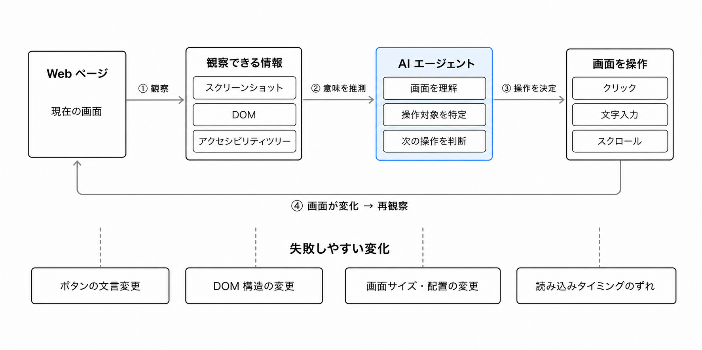
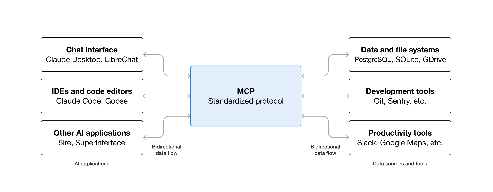
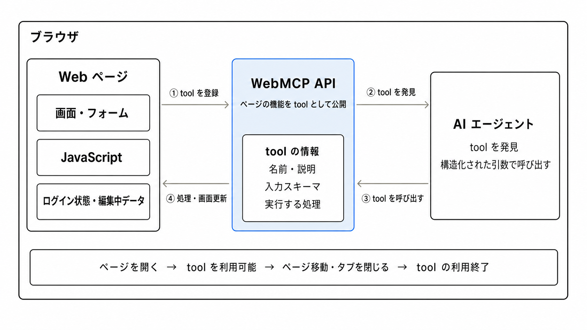
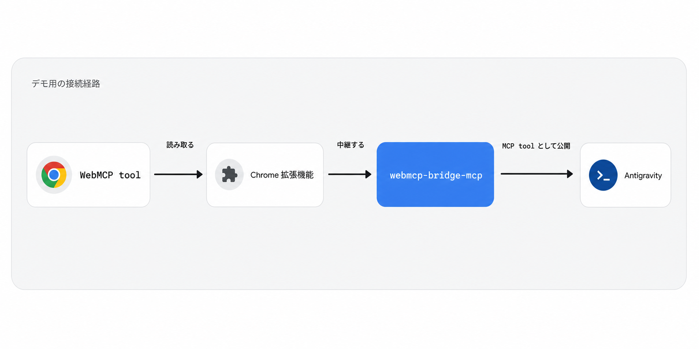

summary: WebMCP を使って席予約サイトの機能を AI エージェントから呼び出すハンズオン
id: webmcp-agent
categories: Web, AI
environments: Web
status: Published
feedback link: https://github.com/gdg-jp/ticket-booking-sample/issues
author: GDG on Campus University of Osaka

# WebMCP を作って Antigravity から呼び出してみよう！ WebMCP 開発ハンズオン

## はじめに

Duration: 0:05:00

このコードラボでは、既存の席予約サイトに WebMCP を追加し、Antigravity CLI の AI エージェントから席の検索、予約、予約確認、キャンセルを行えるようにします。


### このコードラボで作るもの

開始時点の席予約サイトは、人がフォームやボタンを操作すれば予約できます。このサイトに WebMCP の tool を追加し、AI エージェントにも同じ機能を利用できる入口を用意します。

完成すると、Antigravity に次のような自然言語で依頼できます。

```text
空いている席を教えてください。
A-1 を予約してください。
自分の現在の予約を教えてください。
自分の予約をキャンセルしてください。
```

参加者IDは最初にWebページへログインするとブラウザのCookieへ保存されます。WebMCP toolはこのログイン状態を再利用するため、Agentへ参加者IDを毎回伝える必要はありません。

### このコードラボで学ぶこと

- MCP と WebMCP の関係を説明する方法
- HTML フォームを WebMCP tool として公開する方法
- JavaScript 関数を WebMCP tool として公開する方法
- JSON Schema で tool の入力を定義する方法
- ブラウザ内のログインセッションを WebMCP tool から再利用する方法
- 読み取り tool と状態変更 tool を区別する方法
- Antigravity から WebMCP tool を実行して確認する方法

### 必要なもの

- Windows または macOS の PC
- Google Chrome
- Visual Studio Code
- Node.js と npm
- Antigravity CLI
- connpass ID
- GitHub からファイルをダウンロードできるネットワーク

### 前提知識

- HTML のタグと属性に関する基本的な理解
- JavaScript の関数と object に関する基本的な理解
- ターミナルまたは PowerShell でコマンドを実行できること

### このコードラボで扱わないこと

- 席予約バックエンド API の実装
- 本番運用向けの認証、認可、監査、セキュリティ設計
- MCP の Resources や Prompts の実装
- Antigravity 以外の AI エージェントでの動作保証
- WebMCP 仕様のすべての API

> **補足:** WebMCP は実験段階の仕様です。このコードラボでは、指定された Chrome、拡張機能、MCP bridge、Antigravity CLI の組み合わせを使います。

## MCP と WebMCP を理解する

Duration: 0:15:00

席予約サイトでは、人が参加者IDでログインし、画面を見て空席を探して予約します。では、AI エージェントが同じログイン状態で予約するとしたら、何を手がかりにすればよいでしょうか。

このステップでは、AI エージェントが Web サイトの機能を使う方法と、そのために MCP と WebMCP が担う役割を整理します。API や HTML 属性の詳細は、実際に実装するステップで説明します。

### Web サイトを AI が操作するときの難しさ

人が使う Web サイトは、見出し、入力欄、ボタン、画面の変化などを組み合わせて操作方法を伝えています。AI エージェントが同じ画面を操作する場合は、スクリーンショット、DOM、アクセシビリティツリーなどを読み、どこをクリックし、何を入力すればよいか推測します。

この方法なら、専用の仕組みを持たない Web サイトでも操作できます。一方で、ボタンの文言や DOM 構造、画面サイズ、読み込みのタイミングが変わると、操作に失敗することがあります。ひとつの予約を完了するまでに、画面の確認と操作を何度も繰り返すこともあります。

WebMCP は、このような画面操作を禁止するものではありません。Web サイト側が重要な機能を明示し、AI エージェントが画面から操作方法を推測する場面を減らすための選択肢です。



### AI エージェントが使う tool

AI エージェントに公開する機能を **tool（ツール）** と呼びます。席予約サイトなら、「空席を取得する」「席を予約する」「現在の予約を確認する」「予約をキャンセルする」といった機能が tool の候補です。

tool は、AI エージェントが用途と呼び出し方を判断できるように、機能の意味を構造化して伝えます。

| 要素 | 席を予約する tool の例                         |
| ---- | ---------------------------------------------- |
| 名前 | `reserve_seat`                                 |
| 説明 | ログイン中の参加者として席番号を指定して予約する |
| 入力 | `seatId`                                       |
| 処理 | Cookieの参加者IDを使って予約APIを呼び、結果を返す |

tool があれば、AI エージェントは予約ボタンの場所を探す代わりに、「どの機能を、どの入力で呼ぶか」を判断できます。

### MCP とは

[Model Context Protocol（MCP）](https://modelcontextprotocol.io/docs/getting-started/intro)は、AI アプリケーションと外部システムの間で、機能や情報をやり取りするためのオープンな標準です。MCP は AI モデルそのものではなく、AI アプリケーションが外部の tool やデータを利用するための接続方法を定めます。

MCP はクライアント・サーバー構成を採用しています。

| 役割       | 担当すること                                          |
| ---------- | ----------------------------------------------------- |
| MCP host   | AI アプリケーション全体を動かし、複数の接続を管理する |
| MCP client | ひとつの MCP server との接続を維持する                |
| MCP server | tool や情報を MCP client へ提供する                   |

MCP server は、主に Tools、Resources、Prompts を提供できます。このコードラボで扱うのは、AI エージェントが処理を実行するための **Tools** です。

通常、MCP server はローカルのプログラムまたはリモートサービスとして動作します。サーバー上のデータ取得や、画面を開いていないときにも実行したい処理に向いています。



_出典: [Model Context Protocol 公式ドキュメント](https://modelcontextprotocol.io/docs/getting-started/intro)_

### WebMCP とは

[WebMCP](https://webmachinelearning.github.io/webmcp/) は、表示中の Web ページが自身の機能を JavaScript ベースの tool として AI エージェントへ公開するための Web API です。

WebMCP tool は、開いている Web ページに登録され、そのページの中で実行されます。そのため、Web アプリケーションがすでに持っている JavaScript、HTML フォーム、ログイン状態、現在の画面や編集中のデータを再利用できます。tool を実行して画面を更新すれば、人と AI エージェントが同じ結果を見ながら作業を続けられます。

一方、WebMCP tool はそのページを開いている間だけ利用できます。タブを閉じる、別のページへ移動する、tool の登録を解除すると、その tool は使えなくなります。人向けの画面を置き換えるのではなく、開いている画面に AI エージェント用の入口を追加する考え方です。

> **補足:** 2026 年 7 月時点の WebMCP は、Web Machine Learning Community Group が公開する仕様ドラフトです。W3C Standard ではなく、API やブラウザの挙動は今後変わる可能性があります。



### MCP と WebMCP の関係

WebMCP は MCP の後継や、MCP をブラウザへ移植したものではありません。tool、schema、parameter などの共通した考え方を持ちますが、得意な場面が異なります。

| 観点           | MCP                                         | WebMCP                             |
| -------------- | ------------------------------------------- | ---------------------------------- |
| 主な対象       | ローカルまたはリモートのサービス            | 表示中の Web ページ                |
| 利用できる期間 | MCP server が動いている間                   | ページを開いている間               |
| 得意な処理     | データ取得、バックグラウンド処理            | 現在の画面やページの状態を使う処理 |
| ブラウザ画面   | なくても実行できる                          | 開いている画面と協調する           |
| tool の発見    | AI アプリケーションが MCP server へ接続する | Web サイトを開いたときに登録される |

たとえば、在庫情報を常時提供する処理は MCP server に置き、ユーザーが開いている商品ページの表示を更新する処理は WebMCP tool にする、といった併用が考えられます。MCP と WebMCP のどちらか一方を選ぶ必要はありません。

また、WebMCP は、ブラウザが tool を AI エージェントへ渡す方法を MCP に限定していません。ブラウザに組み込まれた AI エージェントが直接利用することも、別の function calling の仕組みへ渡すこともできます。

### このコードラボで WebMCP を呼び出す方法

2026 年 7 月時点では、一般の開発者が WebMCP tool の動作確認に利用できる、WebMCP 対応のブラウザ組み込み AI エージェントはまだ一般提供されていません。Google は [Gemini in Chrome で今後 WebMCP API をサポートする予定](https://developer.chrome.com/blog/chrome-at-io26?hl=ja)と案内しています。

そこで、このコードラボでは WebMCP を体験するためのデモ環境として、Chrome 拡張機能と `webmcp-bridge-mcp` を使います。表示中のページが公開した WebMCP tool を MCP tool に変換し、Antigravity CLI から呼び出せるようにします。

今回の構成では、次の順番で処理が進みます。

1. 席予約サイトが WebMCP tool を公開する
2. Chrome 拡張機能が表示中のページから tool を読み取る
3. `webmcp-bridge-mcp` が WebMCP tool を MCP tool として Antigravity へ渡す
4. Antigravity がユーザーの依頼に合う tool を選んで実行する

この構成では、Antigravity が MCP host、Antigravity 内部の接続機能が MCP client、`webmcp-bridge-mcp` が MCP server にあたります。Chrome 拡張機能と bridge は、WebMCP と Antigravity を接続するためのデモ用の部品であり、WebMCP の仕様には含まれません。

このあと、席予約サイトの機能を「情報を読む操作」と「予約状態を変更する操作」に分け、それぞれを WebMCP tool として公開します。tool を用意しても操作が自動的に安全になるわけではないため、予約やキャンセルのように状態を変更する操作は、その副作用を名前と説明に明記します。本番の Web アプリケーションでは、認証、認可、入力検証、必要に応じたユーザー確認もアプリケーション側で行います。



## セットアップ

Duration: 0:20:00

このステップでは、インストールに時間がかかる Visual Studio Code、Node.js、Antigravity CLI を準備します。すでにインストール済みのものは、バージョン確認だけ行って次へ進んでください。

### Windows のセットアップ手順

#### Visual Studio Code をインストールする

次の公式サイトから Windows 版をダウンロードし、インストーラを実行します。

<button>
  [Visual Studio Code をダウンロード](https://code.visualstudio.com/Download)
</button>

インストーラでは **Add to PATH** と **Open with Code** を有効にしておくと、後の操作が簡単になります。

#### Node.js と npm をインストールする

次の公式サイトから **LTS** と表示された Windows Installer をダウンロードして実行します。

<button>
  [Node.js LTS をダウンロード](https://nodejs.org/en/download)
</button>

インストール後、新しい PowerShell を開いて確認します。

```powershell
node --version
npm --version
```

**期待される出力:**

```text
v24.x.x
11.x.x
```

バージョン番号が表示されれば成功です。コマンドが見つからない場合は PowerShell を開き直し、それでも解決しなければ PC を再起動します。

#### Antigravity CLI をインストールする

PowerShell で公式インストールスクリプトを実行します。

```powershell
irm https://antigravity.google/cli/install.ps1 | iex
```

PowerShell を開き直して確認します。

```powershell
agy --version
```

`agy`に続いてバージョン番号が表示されれば成功です。

> **Troubleshooting:** `agy`が見つからない場合は、PowerShellを開き直してください。Windowsでは通常、`%LOCALAPPDATA%\agy\bin`へインストールされます。

### macOS のセットアップ手順

#### Visual Studio Code をインストールする

次の公式サイトから macOS 版をダウンロードします。ZIP を展開し、Visual Studio Code を **アプリケーション** フォルダへ移動します。

<button>
  [Visual Studio Code をダウンロード](https://code.visualstudio.com/Download)
</button>

#### Node.js と npm をインストールする

次の公式サイトから **LTS** と表示された macOS Installer をダウンロードして実行します。

<button>
  [Node.js LTS をダウンロード](https://nodejs.org/en/download)
</button>

インストール後、新しいターミナルを開いて確認します。

```bash
node --version
npm --version
```

**期待される出力:**

```text
v24.x.x
11.x.x
```

#### Antigravity CLI をインストールする

ターミナルで公式インストールスクリプトを実行します。

```bash
curl -fsSL https://antigravity.google/cli/install.sh | bash
```

ターミナルを開き直して確認します。

```bash
agy --version
```

`agy`に続いてバージョン番号が表示されれば成功です。

> **Troubleshooting:** `agy`が見つからない場合は、ターミナルを開き直してください。macOSでは通常、`~/.local/bin/agy`へインストールされます。

## プロジェクトを開く

Duration: 0:20:00

このステップでは、テンプレートコードをダウンロードし、Antigravity から最初から用意されている `ping` tool を実行できるところまで準備します。

### テンプレートコードをダウンロードする

次のボタンから ZIP ファイルをダウンロードします。Git は使いません。

<button>
  [テンプレートコードをダウンロード](https://github.com/gdg-jp/ticket-booking-template/archive/refs/heads/main.zip)
</button>

ダウンロードした `ticket-booking-template-main.zip` を展開します。

- Windows: ZIP を右クリックし、**すべて展開**を選ぶ
- macOS: Finder で ZIP をダブルクリックする

展開後はこのようなファイルが確認できます。

```text
ticket-booking-template-main
├── app.js
├── index.html
├── style.css
└── webmcp.js
```

### 席予約サイトをローカルサーバーで起動する

PowerShellまたはターミナルを開き、展開した`ticket-booking-template-main`フォルダへ移動します。次のコマンドでローカルサーバーを起動します。

```bash
npx serve -p 8080
```

初回実行時に`serve`のインストール確認が表示された場合は、`y`を入力してEnterキーを押します。`Local`に`http://localhost:8080`と表示されたら、Google ChromeでそのURLを開きます。

コードラボが終わるまで、ローカルサーバーを起動したPowerShellまたはターミナルは開いたままにします。

**期待される状態:**

- 「席予約 WebMCP ハンズオン」と表示される
- 左側にログイン、予約、自分の予約が縦に表示される
- 右側に座席マップと席一覧が表示される
- 画面幅を狭くすると1カラム表示へ切り替わる

> **Troubleshooting:** 席一覧が表示されない場合は、会場で案内されたAPIへ接続できるネットワークにいるか確認してください。画面下部に表示されたエラーメッセージもTAへ共有してください。

### 席予約サイトへログインする

**ログイン**セクションへ自分のconnpass IDを入力し、**ログイン**ボタンを押します。`ログイン中: <自分のconnpass ID>`と表示されれば成功です。

参加者IDは`participantId`というセッションCookieへ保存されます。ページを再読み込みしても同じブラウザセッション内ではログイン状態が残り、予約、予約確認、キャンセルのAPI呼び出しで`X-Participant-ID`ヘッダーとしてサーバーへ渡されます。

> **補足:** このログインはハンズオン用の参加者ID選択です。本番向けの本人確認や認可を実装するものではありません。

### プロジェクトを Visual Studio Code で開く

Visual Studio Code を起動し、**File** → **Open Folder...**から`ticket-booking-template-main`を開きます。

Explorerに次のファイルが表示されることを確認します。

```text
ticket-booking-template-main
├── README.md
├── app.js
├── index.html
├── style.css
└── webmcp.js
```

### WebMCP bridge MCP を設定する

AntigravityからChrome側のWebMCP toolを利用するため、`webmcp-bridge-mcp`を設定します。

設定ファイルは次の場所です。フォルダやファイルがなければ作成します。

- Windows: `%USERPROFILE%\.gemini\config\mcp_config.json`
- macOS: `~/.gemini/config/mcp_config.json`

`mcp_config.json`がなかった人はファイルを次の内容にします。

```json
{
  "mcpServers": {
    "webmcp": {
      "command": "npx",
      "args": ["-y", "webmcp-bridge-mcp"]
    }
  }
}
```

`mcp_config.json`がすでにあった人は、`mcpServers`の末尾に`webmcp`の設定を追加します。

この設定により、Antigravityは`npx -y webmcp-bridge-mcp`をローカルMCP serverとして起動します。

### Chrome の WebMCP flag を有効にする

Chromeのアドレスバーに次を入力します。

```text
chrome://flags/#enable-webmcp-testing
```

**WebMCP Testing**を**Enabled**へ変更し、Chromeを再起動します。再起動後、`http://localhost:8080`をChromeで開き直します。

> **Troubleshooting:** flagが見つからない場合は、Chromeを最新版へ更新してからもう一度確認してください。

### Antigravity CLI を起動する

新しいPowerShellまたはターミナルで次を実行します。

```bash
agy
```

初回起動時にブラウザが開いた場合は、案内に従ってログインします。Antigravityが起動したら、プロンプトに次を入力します。

```text
/mcp
```

MCP managerで`webmcp`または`webmcp-bridge-mcp`に`✓`が表示されれば、MCP serverの起動は成功です。

> **Warning:** ここから拡張機能の追加と`ping`の確認が終わるまで、Antigravity CLIを閉じないでください。CLIを閉じるとbridgeの接続も停止します。

### Chrome 拡張機能を追加する

次のReleasesページから、講師が指定した`webmcp-bridge-extension`をダウンロードします。

<button>
  [WebMCP bridge 拡張機能をダウンロード](https://github.com/gdg-jp/webmcp-bridge-extension/releases/latest/download/webmcp-bridge-extension.zip)
</button>

1. Chromeで`chrome://extensions`を開く
2. **デベロッパーモード**を有効にする
3. ダウンロードしたファイルを展開する
4. **パッケージ化されていない拡張機能を読み込む**を選ぶ
5. 展開した拡張機能のフォルダを選ぶ
6. 席予約サイトを再読み込みする

### `ping` tool で接続を確認する

Antigravityへ次のように依頼します。

```text
WebMCP で ping ツールを実行してください。
```

**期待される結果:**

- `ping` toolが呼び出される
- `ok: true`が返る
- `message: "pong"`が返る
- `pageTitle`に席予約サイトのタイトルが入る

> **Troubleshooting:** toolが見えない場合は、`/mcp`の接続状態、Chrome拡張機能、WebMCP flagを順に確認し、最後に席予約サイトを再読み込みしてください。

## 席を予約する WebMCP tool を実装する

Duration: 0:12:00

このステップでは、既存の予約フォームを`reserve_seat` toolとして公開します。予約フォームが受け取るのは席番号だけです。参加者IDは、ログイン時に保存したCookieを既存のJavaScriptが読み取ります。

### 宣言型 WebMCP とは

宣言型 WebMCP は、HTML フォームに専用の属性を追加し、そのフォームを AI エージェント向けの tool として公開する方法です。既存の入力欄、バリデーション、送信処理を再利用できるため、tool を登録する JavaScript を書かずに WebMCP へ対応できます。

以下では、TODO リストへ項目を追加するフォームを例に、宣言型 WebMCP の仕組みを確認します。

#### 基本的な使い方

`<form>`要素と、その中の`<input>`要素へそれぞれ専用の属性を追加します。

**`<form>`要素の属性**

| 属性              | 説明                                                                                      |
| ----------------- | ----------------------------------------------------------------------------------------- |
| `toolname`        | tool の名前。AI エージェントはこの名前で tool を識別します                                |
| `tooldescription` | tool が行う処理の説明。AI エージェントが使う tool を選ぶ判断材料になります                |
| `toolautosubmit`  | AI エージェントがフォームへ値を入力したあと、自動的に送信するかどうかを指定します（任意） |

**`<input>`要素の属性**

| 属性                   | 説明                                                              |
| ---------------------- | ----------------------------------------------------------------- |
| `toolparamtitle`       | 引数のタイトル。生成される schema の`title`に対応します           |
| `toolparamdescription` | 引数の説明。AI エージェントが入力すべき値を判断する材料になります |

#### コード例: TODO 追加フォーム

既存の TODO 追加フォームへ、tool 名、説明、引数の情報を追加します。

`index.html`

```html
<form
  toolname="add-todo-item"
  tooldescription="TODOリストに新しいアイテムを追加する。"
  toolautosubmit
>
  <input
    name="text"
    type="text"
    toolparamtitle="TODOテキスト"
    toolparamdescription="追加するTODOアイテムのテキスト"
    required
  />
  <button type="submit">追加</button>
</form>
```

人がこのフォームを使うときは、これまでどおり入力欄とボタンを操作します。AI エージェントが使うときは、追加した属性から tool の用途と引数を読み取ります。ひとつのフォーム処理を、人と AI エージェントの両方から利用できる点が特徴です。

#### フォームから生成される input schema

ブラウザは、フォームの入力要素と属性を解析し、次のような JSON Schema に相当する input schema を組み立てます。開発者が同じ schema を JavaScript でもう一度定義する必要はありません。

```json
{
  "type": "object",
  "properties": {
    "text": {
      "type": "string",
      "title": "TODOテキスト",
      "description": "追加するTODOアイテムのテキスト"
    }
  },
  "required": ["text"]
}
```

`name`が引数名に、`type`が引数の型に、`required`が必須項目に対応します。`min`、`max`、`pattern`、`<select>`など、フォームが持つ既存の制約も、実装に応じて schema の生成や実行時の入力検証に利用されます。

AI エージェントが tool を呼び出すと、ブラウザは schema に沿ってフォームへ値を入力します。`toolautosubmit`がなければ、入力済みのフォームをユーザーが確認してから送信します。`toolautosubmit`があれば、値の入力に続いてフォームの送信まで進みます。

#### エージェント経由の送信を判別する

フォームの`submit`イベントを JavaScript で処理する場合は、`SubmitEvent`に追加される次の API を利用できます。

| プロパティ / メソッド | 説明                                                                       |
| --------------------- | -------------------------------------------------------------------------- |
| `agentInvoked`        | AI エージェントによって送信されたかどうかを示します                        |
| `respondWith()`       | 通常のページ遷移を行わず、構造化された実行結果を AI エージェントへ返します |

```js
document.querySelector("form").addEventListener("submit", (event) => {
  event.preventDefault();
  const formData = new FormData(event.currentTarget);
  const text = formData.get("text").trim();

  // 人の操作とAIエージェント経由の操作で、同じ追加処理を使う
  addTodo(text);

  // AIエージェント経由の場合だけ、toolの実行結果として返す
  if (event.agentInvoked) {
    event.respondWith(Promise.resolve({ added: text }));
  }
});
```

TODO を追加する処理そのものは、人の操作でも AI エージェント経由でも共通にします。`agentInvoked`による分岐では、AI エージェントへの結果の返し方だけを追加すると、既存のフォーム処理を二重に実装せずに済みます。

> **補足:** 2026 年 7 月時点で、Chrome は宣言型 API を試験実装しています。一方、WebMCP 仕様本文の Declarative WebMCP 節と、HTML form から JSON Schema を合成する正確な algorithm はまだ TODO です。このステップでは現在の Chrome / bridge 環境が解釈する実験的な属性を使います。

この実験的な段階でも、フォーム送信がユーザーへ与える影響を考えて`toolautosubmit`の有無を決めることが重要です。

> **Warning:** `toolautosubmit`は、Agentが値を入れたあとにフォーム送信まで進めます。購入、送金、削除など、実行前に人の確認が必要な操作へ無条件に使わないでください。

### 予約フォームを確認する

`index.html`を開き、`<h2>予約する</h2>`を検索します。その下にある`<form>`が今回の編集対象です。

`index.html`

```html
<form
  id="reservation-form"
  action="https://api.webmcp.gdgs.jp/api/reservations"
  method="post"
></form>
```

このフォームはすでに人の操作で予約できます。`app.js`のsubmitハンドラがCookieから参加者IDを読み、席番号と合わせてAPIへ送ります。追加するのはAgent向けの説明だけです。

### `<form>`を MCP tool に対応させる

`form`へtool名、説明、自動送信の指定を追加します。

`index.html`

```diff html
<form
  id="reservation-form"
  action="https://api.webmcp.gdgs.jp/api/reservations"
  method="post"
+ toolname="reserve_seat"
+ tooldescription="ログイン中の参加者として、席番号を指定して予約する。"
+ toolautosubmit
>
```

`reserve_seat`はtoolの識別子です。`tooldescription`には、何を入力して何を行うtoolなのかを短く書きます。

### form の入力値に MCP 用の説明を追加する

席番号の`input`へタイトルと意味を追加します。ログインフォームの参加者IDはtoolの引数にしません。

`index.html`

```diff html
<label>
  席番号
  <input
    name="seatId"
    required
    pattern="[A-J]-([1-9]|10)"
    placeholder="A-5"
+   toolparamtitle="席番号"
+   toolparamdescription="予約する席のID。例: A-5。"
  />
</label>
```

`name`はフォーム送信時のパラメータ名、`toolparamtitle`は引数の表示名、`toolparamdescription`はAgentがそのパラメータを理解するための説明です。生成されるtoolのinput schemaには`seatId`だけが含まれます。

Agentがフォームを送信すると、既存のsubmitハンドラが人の操作と同じ`reserveSeat()`を呼びます。`reserveSeat()`はCookieの参加者IDを`X-Participant-ID`ヘッダーへ設定し、`respondWith()`は予約結果をAgentへ返します。これにより、参加者IDをtoolの引数として公開せずにブラウザ内のログイン状態を利用できます。

### AI エージェントから予約 tool を呼び出す

保存後、Chromeで席予約サイトを再読み込みします。座席マップを見て、`A-1`から`F-5`までの空席を1つ選びます。

Antigravityへ、選んだ空席を指定して依頼します。

```text
WebMCP で <空いている席番号> を予約してください。
```

**期待される結果:**

- `reserve_seat` toolが呼び出される
- 席番号だけがtoolの引数としてフォームへ渡される
- Cookieの参加者IDがAPIの`X-Participant-ID`ヘッダーへ渡される
- フォームが自動送信される
- 指定した席が予約される

予約済みの席を指定した場合は、画面を再読み込みして空席を選び直します。

### 現時点のコードベース

```text
.
├── README.md
├── app.js
├── index.html      # reserve_seat を追加
├── style.css
└── webmcp.js       # ping のみ
```

<button>
  [この時点のコードを見る: step-reserve-seat](https://github.com/gdg-jp/ticket-booking-template/tree/step-reserve-seat)
</button>

## 座席一覧を取得する WebMCP tool を実装する

Duration: 0:12:00

このステップでは、全席の状態を返す`list_seat` toolを追加します。Agentはこのtoolを使って、予約する前に空席を探せるようになります。

### 命令型 WebMCP とは

命令型 WebMCP は、JavaScript から`document.modelContext.registerTool()`を呼び出し、AI エージェントが利用できる tool をプログラムとして登録する方法です。HTML フォームに対応しないデータ取得、複数の処理を組み合わせる操作、既存の JavaScript 関数を再利用する処理に適しています。

宣言型 API ではフォームから input schema と送信処理を組み立てました。命令型 API では、tool の定義、引数の schema、実行する関数、返す結果をすべて JavaScript で明示します。その分、ページの状態やログイン状態に応じた登録、非同期 API の呼び出し、画面更新などを柔軟に実装できます。

#### `registerTool()`で tool を登録する

`registerTool()`へ渡す tool 定義には、主に次の項目を指定します。

| 項目          | 型         | 説明                                                                       |
| ------------- | ---------- | -------------------------------------------------------------------------- |
| `name`        | `string`   | tool の一意な名前。AI エージェントはこの名前で tool を識別します           |
| `title`       | `string`   | tool の人向けの表示名                                                      |
| `description` | `string`   | tool が行う処理の説明。AI エージェントが使う tool を選ぶ判断材料になります |
| `inputSchema` | `object`   | tool が受け取る引数の JSON Schema。型、必須項目、説明などを定義します      |
| `annotations` | `object`   | 読み取り専用など、tool の性質を AI エージェントへ伝える hint です          |
| `execute`     | `function` | tool が呼び出されたときに実行する関数。引数を受け取り、実行結果を返します  |

#### コード例: TODO を検索する tool

TODO リストから文字列を検索する`search_todos`を例に、引数を受け取る命令型 tool の構造を確認します。

`webmcp.js`

```js
await document.modelContext.registerTool({
  // tool名: AIエージェントがこの名前で識別する
  name: "search_todos",

  // 表示名と説明: toolを選ぶための判断材料
  title: "Search TODOs",
  description: "指定したキーワードを含むTODOアイテムを検索する。",

  // 入力schema: 検索キーワードの型と意味を定義する
  inputSchema: {
    type: "object",
    properties: {
      query: {
        type: "string",
        description: "TODOアイテムを絞り込む検索キーワード",
      },
    },
    required: ["query"],
    additionalProperties: false,
  },

  // 状態を変更しない読み取りtoolであることを示すhint
  annotations: {
    readOnlyHint: true,
  },

  // 実行関数: AIエージェントが呼び出すと実行される
  execute: async ({ query }) => {
    const matches = await searchTodos(query);
    return { matches };
  },
});
```

`description`と`inputSchema`は、AI エージェントが tool を正しく選び、正しい引数を渡すための情報です。たとえば「TODO を処理する」とだけ説明するより、「指定したキーワードを含む TODO アイテムを検索する」と書く方が、追加や削除を行う tool との違いを判断しやすくなります。

`execute`の返り値は tool の実行結果として AI エージェントへ渡されます。Promise を返す非同期関数も利用できるため、この例のように API の応答を待ってから、必要なデータだけを構造化して返せます。

#### tool が実行される流れ

命令型 tool は、次の順番で利用されます。

1. ページが`registerTool()`で tool を登録する
2. AI エージェントが tool の`name`、`description`、`inputSchema`を取得する
3. AI エージェントが依頼に合う tool を選び、schema に沿った引数を渡す
4. ブラウザがページ内の`execute`を呼び出す
5. `execute`の返り値が AI エージェントへ返される

`registerTool()`自体も Promise を返します。このコードラボでは`await`し、登録が完了してから次の tool を登録します。同名 tool の重複や不正な schema などで登録できなかった場合は Promise が reject されるため、登録エラーも検出できます。

#### ページの状態に応じて登録を解除する

登録時に`AbortSignal`を渡すと、不要になった tool をあとから登録解除できます。

```js
const controller = new AbortController();

await document.modelContext.registerTool(
  {
    name: "search_todos",
    title: "Search TODOs",
    description: "指定したキーワードを含むTODOアイテムを検索する。",
    inputSchema: {
      type: "object",
      properties: {
        query: {
          type: "string",
          description: "TODOアイテムを絞り込む検索キーワード",
        },
      },
      required: ["query"],
      additionalProperties: false,
    },
    execute: async ({ query }) => {
      const matches = await searchTodos(query);
      return { matches };
    },
  },
  { signal: controller.signal },
);

// このtoolが不要になった時点で登録を解除する
controller.abort();
```

たとえば、TODO 検索画面を表示している間だけ検索 tool を公開し、別の画面へ移動したときに登録を解除できます。tool の登録状態をページの認証状態や画面の状態と揃えられることも、命令型 API の特徴です。

### `list_seat` tool の入出力を確認する

`list_seat`は引数を受け取らず、`getSeats()`から全席の情報を取得します。主に返る項目は次のとおりです。

| 項目     | 例          | 意味                                          |
| -------- | ----------- | --------------------------------------------- |
| `id`     | `A-1`       | 席ID                                          |
| `row`    | `A`         | 列                                            |
| `number` | `1`         | 列内の番号                                    |
| `status` | `available` | `available`、`reserved`、`disabled`のいずれか |

予約者を特定する情報は返さず、Agentが席を選ぶために必要な情報だけを公開します。

### `list_seat` tool を登録する

`webmcp.js`を開き、`ping`の`registerTool()`が終わった直後へ`list_seat`を追加します。

`webmcp.js`

```diff js
  await document.modelContext.registerTool({
    name: "ping",
    title: "Ping",
    description: "WebMCP の命令型 tool が登録できているか確認する。",
    inputSchema: {
      type: "object",
      properties: {},
      additionalProperties: false,
    },
    annotations: {
      readOnlyHint: true,
    },
    execute: async () => {
      return {
        ok: true,
        message: "pong",
        pageTitle: document.title,
      };
    },
  });

+ await document.modelContext.registerTool({
+   name: "list_seat",
+   title: "Seat List",
+   description: "全席の状態一覧を取得する。",
+   inputSchema: {
+     type: "object",
+     properties: {},
+     additionalProperties: false,
+   },
+   annotations: {
+     readOnlyHint: true,
+   },
+   execute: async () => {
+     const data = await getSeats();
+     return { seats: data.seats };
+   },
+ });

- console.info("[webmcp] ping tool registered");
+ console.info("[webmcp] ping and list_seat tools registered");
```

`getSeats()`は`app.js`に定義済みのAPI関数です。`index.html`が`app.js`の後に`webmcp.js`を読み込むため、toolから直接呼び出せます。

`list_seat`は予約データを変更しないため、`readOnlyHint: true`を付けます。これはAgentの判断を助けるhintであり、権限制御そのものではありません。

### AI エージェントから座席一覧を取得する

保存後、Chromeで席予約サイトを再読み込みします。Antigravityへ次のように依頼します。

```text
WebMCP で座席情報を教えてください。
```

**期待される結果:**

- `list_seat` toolが呼び出される
- 席IDと現在の状態が返る
- `available`の席を確認できる
- 予約状態は変更されない

> **Troubleshooting:** `getSeats is not defined`と表示された場合は、`index.html`で`app.js`の後に`webmcp.js`を読み込んでいることを確認してください。

### 現時点のコードベース

```text
.
├── README.md
├── app.js
├── index.html      # reserve_seat
├── style.css
└── webmcp.js       # ping, list_seat
```

<button>
  [この時点のコードを見る: step-list-seat](https://github.com/gdg-jp/ticket-booking-template/tree/step-list-seat)
</button>

## 自分の予約を確認する WebMCP tool を実装する

Duration: 0:10:00

このステップでは、ブラウザへログイン中の参加者の現在の予約を返す`get_my_reservation` toolを追加します。

### 引数を持たない tool を設計する

`get_my_reservation`はブラウザ内のログイン状態を使うため、参加者IDを引数にしません。引数を持たないtoolも、空のobjectとしてJSON Schemaを定義します。

`webmcp.js`

```js
inputSchema: {
  type: "object",
  properties: {},
  additionalProperties: false,
}
```

`properties: {}`は引数がないことを表します。`additionalProperties: false`は、定義していない入力を受け付けないことを示します。

### ブラウザのログイン状態を再利用する

`app.js`には、Cookieの参加者IDを取得してAPIへ渡す次の関数が用意されています。

`app.js`

```js
async function getMyReservation() {
  return apiFetch("/api/reservations/me", {
    participantId: requireParticipantId(),
  });
}
```

`requireParticipantId()`はCookieから参加者IDを取得し、未ログインなら「先にログインしてください。」というエラーを返します。toolはログインフォームを読み書きせず、人が作ったブラウザセッションをそのまま利用します。

### `get_my_reservation` tool を登録する

`list_seat`の登録後へ次を追加します。

`webmcp.js`

```js
await document.modelContext.registerTool({
  name: "get_my_reservation",
  title: "My Reservation",
  description: "ログイン中の参加者の現在の予約を確認する。",
  inputSchema: {
    type: "object",
    properties: {},
    additionalProperties: false,
  },
  annotations: {
    readOnlyHint: true,
  },
  execute: async () => {
    return getMyReservation();
  },
});
```

このtoolはサーバー上の予約状態を読むだけなので、`readOnlyHint: true`を付けます。WebMCPの実装から入力欄の値や画面表示は変更しません。

### AI エージェントから予約情報を取得する

保存後、Chromeで席予約サイトを再読み込みします。Antigravityへ次のように依頼します。

```text
WebMCP で自分の予約情報を教えてください。
```

**期待される結果:**

- `get_my_reservation` toolが呼び出される
- 予約がある場合は`reservation.seatId`が返る
- 予約がない場合は`reservation: null`が返る
- toolの引数に参加者IDが含まれない

### 現時点のコードベース

```text
.
├── README.md
├── app.js
├── index.html      # reserve_seat
├── style.css
└── webmcp.js       # ping, list_seat, get_my_reservation
```

<button>
  [この時点のコードを見る: step-get-my-reservation](https://github.com/gdg-jp/ticket-booking-template/tree/step-get-my-reservation)
</button>

## 予約をキャンセルする WebMCP tool を実装する

Duration: 0:10:00

このステップでは、ログイン中の参加者の予約を解除する`cancel_reservation` toolを追加します。これまでのtoolと異なり、サーバー上の状態を変更します。

### 状態を変更する tool を確認する

`list_seat`と`get_my_reservation`はデータを読むtoolでした。`cancel_reservation`は予約を削除するため、読み取り専用ではありません。

`readOnlyHint`の初期値は`false`です。そのため、このtoolには`readOnlyHint: true`を付けません。tool名とdescriptionにも、予約をキャンセルする状態変更であることを明記します。

> **Warning:** `readOnlyHint`はAgentへ性質を伝えるhintであり、認可や実行確認を提供する機能ではありません。本番環境では、サーバー側の認可と重要操作の確認を別途実装してください。

### UI を介さずに予約をキャンセルする

`app.js`には、Cookieの参加者IDを使う関数が用意されています。

`app.js`

```js
async function cancelReservation() {
  return apiFetch("/api/reservations/me", {
    method: "DELETE",
    participantId: requireParticipantId(),
  });
}
```

`getMyReservation()`と同じように、toolは参加者IDを引数にせず、人が作ったブラウザセッションを再利用します。

### `cancel_reservation` tool を登録する

`get_my_reservation`の登録後へ次を追加します。

`webmcp.js`

```js
await document.modelContext.registerTool({
  name: "cancel_reservation",
  title: "Cancel Reservation",
  description: "ログイン中の参加者の予約を解除する。",
  inputSchema: {
    type: "object",
    properties: {},
    additionalProperties: false,
  },
  execute: async () => {
    return cancelReservation();
  },
});
```

### AI エージェントから予約をキャンセルする

保存後、Chromeで席予約サイトを再読み込みします。ログイン状態が表示されていることを確認して依頼します。

```text
WebMCP で自分の予約をキャンセルしてください。
```

**期待される結果:**

- `cancel_reservation` toolが呼び出される
- ログイン中の参加者の予約が解除される
- APIからキャンセル結果が返る

続けて確認します。

```text
WebMCP で自分の予約情報を教えてください。
```

`get_my_reservation`の結果が`reservation: null`になれば成功です。画面の座席情報を更新する場合は、ページを再読み込みします。

> **Troubleshooting:** 予約がない状態でキャンセルするとAPIエラーになります。先に`get_my_reservation`で予約の有無を確認してください。

### 現時点のコードベース

```text
.
├── README.md
├── app.js
├── index.html      # reserve_seat
├── style.css
└── webmcp.js       # ping, list_seat, get_my_reservation, cancel_reservation
```

<button>
  [この時点のコードを見る: step-cancel-reservation](https://github.com/gdg-jp/ticket-booking-template/tree/step-cancel-reservation)
</button>

## おめでとうございます！

Duration: 0:05:00

席予約サイトにWebMCPの入口を追加し、AntigravityからWebページの機能をtoolとして実行できるようになりました。

### 学んだこと

- MCP と WebMCP の関係を説明する方法
- HTML フォームを WebMCP tool として公開する方法
- JavaScript 関数を WebMCP tool として公開する方法
- JSON Schema で tool の入力を定義する方法
- ブラウザ内のログインセッションを WebMCP tool から再利用する方法
- 読み取り tool と状態変更 tool を区別する方法
- UI と API 呼び出しを分離して既存ロジックを再利用する方法
- Antigravity から WebMCP tool を実行して確認する方法

### 作成した tool

| tool                 | 実装方法         | 役割                                 |
| -------------------- | ---------------- | ------------------------------------ |
| `ping`               | 命令型・実装済み | WebMCPの接続を確認する               |
| `reserve_seat`       | 宣言型           | ログイン中の参加者として席を予約する |
| `list_seat`          | 命令型           | 全席の状態を取得する                 |
| `get_my_reservation` | 命令型           | ログイン中の参加者の予約を確認する   |
| `cancel_reservation` | 命令型           | ログイン中の参加者の予約を解除する   |

### 完成コード

完成版は次のリポジトリで確認できます。

<button>
  [完成版のコードを見る](https://github.com/gdg-jp/ticket-booking-sample)
</button>

各実装ステップで詰まった場合は、ステップ末尾のcheckpointと自分のコードを比較してください。

### 次のステップ

- toolの`description`を変え、Agentのtool選択がどう変わるか比較する
- `inputSchema`へ文字列長やpatternを追加する
- toolの戻り値をAgentが判断しやすい形へ整える
- 状態変更toolの実行前にユーザー確認を入れる設計を考える
- 別のWebフォームやWebアプリへWebMCPを追加する
- [WebMCP Draft Community Group Report](https://webmachinelearning.github.io/webmcp/)の最新版を確認する

WebMCPで重要なのは、画面操作をAgentに推測させるのではなく、Webアプリケーション側が機能の意味と入力を明示することです。今回作った席予約toolを出発点に、既存のWebアプリケーションでどの機能を安全に公開できるか考えてみてください。
